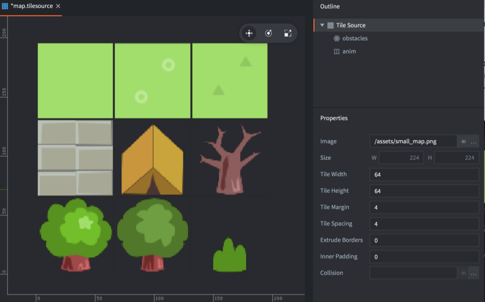
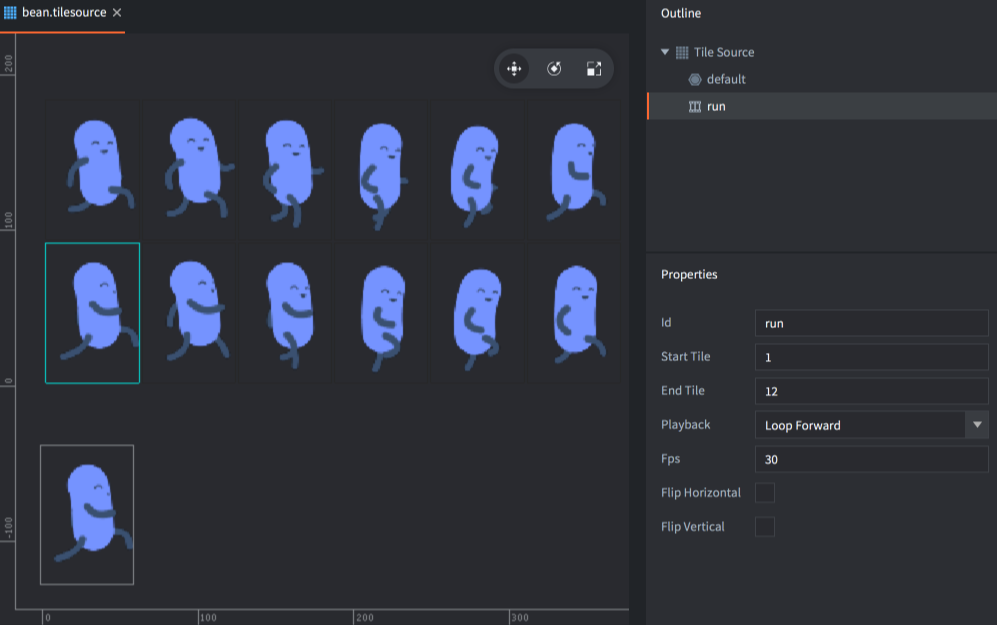

# 瓷砖图集

[Tilemap 组件](/manuals/tilemap) 使用 *瓷砖图集* 来绘制瓷砖地图也可以由 [Sprite](/manuals/sprite) 或 [粒子系统组件](/manuals/particlefx) 来使用. 瓷砖地图还可以使用瓷砖图集里的 *碰撞形状*  [碰撞检测和物理模拟](/manuals/physics).

## 创建瓷砖图集

你需要把瓷砖合并到一张大图里. 网格里的瓷砖都拥有一致的大小. Defold 支持瓷砖间的 _spacing_  和每个瓷砖周围的 _margin_ .

{srcset="images/tilemap/small_map@2x.png 2x"}

大图资源创建完成，就可以使用瓷砖图集了:

- 把大图拖拽进 *Assets* 浏览器里的某个位置下.
- 创建瓷砖图集文件 (在 *Assets* 浏览器里点击鼠标 <kbd>右键</kbd> , 选择 <kbd>New... ▸ Tile Source</kbd>).
- 把文件命名.
- 此时新文件就在瓷砖图集编辑器里打开了.
- 点击 *Image* 属性旁边的浏览按钮选择你的大图. 此时大图就会在编辑器里显示出来了.
- 调整 *Properties* 来匹配瓷砖图集. 调好了的话每个瓷砖就能完美对齐了.

{srcset="images/tilemap/tilesource@2x.png 2x"}

Size
: 大图的大小.

Tile Width
: 瓷砖宽度.

Tile Height
: 瓷砖高度.

Tile Margin
: 每个瓷砖周围的间隙 (上图橙色区域).

Tile Spacing
: 瓷砖间的距离 (上图蓝色区域).

Inner Padding
: 设置游戏运行渲染最终纹理时每个瓷砖边缘自动收缩的像素数量.

Extrude Border
: 设置游戏运行渲染最终纹理时每个瓷砖边缘自动挤出的像素数量.

Collision
: 指定为瓷砖自动生成碰撞形状的图片.

## 瓷砖图集逐帧动画

使用瓷砖图集的逐帧动画，动画帧瓷砖图必须从左到右依次安放. 一行放不开可以放多行. 所有新建的瓷砖图集都有个默认的动画名 "anim". 可以在 *大纲视图* 点击鼠标 <kbd>右键</kbd> 选择 <kbd>Add ▸ Animation</kbd> 来添加动画.

点选动画以显示动画 *属性*.

{srcset="images/tilemap/animation@2x.png 2x"}

Id
: 动画标志. 对于每个瓷砖图集，动画id必须唯一.

Start Tile
: 动画第一帧的瓷砖. 从左上到右下编号从1开始, 一行一行直到结尾.

End Tile
: 动画最后一帧的瓷砖.

Playback
: 设置动画播放方式:

  - `None` 不播放动画，只有第一帧显示出来.
  - `Once Forward` 从头到尾播放一次动画.
  - `Once Backward` 从尾到头倒着播放一次动画.
  - `Once Ping Pong` 从头到尾再从尾到头播放一次动画.
  - `Loop Forward` 从头到尾重复播放动画.
  - `Loop Backward` 从尾到头重复播放动画.
  - `Loop Ping Pong` 从头到尾再从尾到头重复播放动画.

Fps
: 动画播放速率，就是每秒播放帧数 (FPS).

Flip horizontal
: 水平翻转动画.

Flip vertical
: 垂直翻转动画.

## 瓷砖图集碰撞图形

Defold 为每个瓷砖 *Collision* 属性指定一个图片用于生成一个碰撞 _凸多边形_ . 这个形状参考瓷砖有颜色, 即不是 100% 透明的地方来创建.

用瓷砖本身的图片也可以, 用一个跟瓷砖不相干的只用于碰撞的图片也可以. 碰撞图设置好后, 在预览中可以看到瓷砖上会显示一个轮廓线表明碰撞图形已经生成.

大纲视图会显示出你加在瓷砖图集上的碰撞组. 新创建的瓷砖图集默认加在 "default" 碰撞组上. 在 *大纲视图* <kbd>右键点击</kbd> 瓷砖图集根节点，选择 <kbd>Add ▸ Collision Group</kbd> 以添加新的碰撞组.

要指定一个组的碰撞形状, 在 *大概视图* 中选中碰撞组, 然后点击希望加入该组的瓷砖. 瓷砖轮廓颜色会变得和碰撞组颜色一直. 编辑器会为每个碰撞组自动分配颜色.

{srcset="images/tilemap/collision@2x.png 2x"}

要从碰撞组里剔除瓷砖, 选中 *大纲视图* 里瓷砖图集根节点, 然后点击瓷砖.
