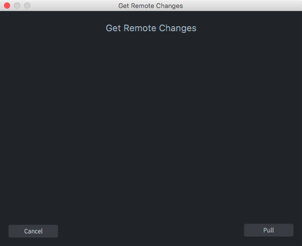
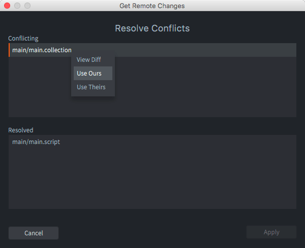
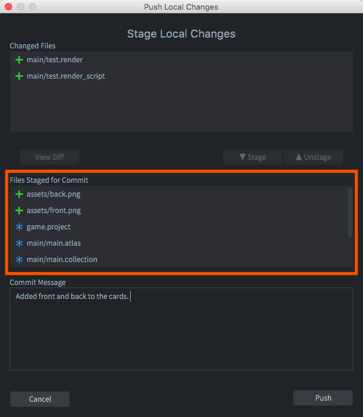

# 版本控制

Defold 为密切合作的小游戏团队而设计. 团队成员可以并行工作而不必担心融合问题. Defold 使用 [Git](https://git-scm.com) 进行版本控制. Git 有助于分布式团队合作而且为各种工作流提供了得力的工具.

## Changed files

本地项目文件改变时, Defold 在 *Changed Files* 面板中追踪这些改变, 把每个新增, 删除或者修改了的文件罗列出来.

{srcset="images/workflow/changed_files@2x.png 2x"}

选中一个文件点击 <kbd>Diff</kbd> 来查看更改, 或者点击 <kbd>Revert</kbd> 来把文件还原回上次同步后的状态.

## Synchronizing

::: 注意
可以使用各种外部 Git 工具进行同步. [GitHub Desktop](https://desktop.github.com/), [GitTower](https://www.git-tower.com), [Git Kraken](https://www.gitkraken.com/git-client) 还有 [SourceTree](https://www.sourcetreeapp.com/) 都是很常用的.
:::

项目同步意味着使本地项目文件与远程保持一致. 在以下情况下项目需要同步:

1. 你想把服务器端最新进展更新到本地.
2. 你想把本地进展提交并推送到服务器端.

要同步项目, 选择菜单栏 <kbd>File ▸ Synchronize</kbd>. 会有一系列引导对话框帮助你完成同步.

点击 <kbd>Pull</kbd> 从服务器拉取更新并混合到本地. 如果发现冲突, 会提示你来解决:

对于每个冲突文件, 右键点击后从弹出菜单选择解决方法:

View Diff
: 打开对比差别的文本编辑器.

  

  左边是从服务器上拉取的文件内容. 右边是本地的文件内容. 差别之处会做高亮显示便于查看.

  内置比较工具仅用于文本文件. 然而, 因为 Defold 把项目中的许多文件 (游戏对象, 集合, 图集等等) 存储成简单易懂的 JSON 文件, 进行对比时也能明白区别是什么:

Use Ours
: 使用本地文件覆盖网络文件.

Use Theirs
: 使用网络文件覆盖本地文件.

::: 注意
编辑器不提供对每个差别选择保留哪个的功能. 如果需要此功能可以使用 Git 命令行的混合工具.
:::

拉取更新并解决冲突之后, 会提示完成对话框.

* 点击 <kbd>Cancel</kbd> 取消此次同步.
* 点击 <kbd>Push</kbd> 把本地更新提交并推送到服务器.
* 点击 <kbd>Done</kbd> 接受服务器更新和冲突解决, 只是不再向服务器推送结果. 推送的工作随时可以进行.

如果打算向服务器推送更新, 第一步必须做提交工作. 推送对话框会让你选择哪些文件需要提交并推送 (下图以橙色方框标明).

点击 <kbd>Push</kbd> 即可提交并推送到服务器.

## Git

Git 是知名的版本控制系统. 通过保留差别实现版本控制, 所以即使提交了很多版本其占用空间也不是很大. 但是像图片和声音这样的二进制文件, 就无法从 Git 的存储方案中收益了. 它们每次的提交都会保存整个文件而不是差异. 对于小文件还好办 (JPEG 或者 PNG 图片, OGG 声音文件之类的), 但是对于大型工程源文件 (PSD 文件, Protools 项目文件之类的). 这些文件随着项目进展越长越大. 这样的文件最好别用 Git 托管而是另找地方进行备份.

使用 Git 便于团队合作. 在 Defold 使用团队工作流. 同步时, 流程如下:

1. 各自的本地更改会被储存起来以便同步失败时可以恢复.
2. 服务器上有更新推送.
3. 更新与本地比较, 如果有冲突会提示解决.
4. 可以选择把本地修改推送到服务器.
5. 如果本地与服务器有冲突, 会提示解决.

如果选择使用 Git 命令行或者其他第三方工具进行拉取, 推送, 提交, 混合, 建立分支等等都是可以的.
