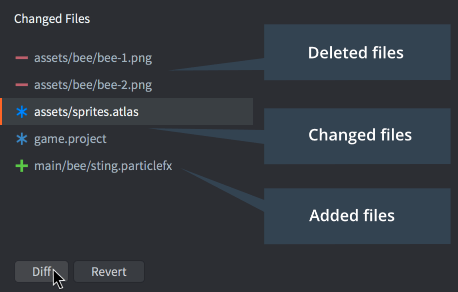

# 版本控制

Defold 是为密切合作的小型游戏团队而设计的，团队成员可以在同一内容上并行工作，几乎没有任何摩擦。Defold 内置支持使用 [Git](https://git-scm.com) 进行版本控制。Git 专为分布式协作工作而设计，是一款极其强大的工具，支持广泛的工作流程。

## 已更改的文件

当您在本地工作副本中保存更改时，Defold 会在 *Changed Files* 编辑器面板中跟踪所有更改，列出每个已添加、删除或修改的文件。

在列表中选择一个文件，然后点击 <kbd>Diff</kbd> 查看您对文件所做的更改，或点击 <kbd>Revert</kbd> 撤销所有更改并将文件恢复到最后一次同步后的状态。

## Git

Git 主要用于处理源代码和文本文件，并以非常小的占用空间存储这些类型的文件。只存储每个版本之间的更改，这意味着您可以以相对较小的成本保留所有项目文件的详细更改历史。然而，二进制文件（如图像或声音文件）无法从 Git 的存储方案中受益。您检入并同步的每个新版本大约占用相同的空间。对于最终的项目资源（JPEG 或 PNG 图像、OGG 声音文件等），这通常不是主要问题，但对于工作中的项目文件（PSD 文件、Protools 项目等），这很快就会成为问题。这些类型的文件通常会变得非常大，因为您通常以比目标资源高得多的分辨率工作。通常认为最好的做法是避免将大型工作文件置于 Git 的控制之下，而是为这些文件使用单独的存储和备份解决方案。

在团队工作流程中，有许多使用 Git 的方式。Defold 使用的方式如下。当您同步时，会发生以下情况：

1. 任何本地更改都会被暂存，以便在同步过程中稍后出现问题时可以恢复。
2. 服务器更改会被拉取。
3. 应用暂存（恢复本地更改），这可能会导致需要解决的合并冲突。
4. 用户可以选择提交任何本地文件更改。
5. 如果有本地提交，用户可以选择将这些提交推送到服务器。同样，这可能会导致需要解决的冲突。

如果您喜欢不同的工作流程，可以从命令行运行 Git 或通过第三方应用程序执行拉取、推送、提交和合并，在多个分支上工作等等。
