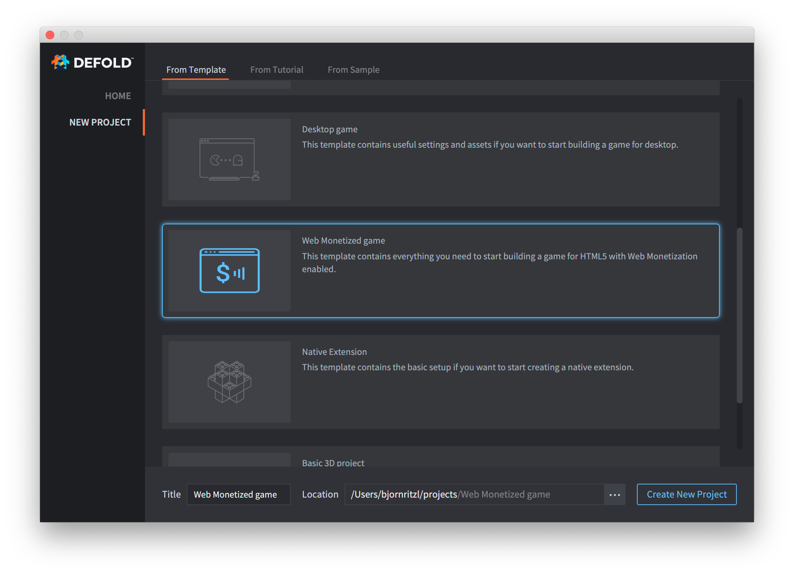
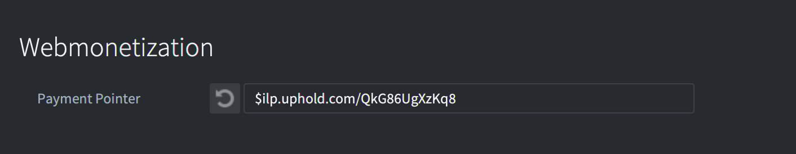

# 网页游戏盈利

[Web Monetization](https://webmonetization.org/) 是一种开放的技术手段, 能让浏览网站或者玩网页游戏的用户向作者进行 (超小额度) 付款而且实时到账. 这给网页游戏开发者一条新的生财之道, 同时付款的玩家会获得额外的高端游戏内容.

网页微支付 [已被提名为 W3C 标准](https://discourse.wicg.io/t/proposal-web-monetization-a-new-revenue-model-for-the-web/3785). 它基于 [Interledger](https://interledger.org/) 协议, 一种开放的, 中立的任意货币转账协议, 包括比特币这样的数字货币.


## 如何工作?

转账要满足以下需求:

1. 玩家必须持有 **Web Monetization Provider** 账户 - 玩家付款的账户.
2. 开发者必须持有 **Web Monetization Wallet** 账户 - 开发者收款的账户.
3. 开发者必须在网页上放置 **Payment Pointer** 其中包含需要付费才能得到的内容 - 支付点用来确定把款项发往哪个钱包.


### 网页支付账户

玩家必须持有网页支付提供商提供账户以便向游戏开发者付款:

[](https://coil.com)

目前 Coil 是唯一的网页支付服务提供商, 以后会越来越多.


### 网页钱包账户

开发者必须持有网页支付钱包以便接收付款. 已经有许多服务提供商提供网页钱包服务:

[](https://www.uphold.com/signup)

[](https://gatehub.net)


### 支付点

钱包提供商把支付点与钱包对应. 支付点是钱包的收款地址, 它可以被随意公开出去. 详情请见 [paymentpointers.org](https://paymentpointers.org/). 支付点就像一个网络连接, 但是是由 $ 开头:

```
$ilp.uphold.com/QkG86UgXzKq8
```

支付点要加入到网页 `<head>` 标签中的 `<meta>` 标签里:

```html
<meta name="monetization" content="$ilp.uphold.com/QkG86UgXzKq8">
```


## 在 Defold 中配置支付点 

在 Defold 游戏中使用网页支付功能是个简单的过程. 新建项目和已有项目的配置方法略有不同.


### 新建项目

如果是新建项目强烈建议你使用 Defold 欢迎屏幕里的网页支付项目模板. 这个模板包含了 [网页支付原生扩展](https://github.com/defold/extension-webmonetization), 还能为你的网页游戏自动添加支付点:



下一步注册 [网页钱包账户](/manuals/web-monetization/#网页钱包账户) 然后在 **game.project** 文件的 Web Monetization 部分将支付点与钱包挂接:




### 已有项目

首先注册 [网页钱包账户](/manuals/web-monetization/#网页钱包账户) 然后手动在网页中加入支付点:

```html
<meta name="monetization" content="YOUR_PAYMENT_POINTER">
```

下一步将 [网页支付原生扩展](https://github.com/defold/extension-webmonetization) 作为 [项目依赖库](http://www.defold.com/manuals/libraries/) 加入. 打开 **game.project** 文件, 找到 Project 部分的 [Dependencies 项](https://defold.com/manuals/project-settings/#dependencies) 加入:

```
https://github.com/defold/extension-webmonetization/archive/master.zip
```


## Defold 网页支付用法

在项目中加入扩展包和支付点之后就可以使用它了. 它的 API 包含两个部分:

检查玩家付款 (或者正在付款):

```lua
local monetized = webmonetization.is_monetized()
if monetized then
	print("The user has an active payment stream")
end
```

设置监听器跟踪付款进度:

```lua
webmonetization.set_listener(function(self, event)
	if event == webmonetization.EVENT_PENDING then
		print("The user is trying to make a first payment")
	elseif event == webmonetization.EVENT_START then
		print("The user has started paying")
	elseif event == webmonetization.EVENT_PROGRESS then
		print("The user is still paying")
	elseif event == webmonetization.EVENT_STOP then
		print("The user has stopped paying")
	end
end)
```


## 最佳实践

* 为付费玩家提供值钱的内容. 不同游戏类型有所不同. 比如:
  * 独一无二的皮肤或装束
  * 新的人物模型
  * 新的关卡
* 如果游戏包含广告还可以考虑为付费玩家去掉广告
