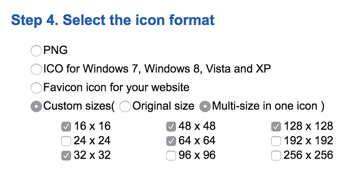

# Windows 开发

为Windows平台开发开发Defold应用是一家轻车熟路的事.

## 项目设置

Windows 相关设置位于*game.project* 文件的 [Windows部分](/manuals/project-settings/#windows)  .

## 应用图标

Windows游戏的图标要使用 .ico 格式. 你可以拿一个 .png 文件，使用[ICOConvert](https://icoconvert.com/) 之类的在线工具生成 .ico 图标. 注意图标使用如下大小:

## Facebook Gameroom

Facebook Gameroom 是全世界都可以免费下载的 Windows 原生游戏客户端. 使用Facebook Gameroom, 玩家可以玩各种网页游戏和各种平台定制游戏. 在编译 Windows 项目时，在*game.project*文件里有一个选项是选择是否支持 Gameroom . Facebook Gameroom 详情请见 [Gameroom 手册](/manuals/gameroom).
