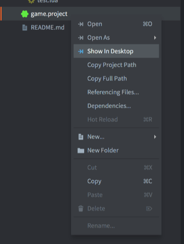
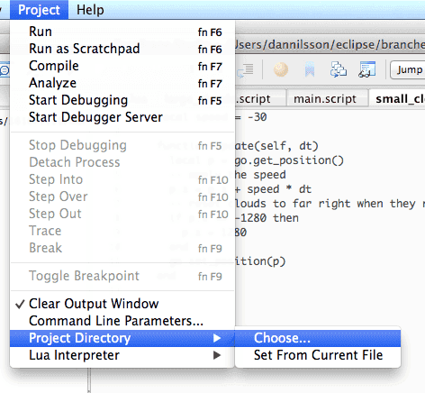
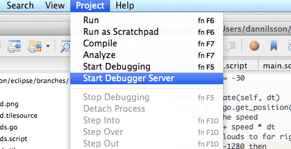
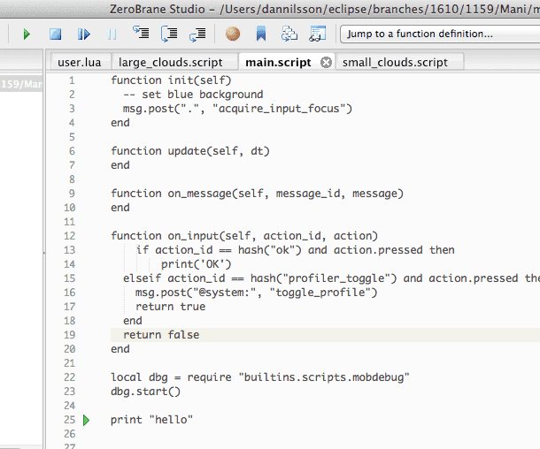
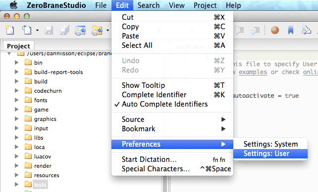

# 在 ZeroBrane Studio 中调试 Lua 脚本 

Defold 自带内置调试器, 但是还可以使用免费开源的 Lua 编辑器 _ZeroBrane Studio_ 作为第三方调试器. 首先需要安装 ZeroBrane Studio. 它是跨平台软件可以运行于 OSX 和 Windows 上.

从 http://studio.zerobrane.com 下载  "ZeroBrane Studio".

## ZeroBrane 设置

要使 ZeroBrane 找到你的项目, 你需要指定 Defold 项目目录. Defold 中, 可以很方便的打开项目根目录.

1. 右键点击 *game.project*
2. 选择 <kbd>Show in Desktop</kbd>

{ srcset="images/zerobrane/show_in_desktop@2x.png 2x" }

## ZeroBrane 打开项目

在 ZeroBrane 打开项目, 选择 <kbd>Project ▸ Project Directory ▸ Choose...</kbd>:



当指定了 Defold 项目目录之后, 就可以在 ZeroBrane 中看到 Defold 项目的结构, 可以跳转和打开文件.

另一个建议, 但不是必须的设置请见下文.

## 启动调试服务器

调试之前, 需要启动 ZeroBrane 内置调试服务器. 此选项位于菜单栏 <kbd>Project</kbd> 中. 选择 <kbd>Project ▸ Start Debugger Server</kbd> 即可:



## 把应用连接到调试器

调试可以在 Defold 应用生命周期任何阶段开始, 但是需要在 Lua 脚本中显式开启. 开启调试的 Lua 脚本像这样:

::: 注意
如果调用 `dbg.start()` 时游戏已经退出, 可能是由于 ZeroBrane 检测到了问题然后向游戏发送了退出指令. 另外, ZeroBrane 调试时需要打开一个脚本文件, 否则就会报错:
"Can't start debugging without an opened file or with the current file not being saved 'untitled.lua')."
在 ZeroBrane 中, 打开含有 `dbg.start()` 的文件即可解决这个报错.
:::

```lua
dbg = require "builtins.scripts.mobdebug"
dbg.start()
```

在应用里插入上面的代码, 它会连接到 ZeroBrane 的调试服务器 (默认建立在 "localhost" 上) 然后中断运行等待调试.

```txt
Debugger server started at localhost:8172.
Mapped remote request for '/' to '/Users/my_user/Documents/Projects/Defold_project/'.
Debugging session started in '/Users/my_user/Documents/Projects/Defold_project'.
```

现在即可使用 ZeroBrane 的调试功能; 步进, 检查, 增加移除断点之类的.

::: 注意
调试只在其初始化位置开启调试lua上下文. 在 game.project 中打开 "shared_state" 就可以在任意位置调试整个应用.
:::



如果连接失败 (可能由于调试服务器未启动), 你的应用会在尝试连接后继续运行.

## 远程调试

因为调试过程基于常规网络连接 (TCP), 这样就是远程调试成为可能. 这意味着当你的应用运行于移动设备时也可以进行调试.

开启调试的代码需要稍微修改. 默认, `start()` 会尝试连接 localhost, 但是对于远程调试, 我们需要指定 ZeroBrane 的调试服务器地址, 比如:

```lua
dbg = require "builtins.scripts.mobdebug"
dbg.start("192.168.5.101")
```

也就是说要确保到达设备的网络通畅, 还要让各种防火墙之类的软件允许使用 8172 端口的 TCP 连接. 否则的话你的应用可能会在尝试连接的时候宕机.

## 其他推荐 ZeroBrane 设置

调试时可以让 ZeroBrane 自动打开 Lua 脚本. 这样就不需要调试哪个文件先要手动打开哪个文件了.

首先打开编辑器配置文件. 推荐修改配置文件的用户设置版本.

- 选择 <kbd>Edit ▸ Preferences ▸ Settings: User</kbd>
- 为配置文件添加如下设置:

  ```txt
  - to automatically open files requested during debugging
  editor.autoactivate = true
  ```

- 重启 ZeroBrane

