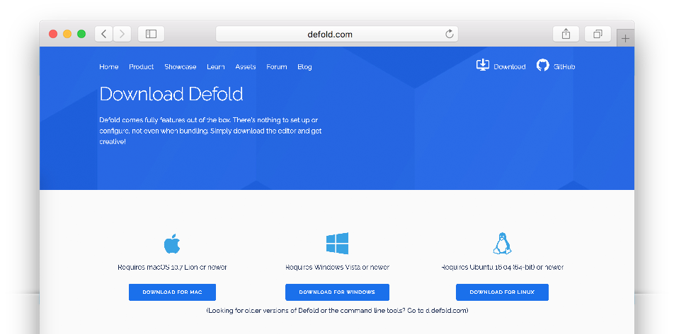
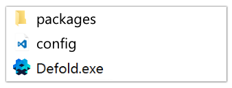
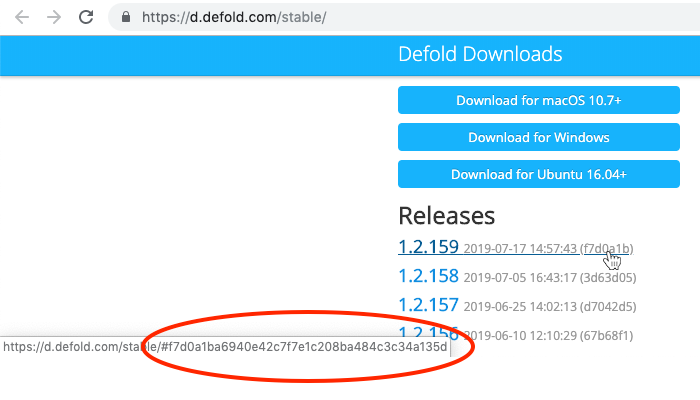

## 下载

打开 [Defold 下载页](https://defold.com/download/) 就能看到许多操作系统对应版本的下载按钮 macOS, Windows 还有 Linux (Ubuntu) 的:



## 安装

在 macOS 上安装
: 下载完成后是一个 DMG 镜像文件.

  1. 双击 "Defold-x86_64-darwin.dmg" 开启镜像打开文件夹.
  2. 把 "Defold" 拖拽到 "Applications" 文件夹里去.

  打开 "Applications" 文件夹 <kbd>双击</kbd> "Defold" 文件即可启动.

  

在 Windows 上安装
: 下载完成后是一个 ZIP 压缩档案:

  1. 在文件资源管理器中找到 "Defold-x86_64-win32.zip" (32位是 "Defold-x86-win32.zip") 文件, <kbd>右键点击</kbd> 选择 *解压到当前位置*, 就会解压缩出来一个 "Defold" 文件夹.
  2. Move the folder "Defold" to "C:\Program Files (x86)\"

  打开 "Defold" 文件夹, <kbd>双击</kbd> "Defold.exe" 文件即可启动.

  

在 Linux 上安装
: 下载完成后是一个 ZIP 压缩档案:

  1. 在控制台里找到 "Defold-x86_64-linux.zip" 文件, 解压出 "Defold" 文件夹来.

     ```bash
     $ unzip Defold-x86_64-linux.zip -d Defold
     ```

  控制台进入文件夹直接启动 `Defold` 可执行文件, 或者在桌面程序上 <kbd>双击</kbd> 它即可启动.

  ```bash
  $ cd Defold
  $ ./Defold
  ```

  如果遇到问题, 请参考 [FAQ 的 Linux 部分](/faq/faq#linux-issues).

## 安装老版本

### 从 Defold GitHub 发布页下载

Defold 各版本也 [发布在 GitHub 上](https://github.com/defold/defold/releases).

### 从 Defold 下载页下载

下载链接遵循以下模式:

* Windows: https://d.defold.com/archive/%sha1%/stable/editor2/Defold-x86_64-win32.zip
* macOS: https://d.defold.com/archive/%sha1%/stable/editor2/Defold-x86_64-darwin.dmg
* Linux: https://d.defold.com/archive/%sha1%/stable/editor2/Defold-x86_64-linux.zip

把上面的 `%sha1%` 换成你需要的版本 hash. 这些 hash 可以在 https://d.defold.com/stable/ 上找到 (不要开头 # 号, 只要后面的字符):


