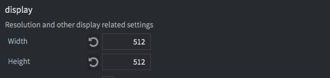
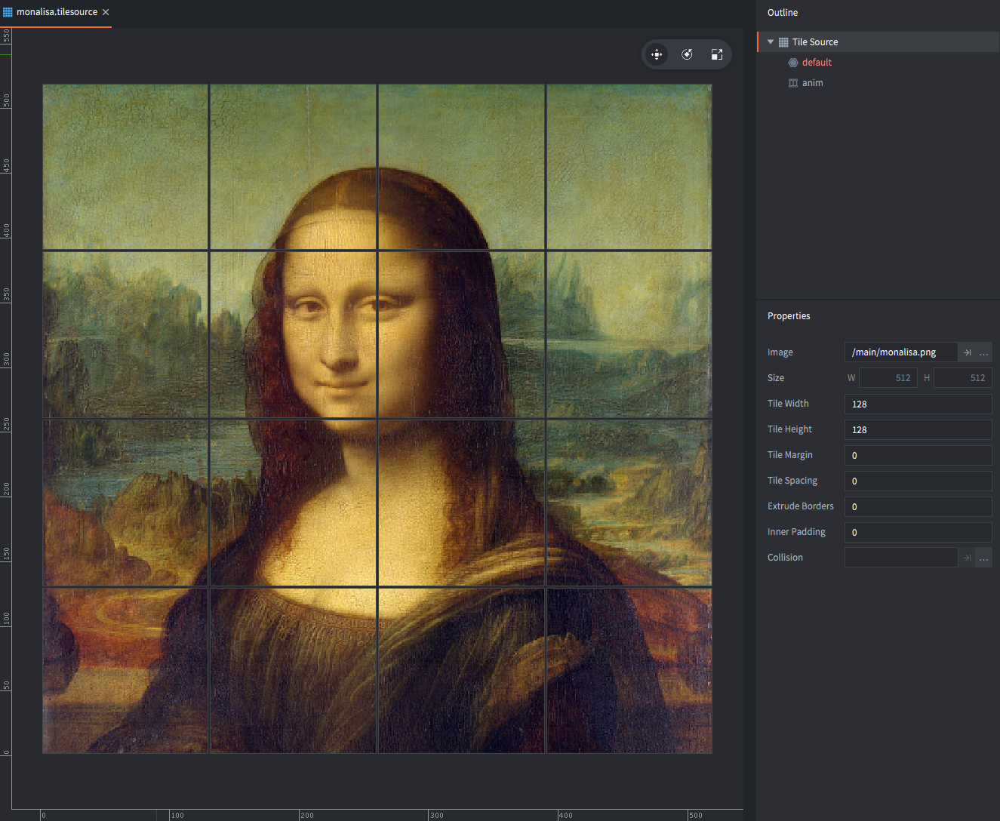
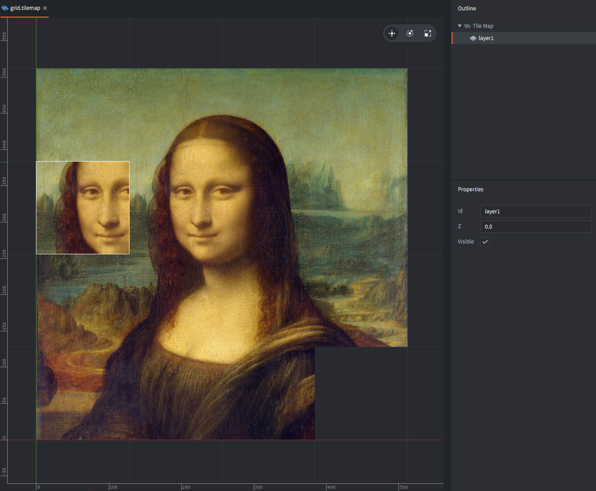
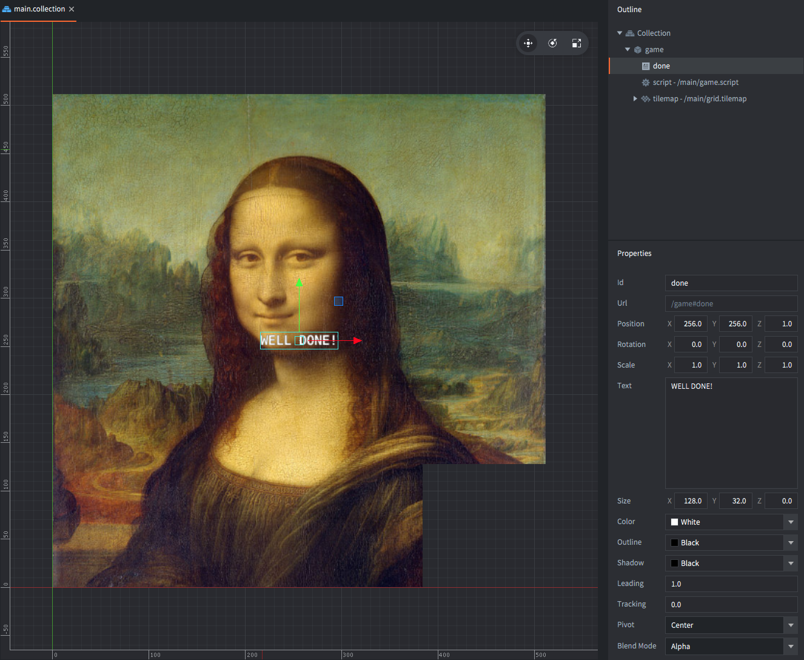
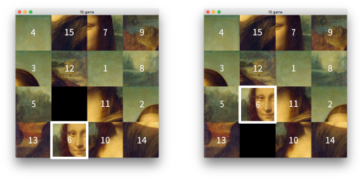
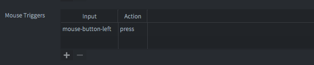

# 经典的 15 拼图

这个著名的拼图在 19 世纪 70 年代在美国流行起来。拼图的目标是通过水平和垂直滑动方块来组织棋盘上的方块。拼图从一个方块被打乱的位置开始。

最常见的拼图版本在方块上显示数字 1--15。但是，您可以通过使方块成为图像的一部分来使拼图更具挑战性。在我们开始之前，尝试解决这个拼图。单击与空白方块相邻的方块，将该方块滑动到空白位置。

## 创建项目

1. 启动 Defold。
2. 在左侧选择 *New Project*。
3. 选择 *From Template* 标签页。
4. 选择 *Empty Project*。
5. 在本地驱动器上为项目选择一个位置。
6. 单击 *Create New Project*。

打开 *game.project* 设置文件，将游戏的尺寸设置为 512⨉512。这些尺寸将与您将要使用的图像相匹配。



下一步是下载适合拼图的图像。选择任何方形图像，但确保将其缩放为 512×512 像素。如果您不想外出搜索图像，这里有一张：


下载图像，然后将其拖到项目的 *main* 文件夹中。

## 表示网格

Defold 包含一个内置的 *Tilemap* 组件，非常适合可视化拼图板。Tilemaps 允许您设置和读取单个方块，这正是这个项目所需要的。

但在创建 tilemap 之前，您需要一个 *Tilesource*，tilemap 将从中获取其方块图像。

<kbd>右键单击</kbd> *main* 文件夹，然后选择 <kbd>New ▸ Tile Source</kbd>。将新文件命名为 `monalisa.tilesource`。

将方块的 *Width* 和 *Height* 属性设置为 128。这会将 512⨉512 像素的图像分割成 16 个方块。当您将它们放在 tilemap 上时，方块将被编号为 1--16。



接下来，<kbd>右键单击</kbd> *main* 文件夹，然后选择 <kbd>New ▸ Tile Map</kbd>。将新文件命名为 "grid.tilemap"。

Defold 需要您初始化网格。为此，选择 "layer1" 层，并在原点的右上角绘制 4⨉4 的方块网格。您将方块设置为什么并不重要。稍后您将编写代码，自动设置这些方块的内容。



## 将各部分组合在一起

打开 *main.collection*。<kbd>右键单击</kbd> *Outline* 中的根节点，然后选择 <kbd>Add Game Object</kbd>。将新游戏对象的 *Id* 属性设置为 "game"。

<kbd>右键单击</kbd> 游戏对象，然后选择 <kbd>Add Component File</kbd>。选择文件 *grid.tilemap*。将 *Id* 属性设置为 "tilemap"。

<kbd>右键单击</kbd> 游戏对象，然后选择 <kbd>Add Component ▸ Label</kbd>。将标签的 *Id* 属性设置为 "done"，将其 *Text* 属性设置为 "Well done"。将标签移动到 tilemap 的中心。

将标签的 Z 位置设置为 1，确保它绘制在网格的顶部。



接下来，为拼图逻辑创建一个 Lua 脚本文件：<kbd>右键单击</kbd> *main* 文件夹，然后选择 <kbd>New ▸ Script</kbd>。将新文件命名为 "game.script"。

然后 <kbd>右键单击</kbd> *main.collection* 中名为 "game" 的游戏对象，然后选择 <kbd>Add Component File</kbd>。选择文件 *game.script*。

运行游戏。您应该看到您绘制的网格和顶部的 "Well done" 消息标签。

## 拼图逻辑

现在您已经将所有部分准备就绪，因此本教程的其余部分将用于组合拼图逻辑。

脚本将携带自己的棋盘方块表示，与 tilemap 分开。这是因为可以使其更容易操作。方块不是存储在二维数组中，而是作为一维列表存储在 Lua 表中。该列表按顺序包含方块编号，从网格的左上角开始一直到右下角：

```lua
-- 完成的棋盘如下所示：
self.board = {1, 2, 3, 4, 5, 6, 7, 8, 9, 10, 11, 12, 13, 14, 15, 0}
```

将这样的方块列表绘制到我们的 tilemap 上的代码非常简单，但需要将列表中的位置转换为 x 和 y 位置：

```lua
-- 将方块表列表绘制到 4x4 tilemap 上
local function draw(t)
    for i=1, #t do
        local y = 5 - math.ceil(i/4) -- <1>
        local x = i - (math.ceil(i/4) - 1) * 4
        tilemap.set_tile("#tilemap","layer1",x,y,t[i])
    end
end
```
1. 在 tilemaps 中，x 值为 1 且 y 值为 1 的方块位于左下角。因此 y 位置需要反转。

您可以通过创建一个测试 `init()` 函数来检查该函数是否按预期工作：

```lua
function init(self)
    -- 一个倒置的棋盘，用于测试
    self.board = {15, 14, 13, 12, 11, 10, 9, 8, 7, 6, 5, 4, 3, 2, 1, 0}
    draw(self.board)
end
```

有了 Lua 表列表中的方块，打乱顺序非常简单。代码只是遍历列表中的每个元素，并将每个方块与另一个随机选择的方块交换：

```lua
-- 交换表列表中的两个项目
local function swap(t, i, j)
    local tmp = t[i]
    t[i] = t[j]
    t[j] = tmp
    return t
end

-- 随机化表列表中元素的顺序
local function scramble(t)
    local n = #t
    for i = 1, n - 1 do
        t = swap(t, i, math.random(i, n))
    end
    return t
end
```

在继续之前，关于 15 拼图有一件事您确实需要考虑：如果您像上面那样随机化方块顺序，有 50% 的可能性拼图是*无法解决*的。

这是个坏消息，因为您绝对不想向玩家呈现一个无法解决的拼图。

幸运的是，可以确定一个设置是否可解决。方法如下：

## 可解性

为了确定 4⨉4 拼图中的位置是否可解，需要两条信息：

1. 设置中的 "逆序数" 数量。逆序是指一个方块在另一个具有较小数字的方块之前。例如，给定列表 `{1, 2, 3, 4, 5, 6, 7, 8, 9, 12, 11, 10, 13, 14, 15, 0}`，它有 3 个逆序数：

    - 数字 12 后面有 11 和 10，给出 2 个逆序数。
    - 数字 11 后面有 10，再给出 1 个逆序数。

    （注意，已解决的拼图状态有零个逆序数）

2. 空白方块所在的行（在列表中用 `0` 表示）。

这两个数字可以通过以下函数计算：

```lua
-- 计算方块列表中的逆序数数量
local function inversions(t)
    local inv = 0
    for i=1, #t do
        for j=i+1, #t do
            if t[i] > t[j] and t[j] ~= 0 then -- <1>
                inv = inv + 1
            end
        end
    end
    return inv
end
```
1. 注意，空白方块不计入。

```lua
-- 查找给定方块的 x 和 y 位置
local function find(t, tile)
    for i=1, #t do
        if t[i] == tile then
            local y = 5 - math.ceil(i/4) -- <1>
            local x = i - (math.ceil(i/4) - 1) * 4
            return x,y
        end
    end
end
```
1. 从底部开始的 y 位置。

现在，给定这两个数字，可以判断拼图状态是否可解。4⨉4 棋盘状态是*可解的*，如果：

- 如果空白方块在*奇数*行（从底部数第 1 或 3 行）并且逆序数是*偶数*。
- 如果空白方块在*偶数*行（从底部数第 2 或 4 行）并且逆序数是*奇数*。

## 这是如何工作的？

每个合法的移动都是通过水平或垂直切换方块与空白方块的位置来移动一个方块。

水平移动方块不会改变逆序数的数量，也不会改变您找到空白方块的行号。

然而，垂直移动方块会改变逆序数的奇偶性（从奇数变为偶数，或从偶数变为奇数）。它也会改变空白方块行的奇偶性。

例如：



这个移动将方块顺序从：

`{ ... 0, 11, 2, 13, 6 ... }`

变为

`{ ... 6, 11, 2, 13, 0 ... }`

新状态增加了 3 个逆序数，如下所示：

- 数字 6 增加了 1 个逆序数（数字 2 现在在 6 之后）
- 数字 11 减少了 1 个逆序数（数字 6 现在在 11 之前）
- 数字 13 减少了 1 个逆序数（数字 6 现在在 13 之前）

通过垂直滑动，逆序数可能的变化方式是 ±1 或 ±3。

通过垂直滑动，空白方块行可能的变化方式是 ±1。

在拼图的最终状态中，空白方块位于右下角（*奇数*行 1），逆序数是*偶数*值 0。每个合法的移动要么保持这两个值不变（水平移动），要么切换它们的极性（垂直移动）。没有合法的移动可以使逆序数和空白方块行的极性变为*奇数*、*奇数*或*偶数*、*偶数*。

因此，任何两个数字都是奇数或都是偶数的拼图状态都是无法解决的。

以下是检查可解性的代码：

```lua
-- 给定的 4x4 方块表列表是否可解？
local function solvable(t)
    local x,y = find(t, 0)
    if y % 2 == 1 and inversions(t) % 2 == 0 then
        return true
    end
    if y % 2 == 0 and inversions(t) % 2 == 1 then
        return true
    end
    return false    
end
```

## 用户输入

现在唯一剩下的就是使拼图具有交互性。

创建一个 `init()` 函数，使用上面创建的函数进行所有运行时设置：

```lua
function init(self)
    msg.post(".", "acquire_input_focus") -- <1>
    math.randomseed(socket.gettime()) -- <2>
    self.board = scramble({1, 2, 3, 4, 5, 6, 7, 8, 9, 10, 11, 12, 13, 14, 15, 0}) -- <3>
    while not solvable(self.board) do -- <4>
        self.board = scramble(self.board)
    end
    draw(self.board) -- <5>
    self.done = false -- <6>
    msg.post("#done", "disable") -- <7>
end
```
1. 告诉引擎这个游戏对象应该接收输入。
2. 为随机数生成器设置种子。
3. 为棋盘创建一个初始随机状态。
4. 如果状态不可解，再次打乱。
5. 绘制棋盘。
6. 设置完成标志以跟踪获胜状态。
7. 禁用完成消息标签。

打开 */input/game.input_bindings* 并添加一个新的 *Mouse Trigger*。将操作的名称设置为 "press"：



回到脚本并创建一个 `on_input()` 函数。

```lua
-- 处理用户输入
function on_input(self, action_id, action)
    if action_id == hash("press") and action.pressed and not self.done then -- <1>
        local x = math.ceil(action.x / 128) -- <2>
        local y = math.ceil(action.y / 128)
        local ex, ey = find(self.board, 0) -- <3>
        if math.abs(x - ex) + math.abs(y - ey) == 1 then -- <4>
            self.board = swap(self.board, (4-ey)*4+ex, (4-y)*4+x) -- <5>
            draw(self.board) -- <6>
        end
        ex, ey = find(self.board, 0)
        if inversions(self.board) == 0 and ex == 4 then -- <7>
            self.done = true
            msg.post("#done", "enable")
        end
    end
end
```
1. 如果有鼠标按钮按下并且游戏仍在运行，请执行以下操作。
2. 计算用户单击的 x 和 y 方块。
3. 找到空白（0）方块的当前位置。
4. 如果单击的方块正好在空白方块的上方、下方、左侧或右侧，请执行以下操作：
5. 交换单击的方块和空白方块上的方块。
6. 重绘更新的棋盘。
7. 如果棋盘上的逆序数为 0，意味着一切都按正确的顺序排列，并且空白方块位于最右边的列（为了使逆序数为 0，它必须在最后一行），那么拼图已解决，请执行以下操作：
8. 设置完成标志。
9. 启用/显示完成消息。

就是这样！您完成了，拼图游戏完成了！

## 完整的脚本

以下是完整的脚本代码供参考：

```lua
local function inversions(t)
    local inv = 0
    for i=1, #t do
        for j=i+1, #t do
            if t[i] > t[j] and t[j] ~= 0 then
                inv = inv + 1
            end
        end
    end
    return inv
end

local function find(t, tile)
    for i=1, #t do
        if t[i] == tile then
            local y = 5 - math.ceil(i/4)
            local x = i - (math.ceil(i/4) - 1) * 4
            return x,y
        end
    end
end

local function solvable(t)
    local x,y = find(t, 0)
    if y % 2 == 1 and inversions(t) % 2 == 0 then
        return true
    end
    if y % 2 == 0 and inversions(t) % 2 == 1 then
        return true
    end
    return false    
end

local function scramble(t)
    for i=1, #t do
        local tmp = t[i]
        local r = math.random(#t)
        t[i] = t[r]
        t[r] = tmp
    end
    return t
end

local function swap(t, i, j)
    local tmp = t[i]
    t[i] = t[j]
    t[j] = tmp
    return t
end

local function draw(t)
    for i=1, #t do
        local y = 5 - math.ceil(i/4)
        local x = i - (math.ceil(i/4) - 1) * 4
        tilemap.set_tile("#tilemap","layer1",x,y,t[i])
    end
end

function init(self)
    msg.post(".", "acquire_input_focus")
    math.randomseed(socket.gettime())
    self.board = scramble({1, 2, 3, 4, 5, 6, 7, 8, 9, 10, 11, 12, 13, 14, 15, 0})   
    while not solvable(self.board) do
        self.board = scramble(self.board)
    end
    draw(self.board)
    self.done = false
    msg.post("#done", "disable")
end

function on_input(self, action_id, action)
    if action_id == hash("press") and action.pressed and not self.done then
        local x = math.ceil(action.x / 128)
        local y = math.ceil(action.y / 128)
        local ex, ey = find(self.board, 0)
        if math.abs(x - ex) + math.abs(y - ey) == 1 then
            self.board = swap(self.board, (4-ey)*4+ex, (4-y)*4+x)
            draw(self.board)
        end
        ex, ey = find(self.board, 0)
        if inversions(self.board) == 0 and ex == 4 then
            self.done = true
            msg.post("#done", "enable")
        end
    end
end

function on_reload(self)
    self.done = false
    msg.post("#done", "disable")
end
```

## 进一步练习

1. 制作一个 5⨉5 的拼图，然后制作一个 6⨉5 的拼图。确保可解性检查一般都能工作。
2. 添加滑动动画。方块不能与 tilemap 分开移动，因此您必须想出解决这个问题的方法。也许是一个只包含滑动方块的单独 tilemap？