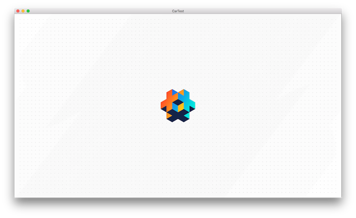
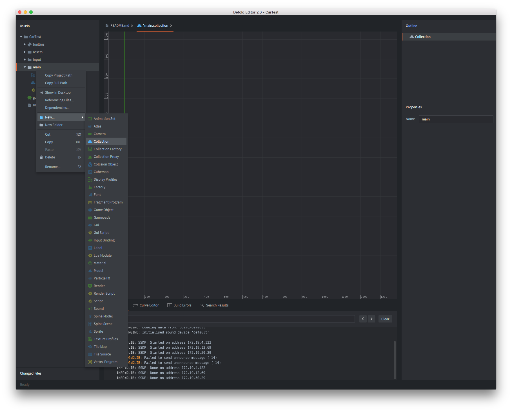
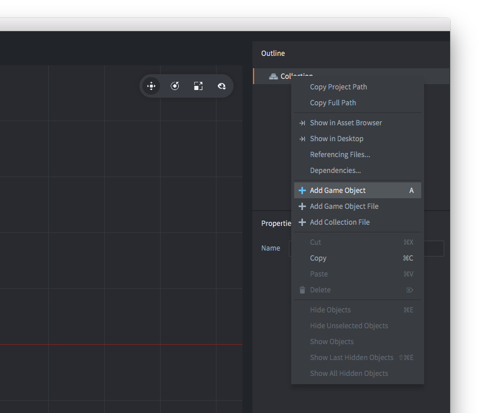
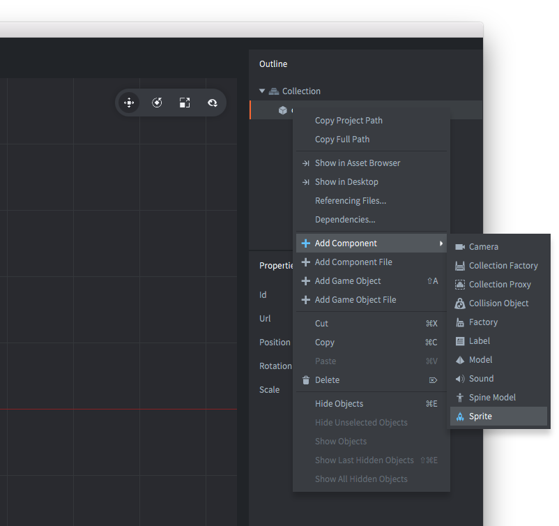
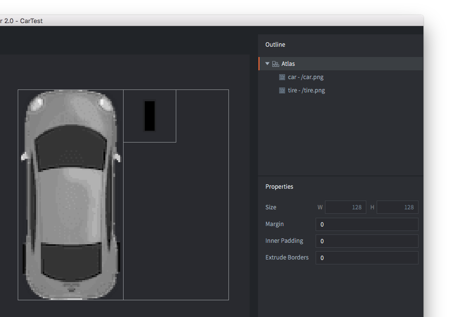
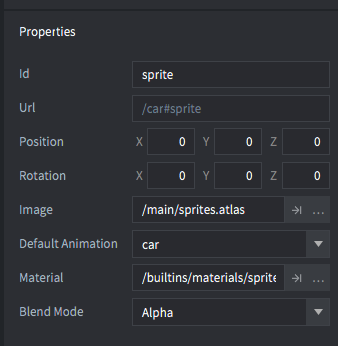
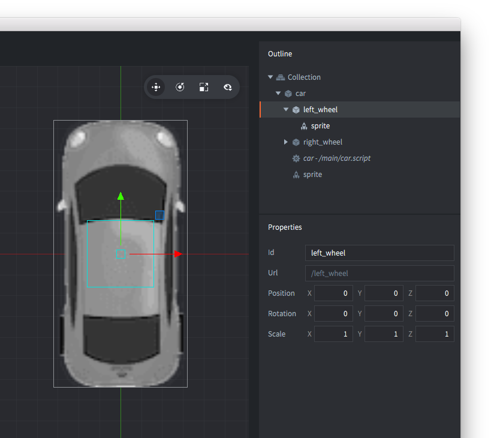
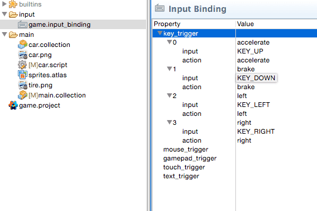
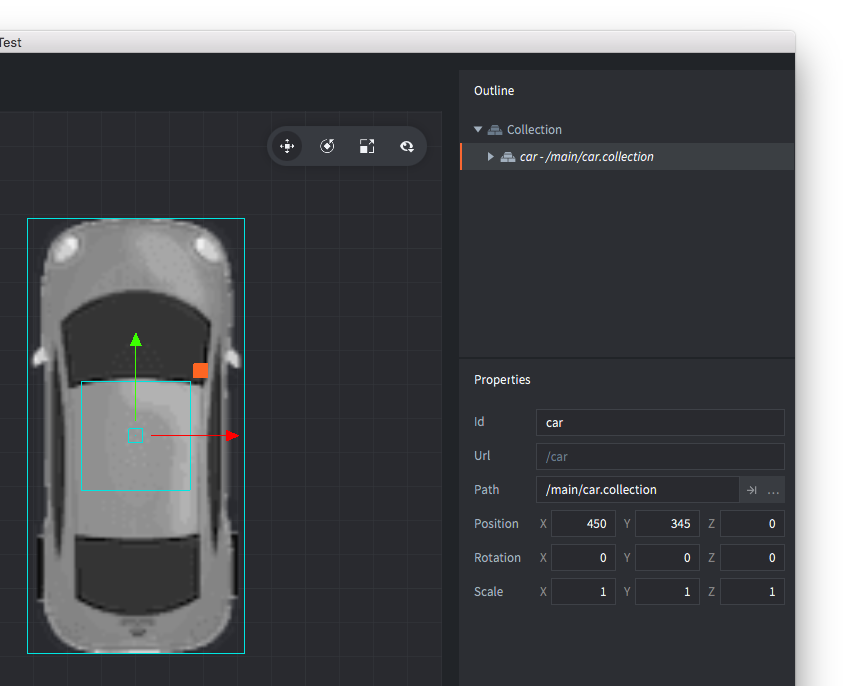

# 构建一辆汽车

如果您是 Defold 的新手，本指南将帮助您在编辑器中找到正确的方向。它还解释了 Defold 中的基本思想和最常见的构建块：游戏对象、集合、脚本和精灵。

我们将从一个空项目开始，逐步构建一个非常小的、可玩的应用程序。在结束时，您将对 Defold 的工作方式有所了解，并准备好 tackling 更广泛的教程或直接进入手册。

::: sidenote
在整个教程中，概念的详细描述和如何执行某些操作都像本段一样标记。如果您觉得这些部分过于详细，请跳过它们。
:::

## 创建一个新项目


1. 启动 Defold。
2. 在左侧选择 *新建项目*。
3. 选择 *从模板* 标签页。
4. 选择 *空项目*。
5. 在本地驱动器上为项目选择一个位置。
6. 单击 *创建新项目*。

## 编辑器

首先创建一个[新项目](/manuals/project-setup/)并在编辑器中打开它。如果您双击文件 *main/main.collection*，该文件将会打开：


编辑器由以下主要区域组成：

资源面板
: 这是项目中所有文件的视图。不同的文件类型有不同的图标。双击文件可在该文件类型的指定编辑器中打开。特殊的只读文件夹 *builtins* 对所有项目都是通用的，包含有用的项目，如默认渲染脚本、字体、用于渲染各种组件的材料和其他内容。

主编辑器视图
: 根据您正在编辑的文件类型，此视图将显示该类型的编辑器。最常用的是您在此处看到的场景编辑器。每个打开的文件都显示在单独的选项卡中。

已更改文件
: 包含自上次同步以来您在分支中所做的所有编辑的列表。因此，如果您在此窗格中看到任何内容，则表示您的更改尚未在服务器上。您可以通过此视图打开纯文本差异并恢复更改。

大纲
: 当前编辑文件的分层视图。您可以通过此视图添加、删除、修改和选择对象和组件。

属性
: 当前选定对象或组件上设置的属性。

控制台
: 运行游戏时，此视图捕获来自游戏引擎的输出（日志、错误、调试信息等），以及来自脚本的任何自定义 `print()` 和 `pprint()` 调试消息。如果您的应用程序或游戏无法启动，控制台是首先要检查的地方。在控制台后面是一组显示错误信息的选项卡，以及一个用于构建粒子效果的曲线编辑器。

## 运行游戏

"空"项目模板实际上是完全空的。尽管如此，请选择 <kbd>项目 ▸ 构建</kbd> 来构建项目并启动游戏。



黑屏可能不是很令人兴奋，但它是一个正在运行的 Defold 游戏应用程序，我们可以轻松地将其修改为更有趣的东西。那么让我们开始吧。

::: sidenote
Defold 编辑器处理文件。通过双击 *资源面板* 中的文件，您可以在合适的编辑器中打开它。然后您可以使用文件的内容。

编辑完文件后，您必须保存它。在主菜单中选择 <kbd>文件 ▸ 保存</kbd>。编辑器通过在任何包含未保存更改的文件的选项卡中的文件名后添加星号 '*' 来提供提示。


:::

## 组装汽车

我们要做的第一件事是创建一个新的集合。集合是您已放置并放入位置的游戏对象的容器。集合最常用于构建游戏关卡，但每当您需要重用属于一起的游戏对象组和/或层次结构时，它们非常有用。将集合视为一种预制件可能会有所帮助。

单击 *资源面板* 中的 *main* 文件夹，然后右键单击并选择 <kbd>新建 ▸ 集合文件</kbd>。您也可以从主菜单中选择 <kbd>文件 ▸ 新建 ▸ 集合文件</kbd>。



将新集合文件命名为 *car.collection* 并打开它。我们将使用这个新的空集合来用几个游戏对象构建一辆小型汽车。游戏对象是组件（如精灵、声音、逻辑脚本等）的容器，您使用这些组件来构建游戏。每个游戏对象在游戏中都通过其 id 唯一标识。游戏对象可以通过消息传递相互通信，但稍后会详细介绍。

此外，可以在集合中就地创建游戏对象，就像我们在这里所做的那样。这会产生一个独特的对象。您可以复制该对象，但每个副本都是独立的——更改一个不会影响其他副本。这意味着如果您创建了一个游戏对象的 10 个副本并意识到想要更改所有副本，您将需要编辑该对象的所有 10 个实例。因此，就地创建的游戏对象应该用于您不打算制作大量副本的对象。

然而，存储在_文件_中的游戏对象作为原型（在其他引擎中也称为"预制件"或"蓝图"）工作。当您将文件存储的游戏对象的实例放置在集合中时，每个对象都是_通过引用_放置的——它是基于原型的克隆。如果您决定需要更改原型，每个基于该原型的放置的游戏对象都会立即更新。



在 *大纲* 视图中选择根"集合"节点，右键单击并选择 <kbd>添加游戏对象</kbd>。一个 id 为"go"的新游戏对象将出现在集合中。标记它，并在 *属性* 视图中将其 id 设置为"car"。到目前为止，"car"非常无趣。它是空的，既没有视觉表示也没有任何逻辑。要添加视觉表示，我们需要添加一个精灵_组件_。

组件用于扩展游戏对象的存在（图形、声音）和功能（生成工厂、碰撞、脚本行为）。组件不能单独存在，但必须驻留在游戏对象内。组件通常在游戏对象所在的同一文件中就地定义。但是，如果您想重用组件，可以将其存储在单独的文件中（就像游戏对象一样），然后将其作为引用包含在任何游戏对象文件中。某些组件类型（例如 Lua 脚本）必须放置在单独的组件文件中，然后作为引用包含在您的对象中。

请注意，您不直接操作组件——您可以移动、旋转、缩放和动画包含组件的游戏对象的属性。



选择"car"游戏对象，右键单击并选择 <kbd>添加组件</kbd>，然后选择 *精灵* 并单击 *确定*。如果您在 *大纲* 视图中标记精灵，您将看到它需要设置一些属性：

图像
: 这需要精灵的图像源。通过在 *资源面板* 视图中标记"main"，右键单击并选择 <kbd>新建 ▸ 图集文件</kbd> 来创建图集图像文件。将新图集文件命名为 *sprites.atlas* 并双击它以在图集编辑器中打开它。将以下两个图像文件保存到您的计算机，并将它们拖到 *资源面板* 视图中的 *main* 中。现在您可以在图集编辑器中标记图集根节点，右键单击并选择 <kbd>添加图像</kbd>。将汽车和轮胎图像添加到图集并保存。现在您可以选择 *sprites.atlas* 作为"car"集合中"car"游戏对象中精灵组件的图像源。

我们游戏的图像：


将这些图像添加到图集：





默认动画
: 将此设置为"car"（或您为汽车图像命名的任何名称）。每个精灵都需要一个在游戏中显示时播放的默认动画。当您将图像添加到图集时，Defold 方便地为每个图像文件创建一帧（静止）动画。

## 完成汽车

继续在集合中添加两个更多的游戏对象。将它们命名为"left_wheel"和"right_wheel"，并在每个中放置一个精灵组件，显示我们添加到 *sprites.atlas* 的轮胎图像。然后抓住轮子游戏对象并将它们拖放到"car"上，使它们成为"car"下的子对象。作为其他游戏对象子对象的游戏对象将在父对象移动时附加到其父对象。它们也可以单独移动，但所有运动都相对于父对象发生。对于轮胎来说，这是完美的，因为我们希望它们粘在汽车上，并且我们可以在驾驶汽车时稍微左右旋转它们。集合可以包含任意数量的游戏对象，并排或排列成复杂的父子树，或混合排列。

通过选择它们然后选择 <kbd>场景 ▸ 移动工具</kbd> 来移动轮胎游戏对象到适当位置。我们需要做的最后一件事是确保轮胎绘制在汽车下方。我们通过将位置的 Z 分量设置为 -0.5 来实现这一点。游戏中的每个视觉项目都是从后到前绘制的，按其 Z 值排序。Z 值为 0 的对象将绘制在 Z 值为 -0.5 的对象之上。由于汽车游戏对象的默认 Z 值为 0，轮胎对象上的新值将使它们位于汽车图像下方。



## 汽车脚本

拼图的最后一块是控制汽车的_脚本_。脚本是一个包含定义游戏对象行为的程序的组件。使用脚本，您可以指定游戏的规则，对象应该如何响应各种交互（与玩家以及其他对象）。所有脚本都是用 Lua 编程语言编写的。为了能够使用 Defold，您或您的团队中的某人需要学习如何用 Lua 编程。

在 *资源面板* 中标记"main"，右键单击并选择 <kbd>新建 ▸ 脚本文件</kbd>。将新文件命名为 *car.script*，然后通过在 *大纲* 视图中标记"car"，右键单击并选择 <kbd>添加组件文件</kbd> 将其添加到"car"游戏对象。选择 *car.script* 并单击 *确定*。保存集合文件。

双击 *car.script* 打开它。

::: sidenote
Defold 提供了几个生命周期函数来编写游戏逻辑。在[脚本手册](/manuals/script)中阅读更多关于它们的信息。
:::

首先删除 `final`、`on_message` 和 `on_reload` 函数，因为我们在本教程中不需要它们。

接下来，在 init 函数开始之前添加以下代码行。

```lua
-- 常量
local turn_speed = 0.1                           									  -- 球面线性插值因子
local max_steer_angle_left = vmath.quat_rotation_z(math.pi / 6)     -- 30 度
local max_steer_angle_right = vmath.quat_rotation_z(-math.pi / 6)   -- -30 度
local steer_angle_zero = vmath.quat_rotation_z(0)									  -- 零度
local wheels_vector = vmath.vector3(0, 72, 0)         		        	-- 从后轮和前轮对中心到中心的向量

local acceleration = 100 																						-- 汽车的加速度

-- 预哈希输入
local left = hash("left")
local right = hash("right")
local accelerate = hash("accelerate")
local brake = hash("brake")
```

这里所做的更改相当简单，我们只是向脚本中添加了一堆稍后将用于编写汽车代码的`常量`。

::: sidenote
注意我们如何预先将哈希存储在变量中。这实际上是一个好习惯，因为它使您的代码更具可读性和性能。
:::

接下来，编辑 `init` 函数，使其包含以下内容：

```lua
function init(self)
	-- 向渲染脚本发送消息（参见 builtins/render/default.render_script）以设置清除颜色。
	-- 这会更改游戏的背景颜色。vector4 包含颜色信息
	-- 按通道从 0-1：红色 = 0.2。绿色 = 0.2，蓝色 = 0.2，Alpha = 1.0
	msg.post("@render:", "clear_color", { color = vmath.vector4(0.2, 0.2, 0.2, 1.0) } )		--<1>

	-- 获取输入焦点以便我们能够对输入做出反应
	msg.post(".", "acquire_input_focus")		-- <2>

	-- 一些变量
	self.steer_angle = vmath.quat()				 -- <3>
	self.direction = vmath.quat()

	-- 速度和加速度是相对于汽车的（未旋转）
	self.velocity = vmath.vector3()
	self.acceleration = vmath.vector3()

	-- 输入向量。稍后将在 on_input 函数中修改
	-- 以存储输入。
	self.input = vmath.vector3()
end
```

想知道我们刚刚更改了什么？这里是解释。

1. 向我们的渲染脚本发送消息，要求它将背景颜色设置为灰色。渲染脚本是 Defold 中的特殊脚本，控制对象如何在屏幕上显示。
2. 要在脚本组件或 GUI 脚本中监听输入操作，需要将 `acquire_input_focus` 消息发送到持有组件的游戏对象。在我们的例子中，我们将此消息发送到持有汽车脚本的 gameobject。
3. 然后，我们声明一些变量，用于跟踪汽车的当前状态。

这很容易，不是吗？我们现在将继续编辑 `update` 函数，使其包含以下内容：

```lua
function update(self, dt)
	-- 将加速度设置为 y 输入
	self.acceleration.y = self.input.y * acceleration				-- <1>

	-- 计算前后轮的新位置
	local front_vel = vmath.rotate(self.steer_angle, self.velocity)
	local new_front_pos = vmath.rotate(self.direction, wheels_vector + front_vel)
	local new_back_pos = vmath.rotate(self.direction, self.velocity)								-- <2>

	-- 计算汽车的新方向
	local new_dir = vmath.normalize(new_front_pos - new_back_pos)
	self.direction = vmath.quat_rotation_z(math.atan2(new_dir.y, new_dir.x) - math.pi / 2)			-- <3>

	-- 根据当前加速度计算新速度
	self.velocity = self.velocity + self.acceleration * dt			-- <4>

	-- 根据当前速度和方向更新位置
	local pos = go.get_position()
	pos = pos + vmath.rotate(self.direction, self.velocity)
	go.set_position(pos)																						-- <5>

	-- 使用 vmath.slerp 插值轮子
	if self.input.x > 0 then																						-- <6>
		self.steer_angle = vmath.slerp(turn_speed, self.steer_angle, max_steer_angle_right)
	elseif self.input.x < 0 then
		self.steer_angle = vmath.slerp(turn_speed, self.steer_angle, max_steer_angle_left)
	else
		self.steer_angle = vmath.slerp(turn_speed, self.steer_angle, steer_angle_zero)
	end

	-- 更新轮子旋转
	go.set_rotation(self.steer_angle, "left_wheel")																						-- <7>
	go.set_rotation(self.steer_angle, "right_wheel")

	-- 将游戏对象的旋转设置为方向
	go.set_rotation(self.direction)

	-- 重置加速度和输入
	self.acceleration = vmath.vector3()																							-- <8>
	self.input = vmath.vector3()
end
```

这是一个巨大的函数！但别担心，这就是它的工作原理：

1. 我们首先根据输入向量设置加速度向量。这确保汽车的加速度在输入的方向上。
2. 接下来，基于汽车的后轮总是向前移动，前轮朝着它们转向的方向移动的简单逻辑，计算两个轮子的位移。
3. 基于两个轮子的位移，计算我们汽车的新运动方向。
4. 在这里，我们将计算出的加速度添加到速度中。
5. 最后，我们基于当前速度更新汽车的位置。
6. 我们根据左/右输入对转向角度进行球面线性插值。这样做是为了使轮子在输入变化时不会瞬间卡住。
7. 然后根据汽车的当前转向角度设置轮子的旋转。类似地，汽车的旋转基于它当前移动的方向设置。
8. 最后，我们重置加速度和输入向量。

最后，是时候让我们的汽车对输入做出反应了。更新 `on_input` 函数，使其看起来像这样：

```lua
function on_input(self, action_id, action)
	-- 将输入向量设置为对应于按键
	if action_id == left then
		self.input.x = -1
	elseif action_id == right then
		self.input.x = 1
	elseif action_id == accelerate then
		self.input.y = 1
	elseif action_id == brake then
		self.input.y = -1
	end
end
```

这个函数实际上相当简单，我们只是接受输入并设置我们的输入向量。

不要忘记保存您的编辑。

## 输入

还没有设置输入操作，所以让我们修复它。打开文件 */input/game.input_bindings* 并为"accelerate"、"brake"、"left"和"right"添加 *key_trigger* 绑定。我们将它们设置为方向键（KEY_LEFT、KEY_RIGHT、KEY_UP 和 KEY_DOWN）：



## 将汽车添加到游戏中

现在汽车已经准备好行驶了。我们在"car.collection"中创建了它，但它尚未存在于游戏中。这是因为引擎当前在启动时加载"main.collection"。为了解决这个问题，我们只需将 *car.collection* 添加到 *main.collection*。打开 *main.collection*，在 *大纲* 视图中标记"集合"根节点，右键单击并选择 <kbd>从文件添加集合</kbd>，选择 *car.collection* 并单击 *确定*。现在 *car.collection* 的内容将作为新实例放置在 *main.collection* 中。如果您更改 *car.collection* 的内容，构建游戏时，集合的每个实例将自动更新。



现在，选择 <kbd>项目 ▸ 构建</kbd> 并试驾您的新汽车！
您会注意到您现在可以移动使汽车按照您的意愿移动。但有些地方还不对。当您离开控制时，汽车不会停止，它应该停止。是时候添加这个功能了！

## 拖动救援

每当物体在现实世界中移动时，拖动力会作用于物体，导致其减速。这种力几乎与运动物体的速度平方成正比，因此可以描述为 `D = k * |V| * V`，其中 `k` 是常数，`V` 是速度，`|V|` 是其大小（速率）。让我们添加这个。

在脚本顶部的常量部分，添加以下常量

```lua
local drag = 1.1	        --拖动常数 <1>
```

然后在 update 函数中，在这行上方添加以下行并保存文件。

```lua
function update(self, dt)
	...
  -- 根据当前加速度计算新速度
	self.velocity = self.velocity + self.acceleration * dt
	...
end
```

```lua
function update(self, dt)
	...
	-- 速度是速度的大小
	local speed = vmath.length_sqr(self.velocity)

	-- 应用拖动
	self.acceleration = self.acceleration - speed * self.velocity * drag

	-- 如果我们已经足够慢，则停止
	if speed < 0.5 then self.velocity = vmath.vector3(0) end
	...
end
```

1. 将拖动值声明为常量。
2. 计算我们移动的速度。
3. 根据公式将拖动应用于当前加速度
4. 如果汽车已经足够慢，则停止。

## 完整的汽车脚本

完成上述步骤后，您的 *car.script* 应该如下所示：

```lua
local turn_speed = 0.1                           				          	-- 球面线性插值因子
local max_steer_angle_left = vmath.quat_rotation_z(math.pi / 6)     -- 30 度
local max_steer_angle_right = vmath.quat_rotation_z(-math.pi / 6)   -- -30 度
local steer_angle_zero = vmath.quat_rotation_z(0)									  -- 零度
local wheels_vector = vmath.vector3(0, 72, 0)         		        	-- 从后轮和前轮对中心到中心的向量

local acceleration = 100 																						-- 汽车的加速度
local drag = 1.1																							-- 拖动常数

function init(self)
	-- 向渲染脚本发送消息（参见 builtins/render/default.render_script）以设置清除颜色。
	-- 这会更改游戏的背景颜色。vector4 包含颜色信息
	-- 按通道从 0-1：红色 = 0.2。绿色 = 0.2，蓝色 = 0.2，Alpha = 1.0
	msg.post("@render:", "clear_color", { color = vmath.vector4(0.2, 0.2, 0.2, 1.0) } )

	-- 获取输入焦点以便我们能够对输入做出反应
	msg.post(".", "acquire_input_focus")

	-- 一些变量
	self.steer_angle = vmath.quat()
	self.direction = vmath.quat()

	-- 速度和加速度是相对于汽车的（未旋转）
	self.velocity = vmath.vector3()
	self.acceleration = vmath.vector3()

	-- 输入向量。稍后将在 on_input 函数中修改
	-- 以存储输入。
	self.input = vmath.vector3()
end

function update(self, dt)
	-- 将加速度设置为 y 输入
	self.acceleration.y = self.input.y * acceleration

	-- 计算前后轮的新位置
	local front_vel = vmath.rotate(self.steer_angle, self.velocity)
	local new_front_pos = vmath.rotate(self.direction, wheels_vector + front_vel)
	local new_back_pos = vmath.rotate(self.direction, self.velocity)

	-- 计算汽车的新方向
	local new_dir = vmath.normalize(new_front_pos - new_back_pos)
	self.direction = vmath.quat_rotation_z(math.atan2(new_dir.y, new_dir.x) - math.pi / 2)

	-- 速度是速度的大小
	local speed = vmath.length(self.velocity)

	-- 应用拖动
	self.acceleration = self.acceleration - speed * self.velocity * drag

	-- 如果我们已经足够慢，则停止
	if speed < 0.5 then self.velocity = vmath.vector3() end

	-- 根据当前加速度计算新速度
	self.velocity = self.velocity + self.acceleration * dt

	-- 根据当前速度和方向更新位置
	local pos = go.get_position()
	pos = pos + vmath.rotate(self.direction, self.velocity)
	go.set_position(pos)

	-- 使用 vmath.slerp 插值轮子
	if self.input.x > 0 then
		self.steer_angle = vmath.slerp(turn_speed, self.steer_angle, max_steer_angle_right)
	elseif self.input.x < 0 then
		self.steer_angle = vmath.slerp(turn_speed, self.steer_angle, max_steer_angle_left)
	else
		self.steer_angle = vmath.slerp(turn_speed, self.steer_angle, steer_angle_zero)
	end

	-- 更新轮子旋转
	go.set_rotation(self.steer_angle, "left_wheel")
	go.set_rotation(self.steer_angle, "right_wheel")

	-- 将游戏对象的旋转设置为方向
	go.set_rotation(self.direction)

	-- 重置加速度和输入
	self.acceleration = vmath.vector3()
	self.input = vmath.vector3()
end

function on_input(self, action_id, action)
	-- 将输入向量设置为对应于按键
	if action_id == hash("left") then
		self.input.x = -1
	elseif action_id == hash("right") then
		self.input.x = 1
	elseif action_id == hash("accelerate") then
		self.input.y = 1
	elseif action_id == hash("brake") then
		self.input.y = -1
	end
end
```

## 尝试最终游戏

现在，从主菜单中选择 <kbd>项目 ▸ 构建</kbd> 并试驾您的新汽车！

这就结束了这个入门教程。以下是一组您可能希望自己解决的挑战：

1. 目前，汽车在向前和向后方向上以相同的加速度移动。您可能希望更改这一点，使汽车在向后移动时移动得更慢。
2. 将一些常量（如加速度）设置为`属性`，以便可以为汽车的不同实例更改它们。
3. 为您的汽车添加声音，使其发出嗡嗡声！（[提示](manuals/sound/)）

现在继续深入了解 Defold。我们准备了许多[手册和教程](/learn)来指导您，如果您遇到困难，非常欢迎您来到[论坛](//forum.defold.com)。

祝您使用 Defold 愉快！