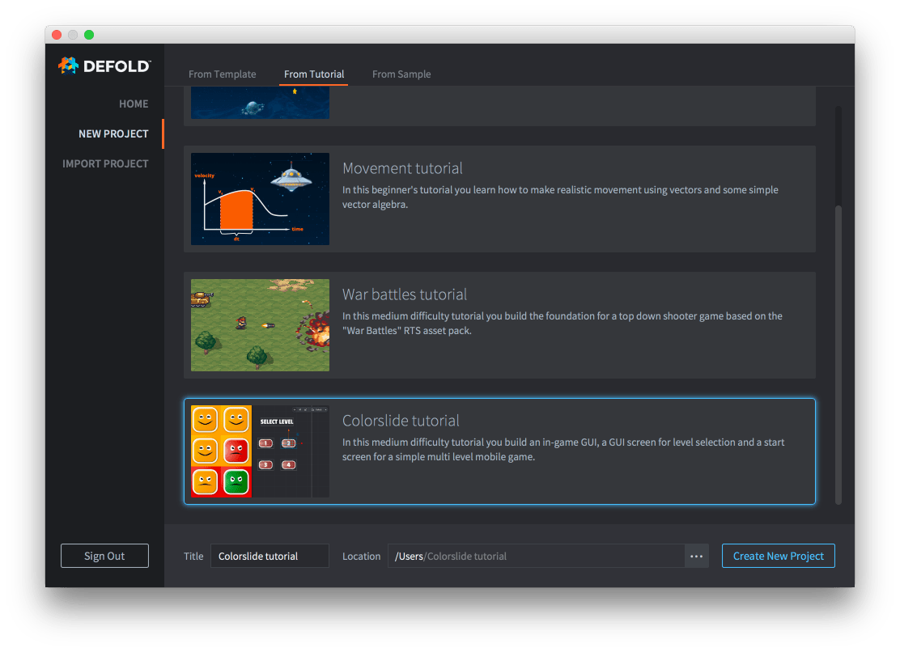

# Colorslide 教程

在这个中等难度的教程中，你将构建一个游戏内GUI，一个用于关卡选择的GUI屏幕和一个简单的多关卡移动游戏的开始屏幕。

该教程已集成到Defold编辑器中，可以轻松访问：

1. 启动 Defold。
2. 在左侧选择 *新建项目*。
3. 选择 *从教程* 标签页。
4. 选择 "Colorslide tutorial"
5. 在本地驱动器上为项目选择一个位置，然后单击 *创建新项目*。

编辑器会自动从项目根目录打开"README"文件，其中包含完整的教程文本。

{.icon} [你也可以在Github上阅读完整的教程文本](https://github.com/defold/tutorial-colorslide)

如果你遇到困难，请前往[Defold论坛](//forum.defold.com)，在那里你将从Defold团队和许多友好的用户那里获得帮助。

祝您使用 Defold 愉快！