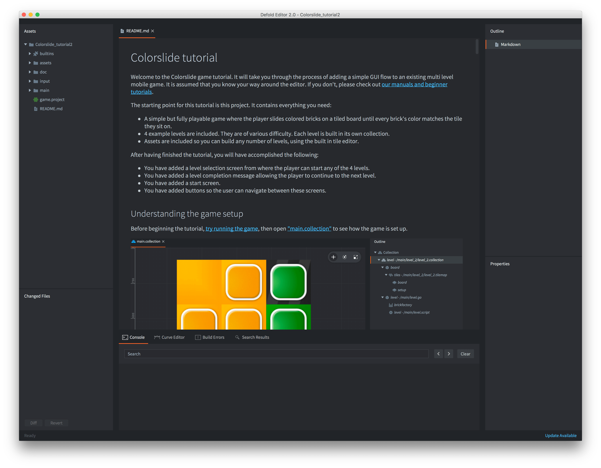

# 入门指南

Defold 引擎和编辑器是功能强大的工具，有很多特性和功能需要学习。为了帮助您入门，我们创建了各种教程。许多教程可以直接从编辑器中获取，这使得它们非常容易上手。

## 从编辑器开始教程

当您运行 Defold 编辑器时，会显示一个项目选择和创建屏幕。从这里您可以轻松选择想要尝试的教程：

1. 启动 Defold。
2. 在左侧选择 *新建项目*。
3. 选择 *从教程* 标签页。
4. 选择您感兴趣的教程。
5. 在本地驱动器上为项目选择一个位置。
6. 单击 *创建新项目*。

编辑器现在会自动下载教程项目，在编辑器中打开它，并打开教程文本（项目根目录中的"README"文件）。

现在按照教程文本操作！如果您想回到文本，请在 *资源* 视图中<kbd>双击</kbd>"README"文件。您也可以<kbd>右键单击</kbd>打开文件的选项卡，然后选择<kbd>移动到其他选项卡窗格</kbd>，以便与您正在处理的文件并排查看教程文本。

如果您是 Defold 的新手，您可能还想查看[编辑器介绍](/manuals/editor)。

如果您遇到困难，请前往[Defold 论坛](//forum.defold.com)，在那里您将从 Defold 开发人员和许多友好的用户那里获得帮助。

祝您使用 Defold 愉快！