# Magic Link 教程

这个游戏是经典匹配游戏的一个变体，类似于《宝石迷阵》和《糖果传奇》。玩家拖动并连接相同颜色的方块来移除它们，但游戏的目标不是移除长串的相同颜色方块、清除游戏板或收集分数，而是让分布在游戏板上的一组特殊的"魔法方块"连接起来。

本教程作为逐步指南编写，我们在完整设计的基础上构建游戏。实际上，找到一个有效的设计需要大量的时间和精力。您可能从一个核心想法开始，然后找到一种方法来制作原型，以更好地理解这个想法能带来什么。即使是像"Magic Link"这样的简单游戏也需要相当多的设计工作。这个游戏经历了几次迭代和一些实验，才达到其最终（但仍远非完美）的形状和游戏规则集。但对于本教程，我们将跳过这个过程，开始在最终设计的基础上构建。

## 入门指南

您需要首先创建一个新项目并导入资源包：

* 从"空项目"模板创建一个[新项目](/manuals/project-setup/#creating-a-new-project)
* 下载完整的"Magic Link"项目 [magic-link.zip](https://github.com/defold/defold-examples/releases/latest) 作为参考。完整项目包含所有资源，以防您想从头开始创建项目。

## 游戏规则

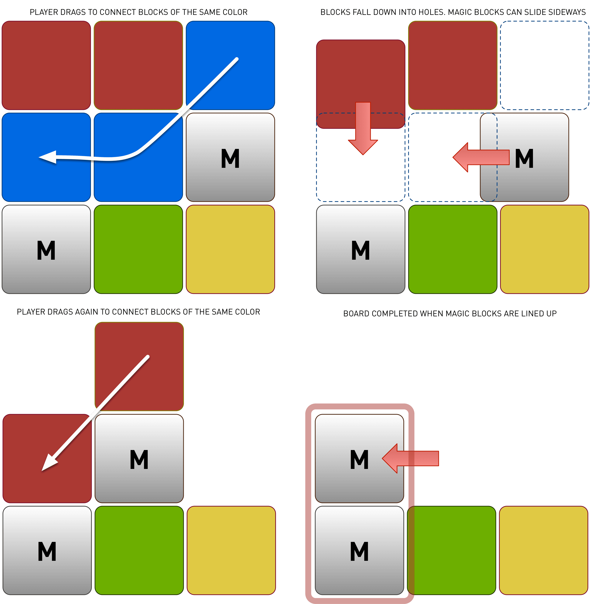

游戏板每轮随机填充彩色方块和一组魔法方块。彩色方块遵循以下规则：

* 如果玩家通过拖动将它们与相同颜色的方块连接，它们就会消失。
* 当方块消失时，它们会在下面留下空洞。彩色方块只是垂直向下落入下面打开的空洞中。
* 屏幕底部阻止所有方块进一步下落。

魔法方块的行为不同，根据以下规则：

* 如果任一侧出现开口，魔法方块会_横向_移动。
* 如果下面出现空洞，它们会像普通彩色方块一样下落。

玩家根据以下规则与游戏互动：

* 玩家可以拖动并连接水平、垂直和对角线相邻的彩色方块。
* 一旦玩家松开触摸输入（抬起手指），链接的方块就会消失。
* 魔法方块对拖动没有反应，不能手动链接。
* 然而，魔法方块对水平或垂直连接有反应。即它们在这些情况下自动链接。
* 如果玩家设法自动连接游戏板上的所有魔法方块，关卡就完成了。

难度级别决定了放置在游戏板上的魔法方块数量。

## 概述

与所有项目一样，我们需要制定一个计划，大致如何进行实现。游戏可以有很多种结构和构建方式。从技术上讲，如果我们愿意，我们可以在GUI系统中实现整个游戏。然而，使用游戏对象和精灵构建游戏，并使用GUI API进行屏幕上的GUI和抬头显示元素，通常是最自然的游戏构建方式，所以我们将采用这种方式。

由于我们预计文件数量将保持相当低，我们将保持项目文件夹结构非常简单：


*main*
: 此文件夹将包含游戏的所有逻辑。所有脚本、游戏对象文件、集合文件、GUI文件等等都将驻留在此文件夹中。如果您想将此文件夹拆分为几个，或保留子文件夹，那完全没问题。

*images*
: 所有图像资源将存放在此文件夹中。

*fonts*
: 用于文本渲染的字体保存在这里。

*input*
: 输入绑定保存在此文件夹中。

## 设置项目

*game.project* 文件主要保持默认设置，但有一些设置需要决定。首先，我们需要为游戏选择一个分辨率。稍后阶段更改分辨率相当容易，对于最终游戏，我们需要做一些工作，使游戏无论目标设备的分辨率或纵横比如何都能看起来很好。

我们选择将分辨率设置为640x960像素，这是iPhone 4的原生分辨率。这也是适合许多显示器的分辨率，因此在计算机上进行游戏测试变得流畅。如果您想使用不同的分辨率，您只需要稍微调整一些值。

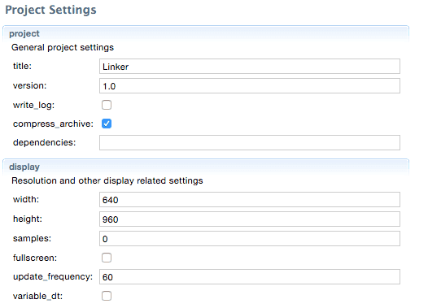

我们还需要增加渲染的最大精灵数量。如果您愿意，可以跳到下一节，当您在控制台收到通知说您已达到精灵限制时再回到这里。

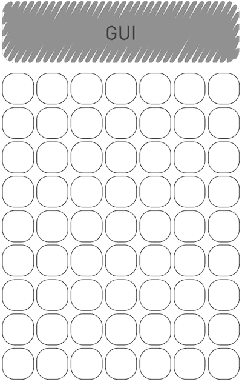

我们可以计算所需的最大精灵数量：

* 游戏板将容纳7x9个方块。游戏板需要在边缘周围有一些边距，以及顶部的一些GUI元素空间。这意味着方块的大小约为90x90像素。任何比这小的方块，在小手机屏幕上都会太小而无法交互。
* 每个方块是一个精灵。我们将使用单帧动画来设置方块的颜色。
* 其中一些方块将是魔法方块，我们将为每个魔法方块使用4个精灵进行特殊效果。
* 链接图形每个元素需要一个精灵。在最坏的情况下，如果玩家以某种方式链接了整个游戏板（减去2个不能拖动链接的魔法方块），这是额外的61个精灵。

所以，假设我们最多有30个魔法方块。游戏板是63个方块（精灵）。其中，30个魔法方块为特殊效果增加了4个精灵。这是额外的120个精灵。因此，加上链接图形（在这种情况下最多33个），我们每帧需要绘制至少120 + 33 = 153个精灵。最接近的2的幂是256。

然而，将最大值设置为256是不够的。每次我们清除并重置游戏板时，我们将删除所有当前的游戏对象并生成新的对象。精灵数量必须满足帧中存在的所有对象。这包括任何已删除的对象，因为它们在帧结束时被移除。因此，将最大精灵数量设置为512就足够了。

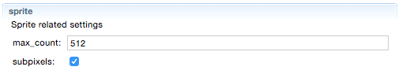

## 添加图形资源

游戏所需的所有资源都已提前准备好。我们将它们添加为512x512像素的图像，并让引擎将它们缩小到目标大小。

::: 旁注
在项目设置中启用*hidpi*意味着后台缓冲区变得高分辨率。通过绘制缩小的大图像，它们在视网膜屏幕上会显得非常清晰。
:::

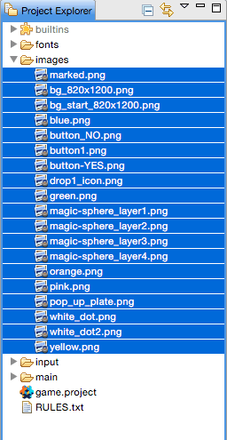

除了方块外，还包括一个"连接器"图像和效果精灵。我们还有两个背景图像。一个将用作游戏板的背景，另一个将用于主菜单。将所有图像添加到*images*文件夹，然后创建一个图集文件*sprites.atlas*。打开图集文件并添加所有图像。

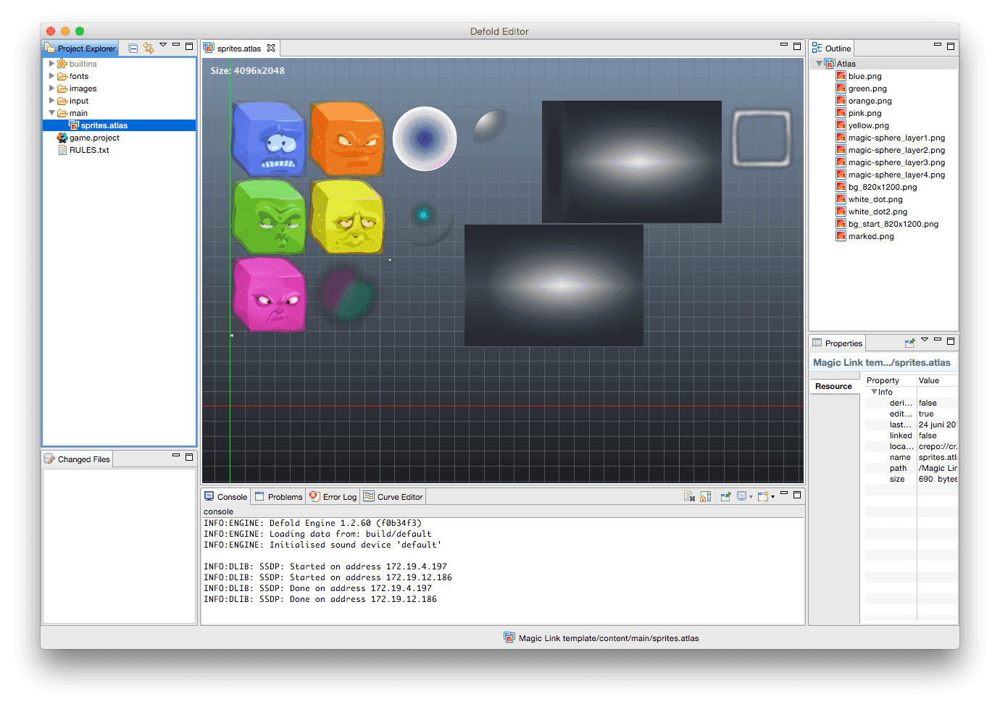

有一组用于创建GUI元素的GUI图像，如按钮和弹出窗口。这些被添加到一个名为*gui.atlas*的单独图集中。

## 生成游戏板

第一步是构建游戏板逻辑。游戏板将驻留在自己的集合中，该集合将包含游戏过程中屏幕上的所有内容。目前，唯一必要的是"blockfactory"工厂组件和脚本。稍后，我们将为连接添加一个工厂，一个主菜单GUI组件，最后是从主菜单开始游戏和退出菜单的加载机制。

1. 在*`main`*文件夹中创建*`board.collection`*。确保将其命名为"board"，以便我们稍后可以寻址它。如果添加背景精灵组件，确保将其Z位置设置为-1，否则它不会绘制在我们稍后生成的所有方块后面。
2. 临时将*game.project*中的*Main Collection*（在*Bootstrap*下）设置为`/main/board.collection`，以便我们可以轻松测试。

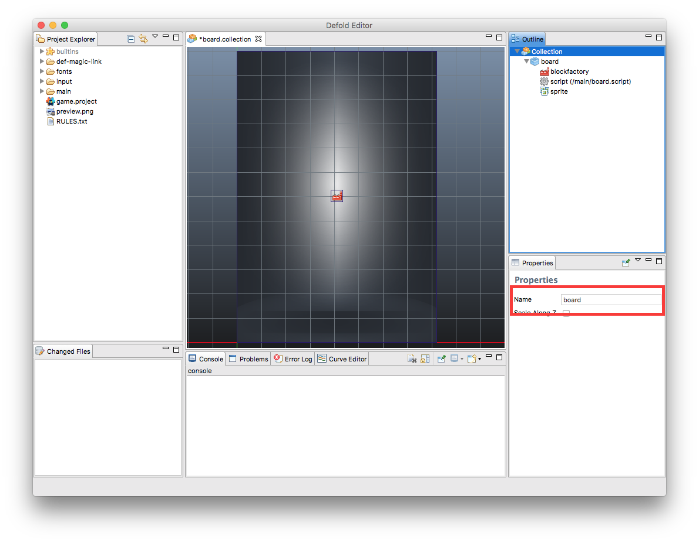

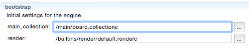

脚本文件*board.script*将包含游戏板本身和游戏板中方块的所有逻辑。首先创建游戏板构建函数并（临时）从`init()`调用它。我们还添加两个我们现在不会使用但稍后会派上用场的函数：

`filter()`
: 这个函数将允许我们过滤项目（方块）列表。

`build_blocklist()`
: 创建游戏板上所有方块的列表，布局为平面列表，这允许我们过滤它。

在构建游戏板后，我们将使用两个包含所有方块的不同数据集，`self.blocks`和`self.board`：

```lua
-- board.script
go.property("timer", 0)     -- 用于计时事件
local blocksize = 80        -- 方块中心之间的距离
local edge = 40             -- 左右边缘
local bottom_edge = 50      -- 底部边缘
local boardwidth = 7        -- 列数
local boardheight = 9       -- 行数
local centeroff = vmath.vector3(8, -8, 0) -- 连接器图形的中心偏移，因为方块图像下方有阴影
local dropamount = 3        -- "掉落"时掉落的方块数量
local colors = { hash("orange"), hash("pink"), hash("blue"), hash("yellow"), hash("green") }

--
-- filter(function, table)
-- 例如: filter(is_even, {1,2,3,4}) -> {2,4}
--
local function filter(func, tbl)
    local new = {}
    for i, v in pairs(tbl) do
        if func(v) then
            new[i] = v
        end
    end
    return new
end

--
-- 构建一维方块列表以便于过滤
--
local function build_blocklist(self)
    self.blocks = {}
    for x, l in pairs(self.board) do
        for y, b in pairs(self.board[x]) do
            table.insert(self.blocks, { id = b.id, color = b.color, x = b.x, y = b.y })
        end
    end
end

--
-- INIT
--
function init(self)
    self.board = {}             -- 包含游戏板结构
    self.blocks = {}            -- 所有方块的列表。用于在选择时轻松过滤。
    self.chain = {}             -- 当前选择链
    self.connectors = {}        -- 标记选择链的连接器元素
    self.num_magic = 3          -- 游戏板上魔法方块的数量
    self.drops = 1              -- 您可用的掉落数量
    self.magic_blocks = {}      -- 排列好的魔法方块
    self.dragging = false       -- 拖动触摸输入
    msg.post(".", "acquire_input_focus")
    msg.post("#", "start_level")
end

local function build_board(self)
    math.randomseed(os.time())
    local pos = vmath.vector3()
    local c
    local x = 0
    local y = 0
    for x = 0,boardwidth-1 do
        pos.x = edge + blocksize / 2 + blocksize * x
        self.board[x] = {}
        for y = 0,boardheight-1 do
            pos.y = bottom_edge + blocksize / 2 + blocksize * y
            -- 计算z
            pos.z = x * -0.1 + y * 0.01 -- <1>
            c = colors[math.random(#colors)]    -- 选择随机颜色
            local id = factory.create("#blockfactory", pos, null, { color = c })
            self.board[x][y] = { id = id, color = c,  x = x, y = y }
        end
    end

    -- 构建可以轻松过滤的一维列表。
    build_blocklist(self)
end

function on_message(self, message_id, message, sender)
    if message_id == hash("start_level") then
        build_board(self)
    end
end
```
1. 注意，由于方块图形重叠，我们需要以正确的顺序绘制它们。这是通过为每个方块设置z坐标来完成的。该值将保持在-1以上，我们在那里有背景精灵。

游戏板逻辑通过"blockfactory"工厂组件生成"block"游戏对象。我们需要构建方块游戏对象才能使其工作。方块有一个脚本和一个精灵。我们将精灵的默认动画设置为*sprites.atlas*中的任何彩色方块，然后在*block.script*中添加代码，使方块在生成时采用正确的颜色：

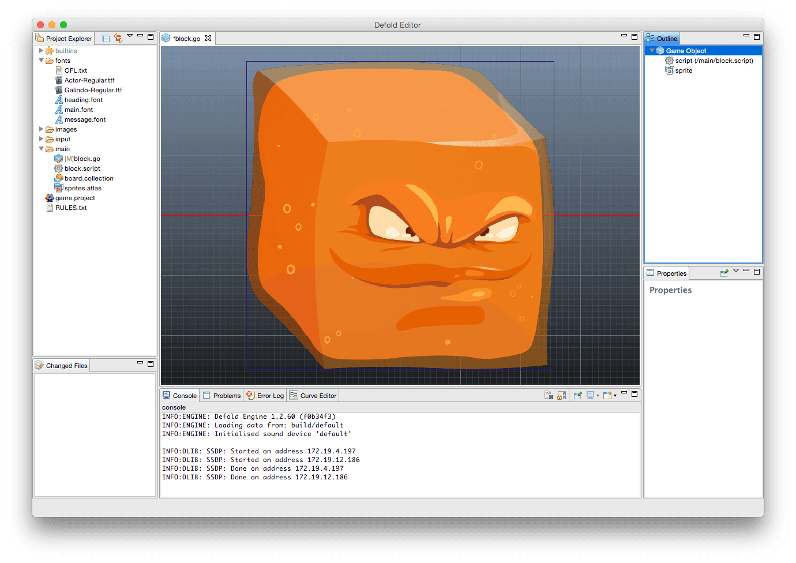

```lua
-- block.script
go.property("color", hash("none"))

function init(self)
    go.set_scale(0.18)        -- 渲染缩小

    if self.color ~= nil then
        sprite.play_flipbook("#sprite", self.color)
    else
        msg.post("#sprite", "disable")
    end
end
```

将"blockfactory"工厂组件的*Prototype*设置为新的*block.go*游戏对象文件。

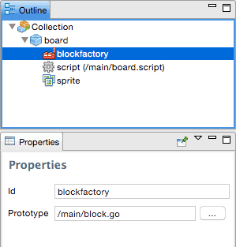

现在您应该能够运行游戏并看到填充了随机颜色方块的游戏板：

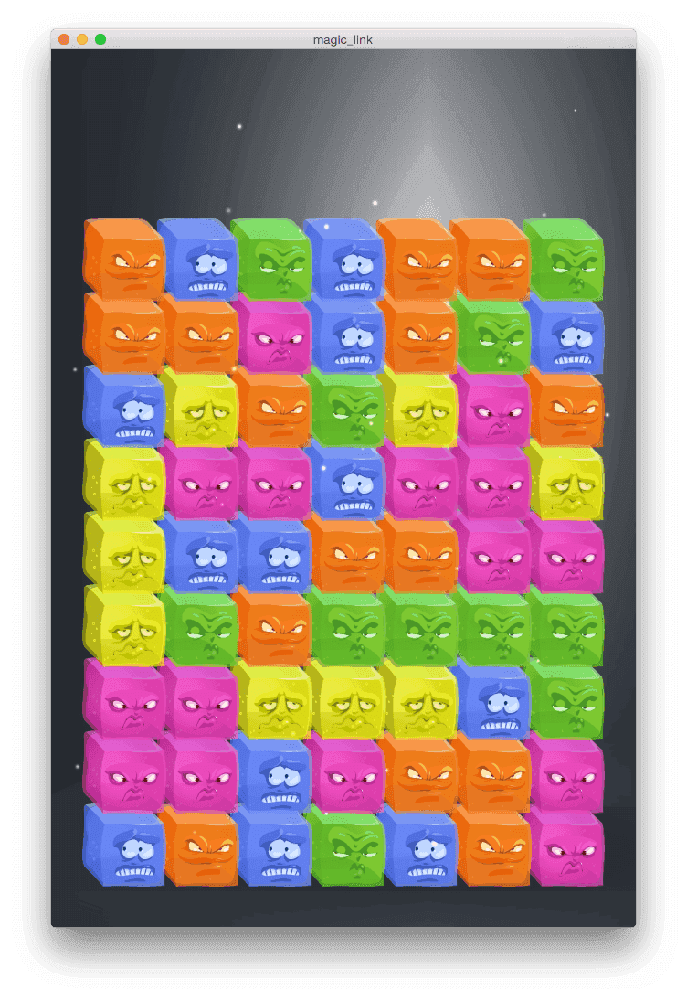

## 交互

现在我们有了一个游戏板，我们应该添加用户交互。首先，我们在*input*文件夹中的*game.input_binding*中定义输入绑定。确保*game.project*设置使用您的输入绑定文件。

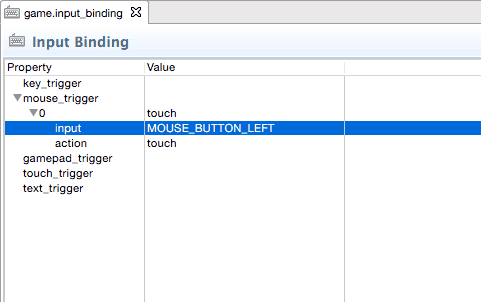

我们只需要一个绑定，我们将`MOUSE_BUTTON_LEFT`分配给动作名称"touch"。这个游戏不使用多点触摸，为了方便，Defold将单指触摸输入转换为鼠标左键点击。

处理输入的工作落在游戏板上，因此我们需要在*board.script*中添加代码：

```lua
-- board.script
function on_input(self, action_id, action)
    if action_id == hash("touch") and action.value == 1 then
        -- 触摸或拖动了哪个方块？
        local x = math.floor((action.x - edge) / blocksize)
        local y = math.floor((action.y - bottom_edge) / blocksize)

        if x < 0 or x >= boardwidth or y < 0 or y >= boardheight or self.board[x][y] == nil then
            -- 在游戏板外。
            return
        end

        if action.pressed then
            -- 玩家开始触摸
            msg.post(self.board[x][y].id, "make_orange")

            self.dragging = true
        elseif self.dragging then
            -- 然后拖动
            msg.post(self.board[x][y].id, "make_green")
        end
    elseif action_id == hash("touch") and action.released then
        -- 玩家释放触摸。
        self.dragging = false
    end
end
```

消息`make_orange`和`make_green`只是临时的，以获得代码工作的视觉反馈。我们需要在*block.script*中添加代码来处理这些消息：

```lua
-- block.script
function on_message(self, message_id, message, sender)
    if message_id == hash("make_orange") then
        sprite.play_flipbook("#sprite", hash("orange"))
    elseif message_id == hash("make_green") then
        sprite.play_flipbook("#sprite", hash("green"))
    end
end
```

现在，方块将首先被喷上一个`make_orange`消息，然后只要您触摸（或鼠标按下）就会喷上`make_green`消息，所以方块很可能在变绿之前只会闪烁橙色（如果有的话）。但我们确实知道玩家触摸了哪个方块！如果您想更详细地跟踪输入的处理方式，请在代码中插入`print()`或`pprint()`调用。

## 标记链接

现在我们需要用于标记的资产，用于指示方块何时被玩家链接。我们的想法是简单地在每个方块上覆盖一个图形，以显示它已被链接。

我们需要创建一个"connector"游戏对象，它包含连接器精灵图像以及"board"游戏对象中的"connector factory"工厂组件：

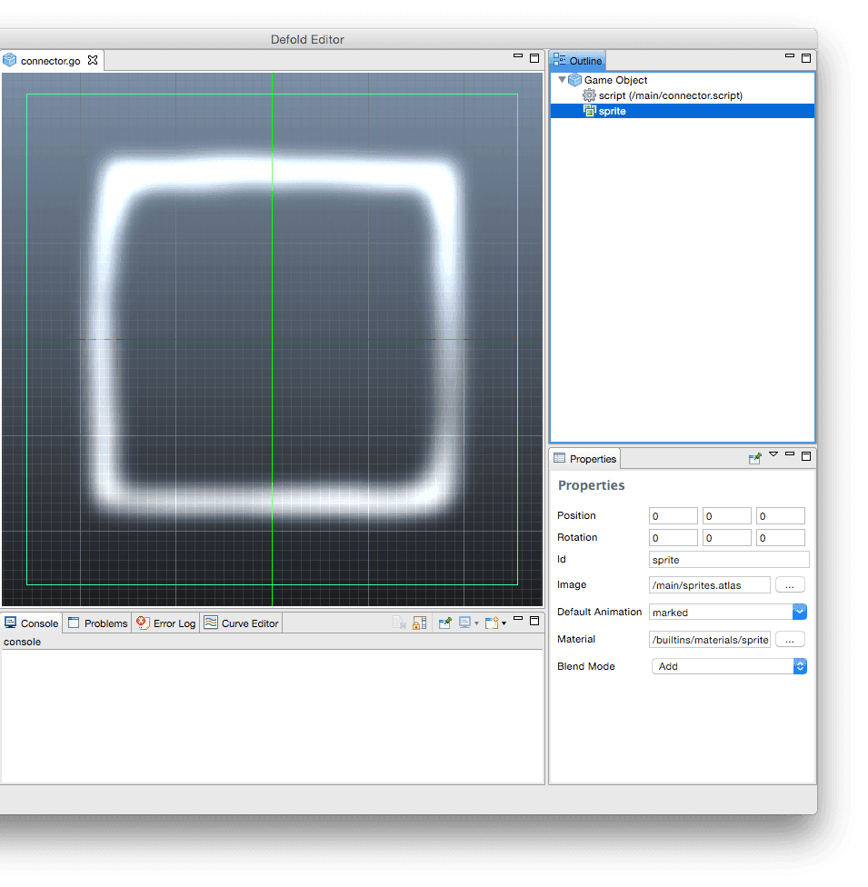

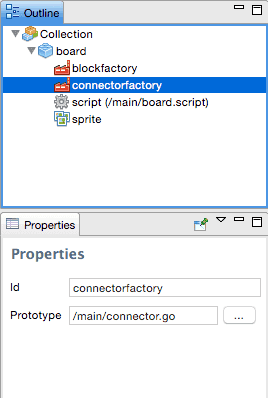

这个游戏对象的脚本很小，它只需要缩放图形使其与游戏的其余部分匹配，并正确设置Z顺序。

```lua
-- connector.script
function init(self)
    go.set_scale(0.18)              -- 设置此游戏对象的比例。
    go.set(".", "position.z", 1)    -- 放在顶部。
end
```

函数`same_color_neighbors()`返回与特定方块（位置x, y）相邻且颜色相同的方块列表。此函数使用应用于`self.blocks`中完整扁平方块列表的`filter()`函数。

```lua
-- board.script
--
-- 返回与x, y处方块颜色相同的相邻方块列表
--
local function same_color_neighbors(self, x, y)
    local f = function (v)
        return (v.id ~= self.board[x][y].id) and
               (v.x == x or v.x == x - 1 or v.x == x + 1) and
               (v.y == y or v.y == y - 1 or v.y == y + 1) and
               (v.color == self.board[x][y].color)
    end
    return filter(f, self.blocks)
end
```

一个辅助函数`in_blocklist()`检查方块是否存在于方块列表中：

```lua
-- board.script
--
-- 方块是否存在于方块列表中？
--
local function in_blocklist(blocks, block)
    for i, b in pairs(blocks) do
        if b.id == block then
            return true
        end
    end
    return false
end
```

我们在`on_input()`中的触摸和拖动输入期间使用这些函数来构建触摸的方块链接。我们在这里测试并忽略魔法方块，即使还没有任何魔法方块：

```lua
-- board.script
function on_input(self, action_id, action)

    ...

    -- 如果试图操纵魔法方块，请忽略。
    if self.board[x][y].color == hash("magic") then
        return
    end

    if action.pressed then
        -- 与触摸方块相同颜色的邻居列表
        self.neighbors = same_color_neighbors(self, x, y)
        self.chain = {}
        table.insert(self.chain, self.board[x][y])

        -- 标记方块。
        p = go.get_position(self.board[x][y].id)
        local id = factory.create("#connectorfactory", p + centeroff)
        table.insert(self.connectors, id)

        self.dragging = true
    elseif self.dragging then
        -- 然后拖动
        if in_blocklist(self.neighbors, self.board[x][y].id) and not in_blocklist(self.chain, self.board[x][y].id) then
            -- 拖过相同颜色的邻居
            table.insert(self.chain, self.board[x][y])
            self.neighbors = same_color_neighbors(self, x, y)

            -- 标记方块。
            p = go.get_position(self.board[x][y].id)
            local id = factory.create("#connectorfactory", p + centeroff)
            table.insert(self.connectors, id)
        end
    end
```

最后，在触摸释放时，视觉上移除所有链接连接器。

```lua
-- board.script
function on_input(self, action_id, action)

    ...

    elseif action_id == hash("touch") and action.released then
        -- 玩家释放触摸。
        self.dragging = false

        -- 清空连接器图形链。
        for i, c in ipairs(self.connectors) do
            go.delete(c)
        end
        self.connectors = {}
    end
end
```

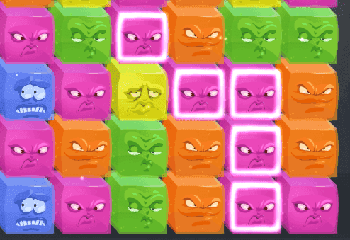

## 移除链接的方块

现在我们已经有了允许链接相同颜色方块的逻辑，简单地移除链接的方块很容易。我们将游戏板上的位置设置为`hash("removing")`而不仅仅是`nil`的原因是，稍后当我们执行魔法方块逻辑时，我们需要确保魔法方块只滑动到新移除的方块中。如果我们将游戏板上的位置设置为`nil`，我们就无法区分新移除的方块和之前移除的方块。

```lua
-- board.script
-- 移除当前选定的方块链
--
local function remove_chain(self)
    -- 删除所有链接的方块
    for i, c in ipairs(self.chain) do
        self.board[c.x][c.y] = hash("removing")
        go.delete(c.id)
    end
    self.chain = {}
end
```

我们还需要一个函数来实际移除（设置为 `nil`）游戏板上已设置为 `hash("removing")` 的位置：

```lua
-- board.script
--
-- 将移除的方块设置为 nil
--
local function nilremoved(self)
    for y = 0,boardheight - 1 do
        for x = 0,boardwidth - 1 do
            if self.board[x][y] == hash("removing") then
                self.board[x][y] = nil
            end
        end
    end
end
```

我们还创建一个函数，当它们下方的方块被移除（设置为 `nil`）时，将剩余的方块向下滑动。我们从左到右逐列遍历游戏板，并从下到上遍历每一列。如果我们遇到一个空的（`nil`）位置，将该位置上方的所有方块向下滑动。

```lua
-- board.script
--
-- 对所有方块应用向下移动逻辑。
--
local function slide_board(self)
    -- 将所有剩余的方块向下滑动到空白处。
    -- 逐列进行使这变得容易。
    local dy = 0
    local pos = vmath.vector3()
    for x = 0,boardwidth - 1 do
        dy = 0
        for y = 0,boardheight - 1 do
            if self.board[x][y] ~= nil then
                if dy > 0 then
                    -- 向下移动 dy 步
                    self.board[x][y - dy] = self.board[x][y]
                    self.board[x][y] = nil
                    -- 计算新位置
                    self.board[x][y - dy].y = self.board[x][y - dy].y - dy
                    go.animate(self.board[x][y-dy].id, "position.y", go.PLAYBACK_ONCE_FORWARD, bottom_edge + blocksize / 2 + blocksize * (y - dy), go.EASING_OUTBOUNCE, 0.3)
                    -- 计算新的 z
                    go.set(self.board[x][y-dy].id, "position.z", x * -0.1 + (y-dy) * 0.01)
                end
            else
                dy = dy + 1
            end
        end
    end
    -- blocklist 需要更新
    build_blocklist(self)
end
```

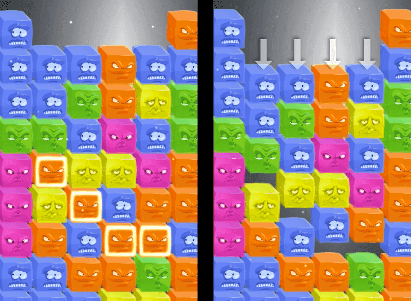

现在我们可以在 `on_input()` 中简单地添加对这些函数的调用，当触摸被释放并且 `self.chain` 中有方块时。

```lua
-- board.script
function on_input(self, action_id, action)

    ...

    elseif action_id == hash("touch") and action.released then
        -- 玩家释放触摸。
        self.dragging = false

        if #self.chain > 1 then
            -- 有一串方块。从游戏板上移除它并将剩余的方块向下滑动。
            remove_chain(self)
            nilremoved(self)
            slide_board(self)
        end

        -- 清空连接器图形链。
        for i, c in ipairs(self.connectors) do
            go.delete(c)
        end
        self.connectors = {}
    end
```

## 魔法方块逻辑

现在是时候将魔法方块添加到混合中。首先，让我们为方块添加成为魔法方块的能力。这样我们就可以在填充的游戏板上做一个单独的路径，并将我们想要的方块转换成魔法方块。为了让魔法方块更有趣一点，让我们先创建一个动画魔法效果，以游戏对象 *`magic_fx.go`* 的形式，我们可以从魔法方块中生成它。

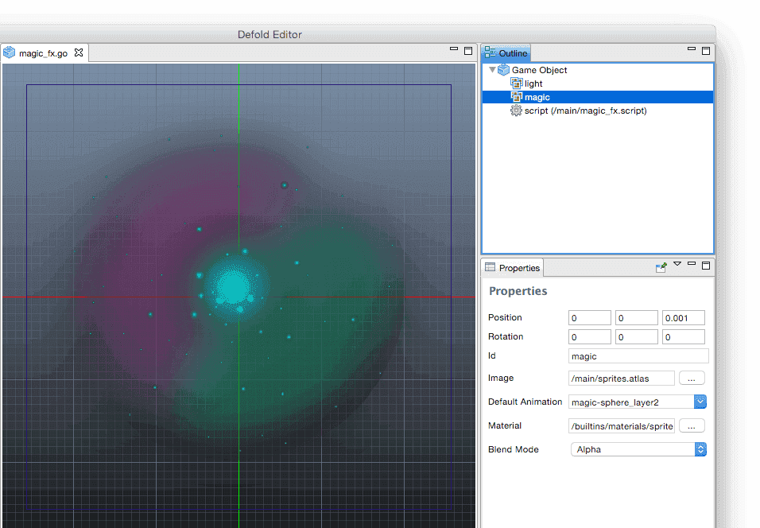

这个游戏对象包含两个精灵。一个是 "magic" 颜色（使用 *`magic-sphere_layer2.png`* 图像的精灵），另一个是 "light" 效果（使用 *`magic-sphere_layer3.png`* 图像的精灵）。对象设置为在对象生成时旋转，取决于属性 `direction` 的值。我们还使对象监听两个消息：`lights_on` 和 `lights_off`，它们控制光效精灵。

创建一个新脚本并将其作为脚本组件添加到 *`magic_fx.go`*：

```lua
-- magic_fx.script
go.property("direction", hash("left"))

function init(self)
    msg.post("#", "lights_off")
    if self.direction == hash("left") then
        go.set(".", "euler.z", 0)
        go.animate(".", "euler.z", go.PLAYBACK_LOOP_FORWARD, 360,  go.EASING_LINEAR, 3 + math.random())
    else
        go.set(".", "euler.z", 0)
        go.animate(".", "euler.z", go.PLAYBACK_LOOP_FORWARD, -360,  go.EASING_LINEAR, 2 + math.random())
    end
end

function on_message(self, message_id, message, sender)
    if message_id == hash("lights_on") then
        msg.post("#light", "enable")
    elseif message_id == hash("lights_off") then
        msg.post("#light", "disable")
    end
end
```

现在，魔法方块将在消息 `make_magic` 时生成两个 `magic_fx` 游戏对象。每个将以相反方向旋转，在方块内创建一个漂亮的颜色舞蹈。我们还在 *`block.go`* 中添加一个额外的精灵，使用图像 *`magic-sphere_layer4.png`*。这个图像放在比生成效果更高的 Z 上，并绘制魔法球的外壳或 "盖子"。

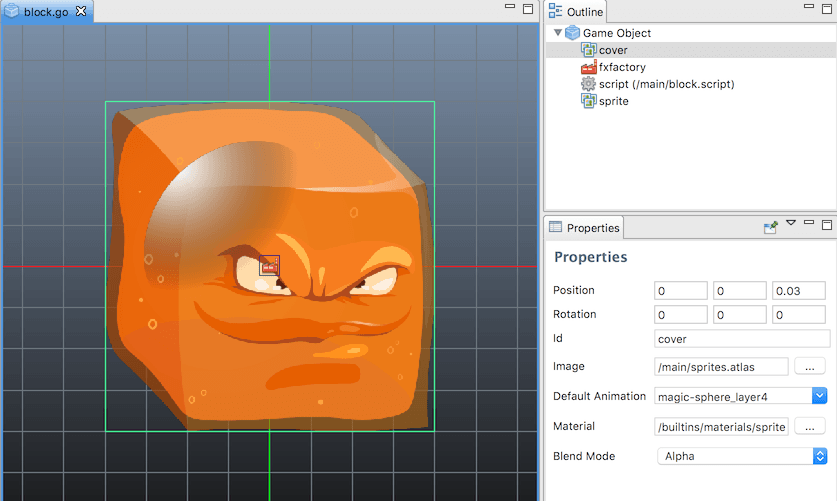

请注意，我们必须向方块游戏对象添加一个 *Factory* 组件，并告诉它使用我们的 *`magic_fx.go`* 游戏对象作为 *Prototype*。方块脚本还需要监听消息 `lights_on` 和 `lights_off` 并将它们传播到生成的对象。请注意，生成的对象在方块被删除时需要被删除。这在方块的 `final()` 函数中得到处理。所有这些都发生在 *`block.script`* 中。

```lua
-- block.script
function init(self)
    go.set_scale(0.18) -- 渲染缩小

    self.fx1 = nil
    self.fx2 = nil

    msg.post("#cover", "disable")

    if self.color ~= nil then
        sprite.play_flipbook("#sprite", self.color)
    else
        msg.post("#sprite", "disable")
    end
end

function final(self)
    if self.fx1 ~= nil then
        go.delete(self.fx1)
    end

    if self.fx2 ~= nil then
        go.delete(self.fx2)
    end
end

function on_message(self, message_id, message, sender)
    if message_id == hash("make_magic") then
        self.color = hash("magic")
        msg.post("#cover", "enable")
        msg.post("#sprite", "enable")
        sprite.play_flipbook("#sprite", hash("magic-sphere_layer1"))

        self.fx1 = factory.create("#fxfactory", p, nil, { direction = hash("left") })
        self.fx2 = factory.create("#fxfactory", p, nil, { direction = hash("right") })

        go.set_parent(self.fx1, go.get_id())
        go.set_parent(self.fx2, go.get_id())

        go.set(self.fx1, "position.z", 0.01)
        go.set(self.fx1, "scale", 1)
        go.set(self.fx2, "position.z", 0.02)
        go.set(self.fx2, "scale", 1)
    elseif message_id == hash("lights_on") or message_id == hash("lights_off") then
        msg.post(self.fx1, message_id)
        msg.post(self.fx2, message_id)
    end
end
```

```

现在我们能够制作魔法方块并点亮它们，我们将使用这个效果来指示魔法方块与另一个魔法方块相邻。

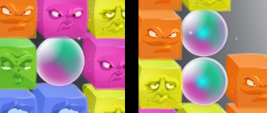

用方块填充游戏板的代码现在需要更改，以便我们在那里得到一些魔法方块：

```lua
-- board.script
local function build_board(self)

    ...

    -- 分配魔法方块。
    local rand_x = 0
    local rand_y
    for y = 0, boardheight - 1, boardheight / self.num_magic do
        local set = false
        while not set do
            rand_y = math.random(math.floor(y), math.min(boardheight - 1, math.floor(y + boardheight / self.num_magic)))
            rand_x = math.random(0, boardwidth - 1)
            if self.board[rand_x][rand_y].color ~= hash("magic") then
                msg.post(self.board[rand_x][rand_y].id, "make_magic")
                self.board[rand_x][rand_y].color = hash("magic")
                set = true
            end
        end
    end

    -- 构建可以轻松过滤的一维列表。
    build_blocklist(self)
end
```

魔法方块的主要机制是它们在另一个方块在它们旁边消失时能够横向滑动。我们在 *board.script* 的 `slide_magic_blocks()` 函数中反映了该机制的所有细节。算法很简单：

1. 对于游戏板上的每一行，创建一个魔法方块列表 `M`。
2. 遍历列表 `M` 中的每个魔法方块，直到它不缩小。对于每次迭代：
    1. 如果魔法方块下面有一个 `hash("removing")` 方块位置，只需将其从列表 `M` 中移除。
    2. 如果魔法方块侧面有一个标记为 `hash("removing")` 的孔，将其滑到那里，将其旧位置设置为 `hash("removing")`，然后将其从列表 `M` 中移除。

```lua
-- board.script
-- 将移动逻辑应用于魔法方块。仅滑动到标记为
-- hash("removing") 的移除位置
--
local function slide_magic_blocks(self)
    -- 首先将所有魔法方块滑动到应该滑动的侧面。
    -- 逐行进行效果最好！
    local row_m
    for y = 0,boardheight - 1 do
        row_m = {}
        -- 构建此行上的魔法方块列表。
        for x = 0,boardwidth - 1 do
            if self.board[x][y] ~= nil and self.board[x][y] ~= hash("removing") and self.board[x][y].color == hash("magic") then
                table.insert(row_m, self.board[x][y])
            end
        end

        local mc = #row_m + 1
        -- 遍历列表，如果可能则滑动并移除。重复直到列表不缩小。
        while #row_m < mc do
            mc = #row_m
            for i, m in pairs(row_m) do
                local x = m.x
                if y > 0 and self.board[x][y-1] == hash("removing") then
                    -- 下面有孔，什么都不做。
                    row_m[i] = nil
                elseif x > 0 and self.board[x-1][y] == hash("removing") then
                    -- 左边有孔！将魔法方块滑到那里
                    self.board[x-1][y] = self.board[x][y]
                    self.board[x-1][y].x = x - 1
                    go.animate(self.board[x][y].id, "position.x", go.PLAYBACK_ONCE_FORWARD, edge + blocksize / 2 + blocksize * (x - 1), go.EASING_OUTBOUNCE, 0.3)
                    -- 计算新的 z
                    go.set(self.board[x][y].id, "position.z", (x - 1) * -0.1 + y * 0.01)
                    self.board[x][y] = hash("removing") -- 稍后将被设置为 nil
                    row_m[i] = nil
                elseif x < boardwidth - 1 and self.board[x + 1][y] == hash("removing") then
                    -- 右边有孔。将魔法方块滑到那里
                    self.board[x+1][y] = self.board[x][y]
                    self.board[x+1][y].x = x + 1
                    go.animate(self.board[x+1][y].id, "position.x", go.PLAYBACK_ONCE_FORWARD, edge + blocksize / 2 + blocksize * (x + 1), go.EASING_OUTBOUNCE, 0.3)
                    -- 计算新的 z
                    go.set(self.board[x+1][y].id, "position.z", (x + 1) * -0.1 + y * 0.01)
                    self.board[x][y] = hash("removing") -- 稍后将被设置为 nil
                    row_m[i] = nil
                end
            end
        end
    end
end
```

我们可以通过在 `on_input()` 中添加对函数的调用来尝试这个机制：

```lua
-- board.script
function on_input(self, action_id, action)

    ...

    elseif action_id == hash("touch") and action.released then
        -- 玩家释放触摸。
        self.dragging = false

        if #self.chain > 1 then
            -- 有一串方块。从游戏板上移除它
            remove_chain(self)
            slide_magic_blocks(self)
            nilremoved(self)
            -- 将剩余的方块向下滑动。
            slide_board(self)
        end
        self.chain = {}
        -- 清空链会清除连接器图形。
        for i, c in ipairs(self.connectors) do
            go.delete(c)
        end
        self.connectors = {}
    end
```

现在我们清楚地看到了为什么在移除位置时使用了中间的 `hash("removing")` "标记"。没有它，魔法方块会来回滑动到侧面的任何空位置。也许是一个有趣的机制，但不是这个小游戏想要的机制。

现在我们需要逻辑来检测魔法方块是否连接（左、右、上或下彼此相邻），我们需要知道游戏板上的所有魔法方块是否都连接了。使用的算法非常简单：

1. 制作一个游戏板上所有魔法方块的列表 `M`。
2. 对于列表 `M` 中的每个方块：
    1. 如果方块没有设置 `region`，则为其分配区域编号 `R`（最初为 `1`）。
    2. 用相同的区域编号 `R` 标记方块的所有未标记邻居，并迭代到它们的邻居、邻居的邻居等等。
    3. 将区域编号 `R` 增加 `1`。

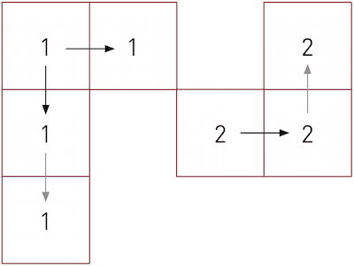

这是算法的实现：

```lua
-- board.script
--
-- 构建所有当前魔法方块的列表。
--
local function magic_blocks(self)
    local magic = {}
    for x = 0,boardwidth - 1 do
        for y = 0,boardheight - 1 do
            if self.board[x][y] ~= nil and self.board[x][y].color == hash("magic") then
                table.insert(magic, self.board[x][y])
            end
        end
    end
    return magic
end

--
-- 过滤出相邻的魔法方块
--
local function adjacent_magic_blocks(blocks, block)
    return filter(function (e)
        return (block.x == e.x and math.abs(block.y - e.y) == 1) or
            (block.y == e.y and math.abs(block.x - e.x) == 1)
    end, blocks)
end

--
-- 将区域传播到邻居
--
local function mark_neighbors(blocks, block, region)
    local neighbors = adjacent_magic_blocks(blocks, block)
    for i, m in pairs(neighbors) do
        if m.region == nil then
            m.region = region
            mark_neighbors(blocks, m, region)
        end
    end
end

--
-- 标记所有魔法方块区域
--
local function mark_magic_regions(self)
    local m_blocks = magic_blocks(self)
    -- 1. 清除所有区域标记并计算邻居
    for i, m in pairs(m_blocks) do
        m.region = nil
        local n = 0
        for _ in pairs(adjacent_magic_blocks(m_blocks, m)) do n = n + 1 end
        m.neighbors = n
    end

    -- 2. 分配区域并传播它们
    local region = 1
    for i, m in pairs(m_blocks) do
        if m.region == nil then
            m.region = region
            mark_neighbors(m_blocks, m, region)
            region = region + 1
        end
    end
    return m_blocks
end
```

我们还创建函数，允许我们计算魔法方块之间的区域数量。如果区域数量为 1，我们就知道所有魔法方块都已连接。此外，我们添加一个函数来关闭所有魔法方块中的灯光，以及一个函数来打开有邻居魔法方块的魔法方块中的光效：

```lua
-- board.script
--
-- 计算魔法方块之间连接区域的数量。
--
local function count_magic_regions(blocks)
    local maxr = 0
    for i, m in pairs(blocks) do
        if m.region > maxr then
            maxr = m.region
        end
    end
    return maxr
end

--
-- 关闭所有列出的魔法方块上的灯光
--
local function shutdown_lined_up_magic(self)
    for i, m in ipairs(self.lined_up_magic) do
        msg.post(m.id, "lights_off")
    end
end

--
-- 为所有魔法方块设置高亮
--
local function highlight_magic(blocks)
    for i, m in pairs(blocks) do
        if m.neighbors > 0 then
            msg.post(m.id, "lights_on")
        else
            msg.post(m.id, "lights_off")
        end
    end
end
```

现在我们可以将这些逻辑位插入到整体流程中。首先，由于游戏板生成是随机的，它有很小的几率会以获胜状态开始。如果发生这种情况，我们只需丢弃游戏板并重新构建它：

```lua
-- board.script
--
-- 清除游戏板
--
local function clear_board(self)
    for y = 0,boardheight - 1 do
        for x = 0,boardwidth - 1 do
            if self.board[x][y] ~= nil then
                go.delete(self.board[x][y].id)
                self.board[x][y] = nil
            end
        end
    end
end

local function build_board(self)

    ...

    -- 构建可以轻松过滤的一维列表。
    build_blocklist(self)

    local magic_blocks = mark_magic_regions(self)
    if count_magic_regions(magic_blocks) == 1 then
        -- 从开始就"获胜"。制作新的游戏板。
        clear_board(self)
        build_board(self)
    end
    highlight_magic(magic_blocks)
end
```

其余的逻辑适合 `on_input()`。仍然没有处理 `level_completed` 消息的代码，但现在没关系：

```lua
-- board.script
function on_input(self, action_id, action)

    ...

    elseif action_id == hash("touch") and action.released then
        -- 玩家释放触摸。
        self.dragging = false

        if #self.chain > 1 then
            -- 有一串方块。从游戏板上移除它并重新填充游戏板。
            remove_chain(self)
            slide_magic_blocks(self)
            nilremoved(self)
            -- 将剩余的方块向下滑动。
            slide_board(self)

            local magic_blocks = mark_magic_regions(self)
            -- 高亮相邻的魔法方块。
            if count_magic_regions(magic_blocks) == 1 then
                -- 获胜！
                msg.post("#", "level_completed")
            end
            highlight_magic(magic_blocks)
        end
        self.chain = {}
        -- 清空链会清除连接器图形。
        for i, c in ipairs(self.connectors) do
            go.delete(c)
        end
        self.connectors = {}
    end
```

现在可以玩游戏并达到获胜状态，即使当您链接所有魔法方块时还没有发生任何事情。

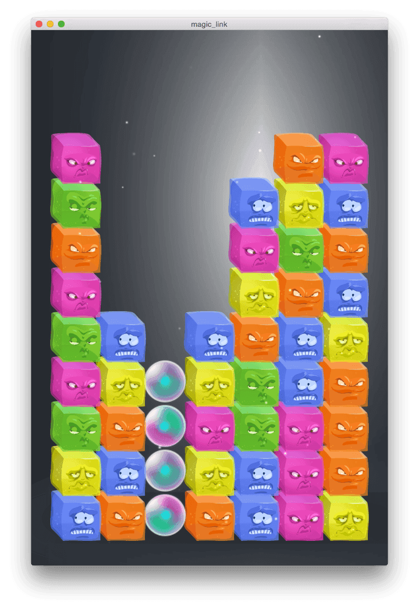

## 掉落

"掉落"的想法是添加一个简单的进度机制。玩家可以执行有限次数的"掉落"，只需按下 *DROP* 按钮即可将几个新的随机方块掉落到游戏板上。玩家开始时有一个掉落，每次清除关卡时，会奖励一个额外的掉落。掉落机制的代码适合两个函数。一个返回掉落可以结束的可能位置列表，另一个执行实际的掉落，包括动画和所有。

```lua
-- board.script
--
-- 找到掉落的位置。
--
local function dropspots(self)
    local spots = {}
    for x = 0, boardwidth - 1 do
        for y = 0, boardheight - 1 do
            if self.board[x][y] == nil then
                table.insert(spots, { x = x, y = y })
                break
            end
        end
    end
    -- 如果超过掉落数量，随机移除一个插槽直到掉落数量
    for c = 1, #spots - dropamount do
        table.remove(spots, math.random(#spots))
    end
    return spots
end

--
-- 执行掉落
--
local function drop(self, spots)
    for i, s in pairs(spots) do
        local pos = vmath.vector3()
        pos.x = edge + blocksize / 2 + blocksize * s.x
        pos.y = 1000
        c = colors[math.random(#colors)]    -- 选择随机颜色
        local id = factory.create("#blockfactory", pos, null, { color = c })
        go.animate(id, "position.y", go.PLAYBACK_ONCE_FORWARD, bottom_edge + blocksize / 2 + blocksize * s.y, go.EASING_OUTBOUNCE, 0.5)
        -- 计算新的 z
        go.set(id, "position.z", s.x * -0.1 + s.y * 0.01)

        self.board[s.x][s.y] = { id = id, color = c,  x = s.x, y = s.y }
    end

    -- 重新构建 blocklist
    build_blocklist(self)
end
```

我们可以通过在例如 `on_reload()` 中运行以下内容来测试掉落，或者将其绑定到临时输入操作：

```lua
s = dropspots(self)
if #s > 0 then
    -- 执行掉落
    drop(self, s)
end
```

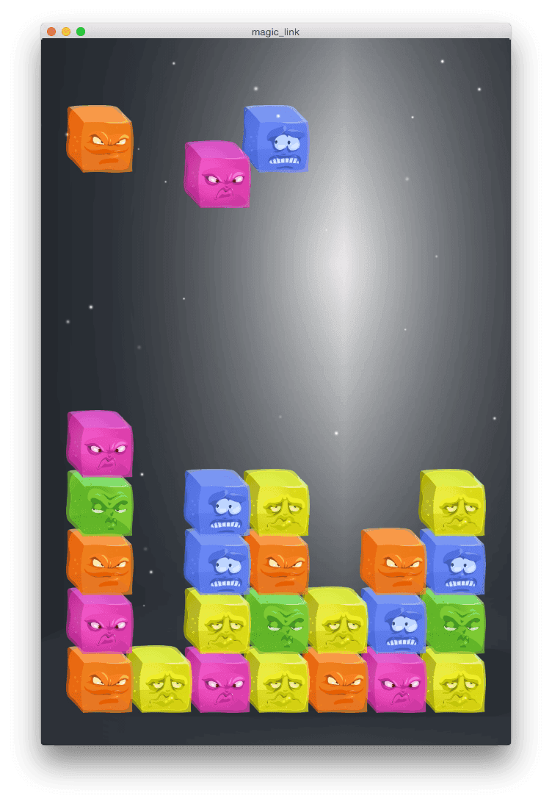

## 主菜单

现在是时候将所有东西放在一起了。首先，让我们创建一个开始屏幕并将其与游戏板分开。步骤 1 是创建一个 *main_menu.gui*，并使用一个 *Start* 按钮（一个文本节点和一个纹理框节点）、一个标题文本节点和一些装饰性方块（纹理框节点）来设置它。我们附加到 GUI 的脚本 *main_menu.gui_script* 在 `init()` 中为装饰性方块设置动画。它还包含一个 `on_input()`，将 `start_game` 消息发送到主脚本。我们将在一分钟内创建该脚本。

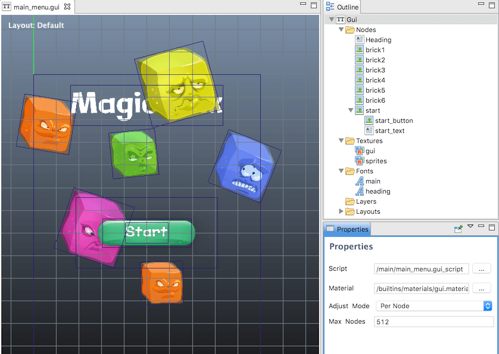

```lua
-- main_menu.gui_script
function init(self)
    msg.post(".", "acquire_input_focus")

    local bs = { "brick1", "brick2", "brick3", "brick4", "brick5", "brick6" }
    for i, b in ipairs(bs) do
        local n = gui.get_node(b)
        local rt = (math.random() * 3) + 1
        local a = math.random(-45, 45)
        gui.set_color(n, vmath.vector4(1, 1, 1, 0))

        gui.animate(n, "position.y", -100 - math.random(0, 50), gui.EASING_INSINE, 1 + rt, 0, nil, gui.PLAYBACK_LOOP_FORWARD)
        gui.animate(n, "color.w", 1, gui.EASING_INSINE, 1 + rt, 0, nil, gui.PLAYBACK_LOOP_FORWARD)
        gui.animate(n, "rotation.z", a, gui.EASING_INSINE, 1 + rt, 0, nil, gui.PLAYBACK_LOOP_FORWARD)
    end

    gui.animate(gui.get_node("start"), "color.x", 1, gui.EASING_INOUTSINE, 1, 0, nil, gui.PLAYBACK_LOOP_PINGPONG)
end

function on_input(self, action_id, action)
    if action_id == hash("touch") and action.pressed then
        local start = gui.get_node("start")

        if gui.pick_node(start, action.x, action.y) then
            msg.post("/main#script", "start_game")
        end
    end
end
```

由于启动游戏的工作很快将由主菜单脚本完成，请移除 *board.script* 中 `init()` 中的临时游戏板设置调用：

```lua
-- board.script
--
-- INIT
--
function init(self)
    self.board = {}                -- 包含游戏板结构
    self.blocks = {}            -- 所有方块的列表。用于在选择时轻松过滤。

    self.chain = {}                -- 当前选择链
    self.connectors = {}        -- 标记选择链的连接器元素
    self.num_magic = 3            -- 游戏板上魔法方块的数量

    self.drops = 1                -- 您可用的掉落数量

    self.magic_blocks = {}        -- 排列好的魔法方块

    self.dragging = false        -- 拖动触摸输入
end
```

主脚本将保持整体游戏状态并根据请求启动游戏。我们在这里要做的是让 *main.collection* 只包含启动时需要显示的最小数量的资产。我们通过让 *main.collection* 包含一个 "main" 游戏对象来实现这一点，该游戏对象包含主菜单 GUI、一个脚本组件，最重要的是一个 *Collection Proxy* 组件。

集合代理允许我们动态地将集合加载和卸载到运行的游戏中。它代表指定的集合文件，我们通过向代理发送消息来加载、初始化、启用、禁用和卸载动态集合。有关如何使用它们的完整描述，请参阅 [Collection Proxy 文档](/manuals/collection-proxy)。

在我们的情况下，我们将集合代理组件的 *Collection* 属性设置为包含 "level" 的 *board.collection*。

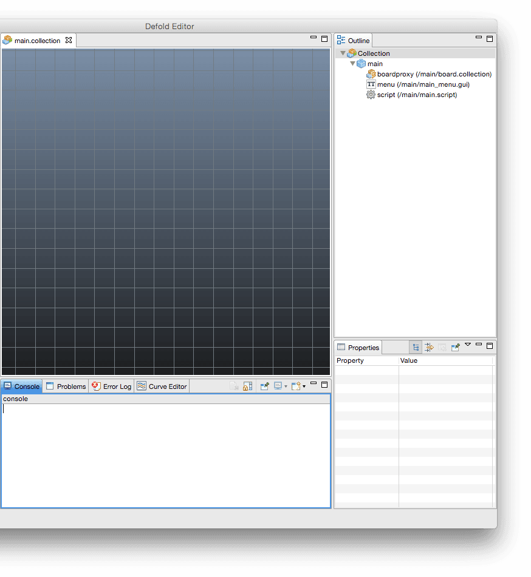

现在我们应该打开 *game.project* 并将引导 *main_collection* 更改为 `/main/main.collectionc`。

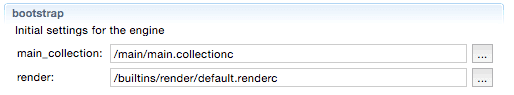

现在，启动游戏意味着向我们的集合代理发送消息以加载、初始化和启用游戏板，然后禁用主菜单（使其不显示）。回到主菜单则相反（假设代理已加载集合）：

```lua
-- main.script
function init(self)
    msg.post("#", "to_main_menu")
    self.state = "MAIN_MENU"
end

function on_message(self, message_id, message, sender)
    if message_id == hash("to_main_menu") then
        if self.state ~= "MAIN_MENU" then
            msg.post("#boardproxy", "unload")
        end
        msg.post("main:/main#menu", "enable") -- <1>
        self.state = "MAIN_MENU"
    elseif message_id == hash("start_game") then
        msg.post("#boardproxy", "load")
        msg.post("#menu", "disable")
    elseif message_id == hash("proxy_loaded") then
        -- 游戏板集合已加载...
        msg.post(sender, "init")
        msg.post("board:/board#script", "start_level", { difficulty = 1 }) -- <2>
        msg.post(sender, "enable")
        self.state = "GAME_RUNNING"
    end
end
```
1. 注意，我们调用套接字 "main"，这是我们需要确保在 *main.collection* 上设置的名称。选择根节点并检查 *Name* 属性是否为 "main"。
2. 类似地，我们通过集合的套接字（通过集合中的 *Name* 属性命名）向加载的集合发送消息。

## 游戏内 GUI

在向游戏板脚本添加最后一部分逻辑之前，我们应该向游戏板添加一组 GUI 元素。首先，在游戏板顶部，我们添加一个 *RESTART* 按钮和一个 *DROP* 按钮。

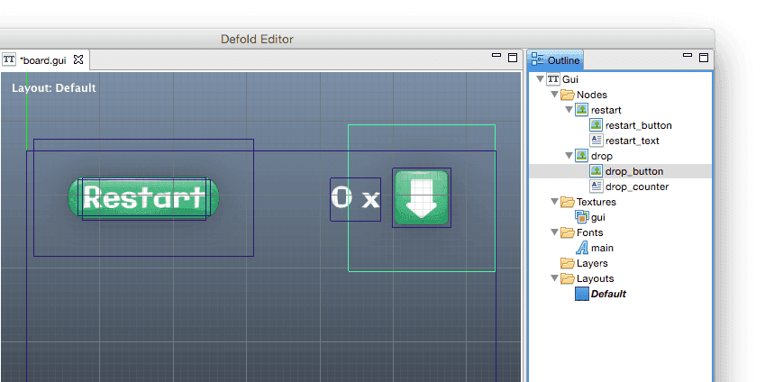

游戏板 GUI 的脚本在点击时向重启 GUI 对话元素发送消息，并在点击 *DROP* 时发送回游戏板脚本本身：

```lua
-- board.gui_script
function init(self)
    msg.post("#", "show")
    msg.post("/restart#gui", "hide")
    msg.post("/level_complete#gui", "hide")
end

function on_message(self, message_id, message, sender)
    if message_id == hash("hide") then
        msg.post("#", "disable")
    elseif message_id == hash("show") then
        msg.post("#", "enable")
    elseif message_id == hash("set_drop_counter") then
        local n = gui.get_node("drop_counter")
        gui.set_text(n, message.drops .. " x")
    end
end

function on_input(self, action_id, action)
    if action_id == hash("touch") and action.pressed then
        local restart = gui.get_node("restart")
        local drop = gui.get_node("drop")

        if gui.pick_node(restart, action.x, action.y) then
            -- 显示重启对话框。
            msg.post("/restart#gui", "show")
            msg.post("#", "hide")
        elseif gui.pick_node(drop, action.x, action.y) then
            msg.post("/board#script", "drop")
        end
    end
end
```

*RESTART* 对话框很简单。我们将其构建为 *restart.gui*，并附加一个简单的脚本，如果玩家点击 *NO* 则什么都不做，如果玩家点击 *YES* 则向游戏板脚本发送 `restart_level` 消息，如果玩家点击 *Quit to main menu* 则向主脚本发送 `to_main_menu` 消息：

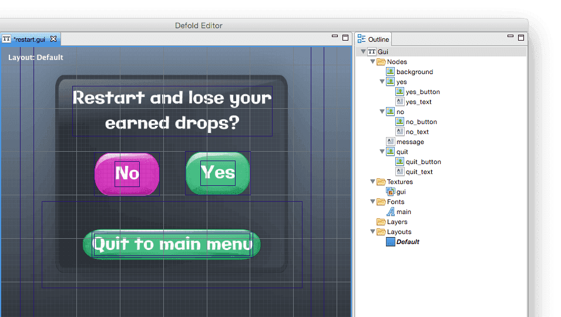

```lua
-- restart.gui_script
function on_message(self, message_id, message, sender)
    if message_id == hash("hide") then
        msg.post("#", "disable")
        msg.post(".", "release_input_focus")
    elseif message_id == hash("show") then
        msg.post("#", "enable")
        msg.post(".", "acquire_input_focus")
    end
end

function on_input(self, action_id, action)
    if action_id == hash("touch") and action.pressed then
        local yes = gui.get_node("yes")
        local no = gui.get_node("no")
        local quit = gui.get_node("quit")

        if gui.pick_node(no, action.x, action.y) then
            msg.post("#", "hide")
            msg.post("/board#gui", "show")
        elseif gui.pick_node(yes, action.x, action.y) then
            msg.post("board:/board#script", "restart_level")
            msg.post("/board#gui", "show")
            msg.post("#", "hide")
        elseif gui.pick_node(quit, action.x, action.y) then
            msg.post("main:/main#script", "to_main_menu")
            msg.post("#", "hide")
        end
    end
    -- 在我们消失之前消耗所有输入。
    return true
end
```

我们还在 *level_complete.gui* 中构建一个简单的关卡完成 GUI 对话框，带有一个简单的脚本，当玩家点击 *CONTINUE* 时向游戏板脚本发送 `next_level` 消息：

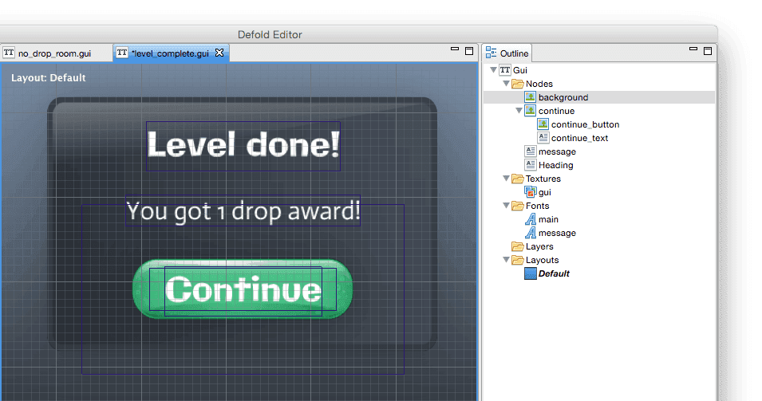

```lua
-- level_complete.gui_script
function init(self)
    msg.post("#", "hide")
end

function on_message(self, message_id, message, sender)
    if message_id == hash("hide") then
        msg.post("#", "disable")
        msg.post(".", "release_input_focus")
    elseif message_id == hash("show") then
        msg.post("#", "enable")
        msg.post(".", "acquire_input_focus")
    end
end

function on_input(self, action_id, action)
    if action_id == hash("touch") and action.pressed then
        local continue = gui.get_node("continue")

        if gui.pick_node(continue, action.x, action.y) then
            msg.post("board#script", "next_level")
            msg.post("#", "hide")
        end
    end
    -- 在我们消失之前消耗所有输入。
    return true
end
```

一个用于呈现当前关卡的对话框，脚本只包括隐藏和显示对话框。显示时，对话框消息设置为包含当前难度级别的消息：

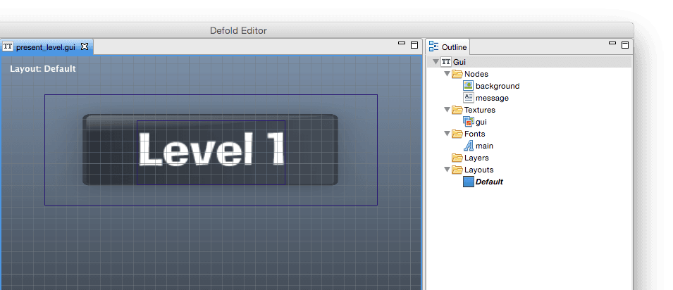

```lua
-- present_level.gui_script
function init(self)
    msg.post("#", "hide")
end

function on_message(self, message_id, message, sender)
    if message_id == hash("hide") then
        msg.post("#", "disable")
    elseif message_id == hash("show") then
        local n = gui.get_node("message")
        gui.set_text(n, "Level " .. message.level)
        msg.post("#", "enable")
    end
end
```

我们还添加一个对话框，显示当玩家尝试进行掉落但没有空间时的情况。

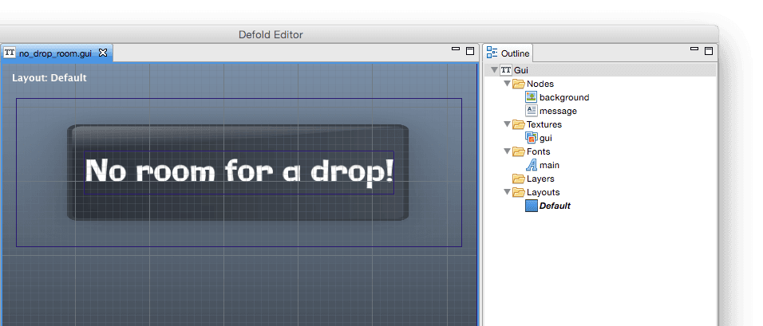

```lua
-- no_drop_room.gui_script
function init(self)
    msg.post("#", "hide")
    self.t = 0
end

function update(self, dt)
    if self.t < 0 then
        msg.post("#", "hide")
    else
        self.t = self.t - dt
    end
end

function on_message(self, message_id, message, sender)
    if message_id == hash("hide") then
        msg.post("#", "disable")
    elseif message_id == hash("show") then
        self.t = 1
        msg.post("#", "enable")
    end
end
```

最后，我们将这些 GUI 组件添加到 *board.collection* 并向 *board.script* 添加必要的代码：

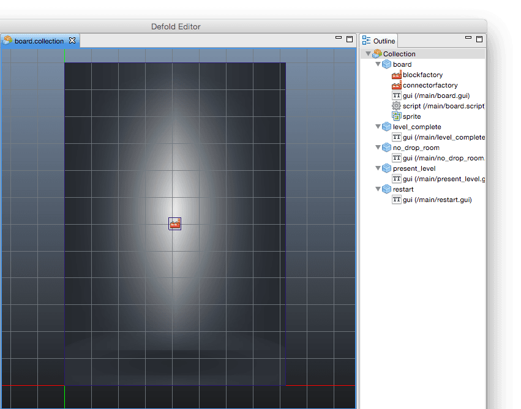

我们需要为 `on_message()` 中发送到游戏板和从游戏板发送的所有消息编写代码。

`start_level`
: 根据难度参数设置魔法方块的数量，构建游戏板，然后显示 "present_level" GUI 对话框 2 秒，然后开始游戏（移除对话框并获取输入焦点）。注意，我们使用 `go.animate()` 作为计时器，通过动画 "timer" 的值，该值不用于其他任何东西。

`restart_level`
: 当玩家按下并确认 *RESTART* GUI 按钮时会发生这种情况。清除并重建游戏板并重置掉落计数器。

`level_completed`
: 一旦游戏板处于获胜状态就发送。关闭输入，为魔法方块设置动画并显示 "level_complete" GUI 对话框。当玩家点击对话框中的 *CONTINUE* 按钮时，对话框将发回 `next_level` 消息。

`next_level`
: 收到此消息时，清除游戏板，增加掉落计数器并发送设置了下一个难度级别的 `start_level`。

`drop`
: 检查可以在哪里进行掉落。如果没有可能的位置，显示 "no_drop_room" GUI 对话框，否则执行掉落（如果玩家还有掉落），减少掉落计数器并更新计数器的视觉表示。

```lua
-- board.script
function on_message(self, message_id, message, sender)
    if message_id == hash("start_level") then
        self.num_magic = message.difficulty + 1
        build_board(self)

        msg.post("#gui", "set_drop_counter", { drops = self.drops } )

        msg.post("present_level#gui", "show", { level = message.difficulty } )
        -- 等待一些时间...
        go.animate("#", "timer", go.PLAYBACK_ONCE_FORWARD, 1, go.EASING_LINEAR, 2, 0, function ()
            msg.post("present_level#gui", "hide")
            msg.post(".", "acquire_input_focus")
        end)
    elseif message_id == hash("restart_level") then
        clear_board(self)
        build_board(self)
        self.drops = 1
        msg.post("#gui", "set_drop_counter", { drops = self.drops } )
        msg.post(".", "acquire_input_focus")
    elseif message_id == hash("level_completed") then
        -- 关闭输入
        msg.post(".", "release_input_focus")

        -- 为魔法设置动画！
        for i, m in ipairs(magic_blocks(self)) do
            go.set_scale(0.17, m.id)
            go.animate(m.id, "scale", go.PLAYBACK_LOOP_PINGPONG, 0.19, go.EASING_INSINE, 0.5, 0)
        end

        -- 显示完成屏幕
        msg.post("level_complete#gui", "show")
    elseif message_id == hash("next_level") then
        clear_board(self)
        self.drops = self.drops + 1
        -- 难度级别是魔法方块的数量 - 1
        msg.post("#", "start_level", { difficulty = self.num_magic })
    elseif message_id == hash("drop") then
        s = dropspots(self)
        if #s == 0 then
            -- 无法执行掉落
            msg.post("no_drop_room#gui", "show")
        elseif self.drops > 0 then
            -- 执行掉落
            drop(self, s)
            self.drops = self.drops - 1
            msg.post("#gui", "set_drop_counter", { drops = self.drops } )
        end
    end
end
```

好了！游戏和本教程现在完成了！去享受玩这个游戏吧！

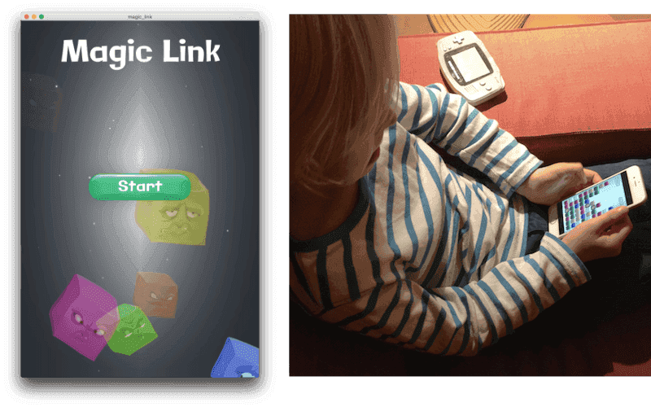

## 继续前进

这个小游戏有一些有趣的属性，鼓励您进行实验。以下是您可以通过做来更熟悉 Defold 的练习列表：

* 澄清交互。新玩家可能很难理解游戏如何工作以及她可以与什么交互。花一些时间使游戏更清晰，而不插入教程元素。
* 添加声音。游戏目前完全沉默，将受益于优美的音轨和交互声音。
* 自动检测游戏结束。
* 高分。添加持久的高分功能。
* 仅使用 GUI API 重新实现游戏。
* 目前，游戏通过为每个关卡增加添加一个魔法方块来继续。这不是永远可持续的。找到这个问题的满意解决方案。
* 优化游戏并通过重用精灵而不是删除和重新生成它们来降低最大精灵数量。
* 实现游戏的独立分辨率渲染，使其在不同分辨率和纵横比的屏幕上看起来同样好。