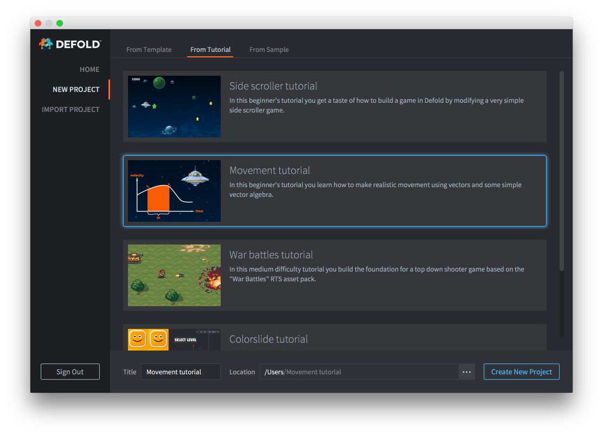

# Movement tutorial

In this beginner's tutorial you learn how to make realistic movement using vectors and some simple vector algebra.

The tutorial is integrated with the Defold editor and easily accessible:

1. Start Defold.
2. Select *New Project* on the left.
3. Select the *From Tutorial* tab.
4. Select the "Movement tutorial"
5. Select a location for the project on your local drive and click *Create New Project*.

{srcset="images/new-movement@2x.png 2x"}

The editor automatically opens the "README" file from the project root, containing the full tutorial text.

{.icon} [You can also read the full tutorial text on Github](https://github.com/defold/tutorial-movement)

If you get stuck, head over to the [Defold Forum](//forum.defold.com) where you will get help from the Defold team and many friendly users.

Happy Defolding!

