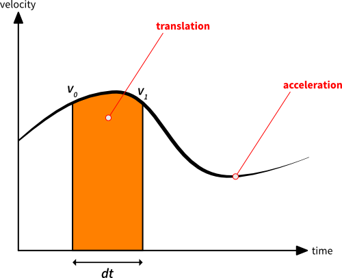
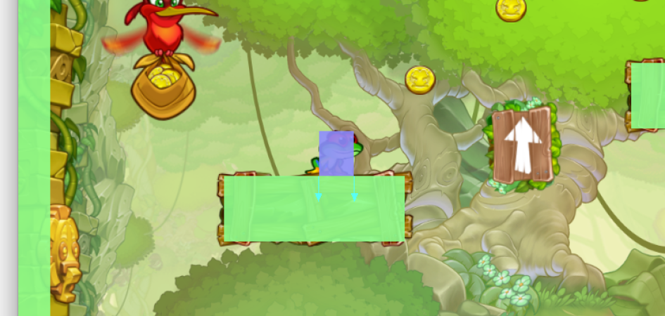
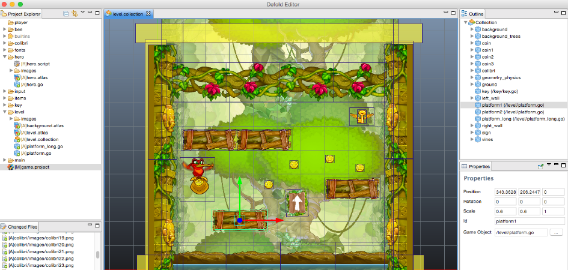
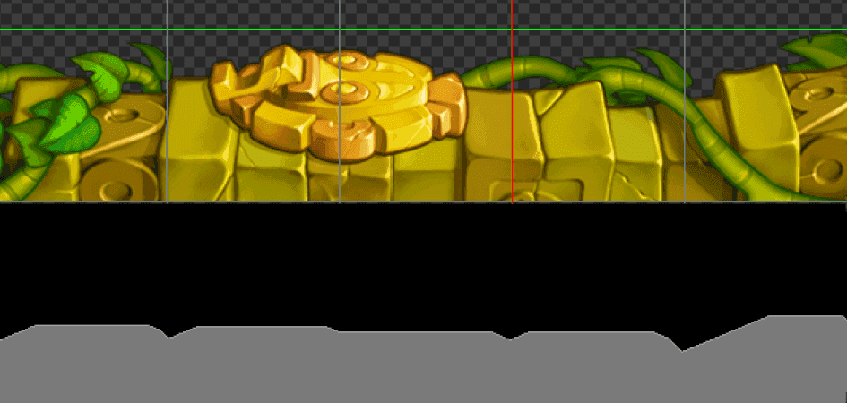

# 平台跳跃游戏

在本文中，我们将学习如何在 Defold 中实现一个基本的基于瓦片的 2D 平台跳跃游戏。我们将学习的机制包括左右移动、跳跃和下落。

创建平台跳跃游戏有许多不同的方法。Rodrigo Monteiro 已经对这个主题进行了详尽的分析，更多信息请点击[这里](http://higherorderfun.com/blog/2012/05/20/the-guide-to-implementing-2d-platformers/)。

如果你是平台跳跃游戏开发的新手，我们强烈建议你阅读这篇文章，因为它包含了许多有价值的信息。我们将更详细地介绍其中一些方法以及如何在 Defold 中实现它们。然而，所有内容都应该很容易移植到其他平台和语言（我们在 Defold 中使用 Lua）。

我们假设你熟悉一些向量数学（线性代数）。如果你不熟悉，建议你学习一下，因为它对游戏开发非常有用。Wolfire 的 David Rosen 写了一系列非常好的文章，点击[这里](http://blog.wolfire.com/2009/07/linear-algebra-for-game-developers-part-1/)可以查看。

如果你已经在使用 Defold，你可以基于 _Platformer_ 模板项目创建一个新项目，并在阅读本文时进行尝试。

::: sidenote
一些读者提到，我们建议的方法在 Box2D 的默认实现中是不可行的。我们对 Box2D 进行了一些修改以使其工作：

运动学对象和静态对象之间的碰撞被忽略。修改 `b2Body::ShouldCollide` 和 `b2ContactManager::Collide` 中的检查。

此外，接触距离（在 Box2D 中称为 separation）不会提供给回调函数。
在 `b2ManifoldPoint` 中添加一个距离成员，并确保在 `b2Collide*` 函数中更新它。
:::

## 碰撞检测

碰撞检测是为了防止玩家穿过关卡几何体。
根据你的游戏及其特定需求，有多种方法可以处理这个问题。
如果可能，最简单的方法之一是让物理引擎来处理它。
在 Defold 中，我们使用物理引擎 [Box2D](http://box2d.org/) 来处理 2D 游戏。
Box2D 的默认实现并不具备所有必需的功能，请参阅本文底部了解我们如何修改它。

物理引擎存储物理对象及其形状的状态，以模拟物理行为。它还会在模拟过程中报告碰撞，以便游戏可以做出反应。在大多数物理引擎中，有三种类型的对象：_静态_、_动态_ 和 _运动学_ 对象（这些名称在其他物理引擎中可能不同）。还有其他类型的对象，但现在让我们忽略它们。

- *静态* 对象永远不会移动（例如，关卡几何体）。
- *动态* 对象受力和扭矩的影响，这些力和扭矩在模拟过程中会转化为速度。
- *运动学* 对象由应用程序逻辑控制，但仍会影响其他动态对象。

在这样的游戏中，我们寻求的是类似于真实世界物理行为的效果，但响应灵敏的控制和平衡的机制远为重要。一个感觉良好的跳跃不需要物理准确或在真实世界重力下运行。[这个](http://hypertextbook.com/facts/2007/mariogravity.shtml) 分析表明，马里奥游戏中的重力在每个版本中都接近 9.8 m/s<sup>2</sup> 的重力。:-)

重要的是，我们必须完全控制正在发生的事情，以便我们可以设计和调整机制以实现预期的体验。这就是为什么我们选择使用运动学对象来建模玩家角色。然后我们可以随意移动玩家角色，而不必处理物理力。这意味着我们将必须自己解决角色和关卡几何体之间的分离问题（稍后会详细介绍），但这是我们愿意接受的缺点。我们将在物理世界中使用盒子形状来表示玩家角色。

## 移动

既然我们已经决定玩家角色将由运动学对象表示，我们可以通过设置位置自由移动它。让我们从左右移动开始。

移动将基于加速度，以给角色一种重量感。就像普通车辆一样，加速度定义了玩家角色能够达到最大速度和改变方向的速度。加速度在帧时间步长上起作用——通常在参数 `dt`（delta-`t`）中提供——然后添加到速度中。同样，速度在帧上起作用，结果平移添加到位置。在数学中，这被称为[时间积分](http://en.wikipedia.org/wiki/Integral)。



两条垂直线标记帧的开始和结束。线的高度是玩家角色在这两个时间点的速度。让我们称这些速度为 `v0` 和 `v1`。`v1` 是通过应用加速度（曲线的斜率）对于时间步长 `dt` 给出的：


橙色区域是我们应该在当前帧应用于玩家角色的平移。在几何上，我们可以将区域近似为：


这就是我们在更新循环中积分加速度和速度以移动角色的方式：

1. 根据输入确定目标速度
2. 计算我们当前速度与目标速度之间的差异
3. 设置加速度以在差异方向上起作用
4. 计算当前帧的速度变化（`dv` 是 delta-velocity 的缩写），如上所述：

    ```lua
    local dv = acceleration * dt
    ```

5. 检查 `dv` 是否超过预期的速度差异，如果是，则限制它
6. 保存当前速度以供以后使用（`self.velocity`，现在是前一帧使用的速度）：

    ```lua
    local v0 = self.velocity
    ```

7. 通过添加速度变化来计算新速度：

    ```lua
    self.velocity = self.velocity + dv
    ```

8. 通过积分速度计算当前帧的 x 平移，如上所述：

    ```lua
    local dx = (v0 + self.velocity) * dt * 0.5
    ```

9. 将其应用于玩家角色

如果你不确定如何在 Defold 中处理输入，有一篇关于这个的指南[这里](/manuals/input)。

在这个阶段，我们可以左右移动角色，并且控制具有重量感和平滑感。现在，让我们添加重力！

重力也是一种加速度，但它沿着 y 轴影响玩家。这意味着它将以与上述移动加速度相同的方式应用。如果我们只是将上述计算更改为向量，并确保在步骤 3 中将重力包含在加速度的 y 分量中，它就会起作用。必须喜欢向量数学！:-)

## 碰撞响应

现在我们的玩家角色可以移动和下落，所以是时候看看碰撞响应了。
我们显然需要着陆并沿着关卡几何体移动。我们将使用物理引擎提供的接触点，以确保我们永远不会与任何物体重叠。

接触点携带接触的_法线_（指向我们碰撞的对象外部，但在其他引擎中可能不同）以及_距离_，该距离测量我们穿透另一个物体的距离。这就是我们分离玩家和关卡几何体所需的全部内容。
由于我们使用的是盒子，我们可能会在一帧内获得多个接触点。例如，当盒子的两个角与水平地面相交时，或者玩家移动到角落时会发生这种情况。



为了避免多次进行相同的校正，我们在向量中累积校正，以确保我们不会过度补偿。这会使我们最终离碰撞的对象太远。在上图中，你可以看到我们目前有两个接触点，由两个箭头（法线）可视化。两个接触的穿透距离相同，如果我们每次都盲目使用它，我们最终会将玩家移动预期量的两倍。

::: sidenote
重要的是每帧将累积的校正重置为 0 向量。
在 `update()` 函数的末尾放置类似这样的内容：
`self.corrections = vmath.vector3()`
:::

假设有一个回调函数将为每个接触点调用，以下是在该函数中进行分离的方法：

```lua
local proj = vmath.dot(self.correction, normal) -- <1>
local comp = (distance - proj) * normal -- <2>
self.correction = self.correction + comp -- <3>
go.set_position(go.get_position() + comp) -- <4>
```

1. 将校正向量投影到接触法线上（对于第一个接触点，校正向量是 0 向量）
2. 计算我们需要为这个接触点进行的补偿
3. 将其添加到校正向量
4. 将补偿应用于玩家角色

我们还需要取消玩家速度中朝向接触点的部分：

```lua
proj = vmath.dot(self.velocity, message.normal) -- <1>
if proj < 0 then
    self.velocity = self.velocity - proj * message.normal -- <2>
end
```
1. 将速度投影到法线上
2. 如果投影为负，意味着部分速度指向接触点；在这种情况下，移除该分量

## 跳跃

既然我们可以在关卡几何体上奔跑和下落，现在是时候跳跃了！平台跳跃游戏的跳跃可以以多种不同的方式完成。在这个游戏中，我们的目标是类似于超级马里奥兄弟和超级肉肉男孩的游戏。当跳跃时，玩家角色通过一个冲力向上推动，这基本上是一个固定的速度。

重力会不断地将角色向下拉，形成一个漂亮的跳跃弧线。在空中时，玩家仍然可以控制角色。如果玩家在跳跃弧线达到峰值之前松开跳跃按钮，向上的速度会按比例缩小，以提前停止跳跃。

1. 当输入被按下时，执行：

    ```lua
    -- jump_takeoff_speed 是在其他地方定义的常量
    self.velocity.y = jump_takeoff_speed
    ```

    这应该只在输入被_按下_时执行，而不是在每帧持续_按住_时执行。

2. 当输入被释放时，执行：

    ```lua
    -- 如果我们仍然在向上移动，则缩短跳跃
    if self.velocity.y > 0 then
        -- 按比例缩小向上速度
        self.velocity.y = self.velocity.y * 0.5
    end
    ```

ExciteMike 为[超级马里奥兄弟 3](http://meyermike.com/wp/?p=175)和[超级肉肉男孩](http://meyermike.com/wp/?p=160)的跳跃弧线制作了一些不错的图表，值得一看。

## 关卡几何体

关卡几何体是玩家角色（可能还有其他东西）与之碰撞的环境的碰撞形状。在 Defold 中，有两种方法可以创建这种几何体。

要么在你构建的关卡之上创建单独的碰撞形状。这种方法非常灵活，允许精确定位图形。如果你想要柔和的斜坡，这特别有用。
游戏[时空幻境](http://braid-game.com/)使用了这种构建关卡的方法，本教程中的示例关卡也是使用这种方法构建的。以下是它在 Defold 编辑器中的外观：



另一种选择是用瓦片构建关卡，并让编辑器根据瓦片图形自动生成物理形状。这意味着当你更改关卡时，关卡几何体会自动更新，这非常有用。

放置的瓦片如果对齐，它们的物理形状会自动合并为一个。
这消除了当玩家在几个水平瓦片上滑动时可能使其停止或碰撞的间隙。这是通过在加载时用 Box2D 中的边缘形状替换瓦片多边形来完成的。



以上是一个示例，我们使用平台跳跃游戏图形的一部分创建了五个相邻的瓦片。在图像中，你可以看到放置的瓦片（顶部）如何对应于一个已经缝合在一起的单个形状（底部灰色轮廓）。

查看我们关于[物理](/manuals/physics)和[瓦片](/manuals/2dgraphics)的指南以获取更多信息。

## 最后的话

如果你想了解更多关于平台跳跃游戏机制的信息，这里有关于[索尼克](http://info.sonicretro.org/Sonic_Physics_Guide)物理的大量信息。

如果你在 iOS 设备或鼠标上尝试我们的模板项目，跳跃可能会感觉非常尴尬。
这只是我们使用单触输入进行平台跳跃游戏的微弱尝试。:-)

我们没有讨论在这个游戏中如何处理动画。你可以通过查看下面的 *player.script* 来了解，查找函数 `update_animations()`。

我们希望你觉得这些信息有用！
请制作一个很棒的平台跳跃游戏，让我们都能玩到！<3

## 代码

以下是 *player.script* 的内容：

```lua
-- player.script

-- 这些是机制的调整参数，随时可以更改以获得不同的感觉
-- 左右移动的加速度
local move_acceleration = 3500
-- 在空中时使用的加速度系数
local air_acceleration_factor = 0.8
-- 左右最大速度
local max_speed = 450
-- 将玩家向下拉的重力，以像素为单位
local gravity = -1000
-- 跳跃时的起跳速度，以像素为单位
local jump_takeoff_speed = 550
-- 双击必须发生的时间才能被视为跳跃（仅用于鼠标/触摸控制）
local touch_jump_timeout = 0.2

-- 预哈希 ID 提高性能
local msg_contact_point_response = hash("contact_point_response")
local msg_animation_done = hash("animation_done")
local group_obstacle = hash("obstacle")
local input_left = hash("left")
local input_right = hash("right")
local input_jump = hash("jump")
local input_touch = hash("touch")
local anim_run = hash("run")
local anim_idle = hash("idle")
local anim_jump = hash("jump")
local anim_fall = hash("fall")

function init(self)
    -- 这让我们可以在此脚本中处理输入
    msg.post(".", "acquire_input_focus")

    -- 初始玩家速度
    self.velocity = vmath.vector3(0, 0, 0)
    -- 用于跟踪碰撞和分离的支持变量
    self.correction = vmath.vector3()
    -- 玩家是否站在地面上
    self.ground_contact = false
    -- 移动输入，范围在 [-1,1]
    self.move_input = 0
    -- 当前正在播放的动画
    self.anim = nil
    -- 控制使用鼠标/触摸时的跳跃窗口的计时器
    self.touch_jump_timer = 0
end

local function play_animation(self, anim)
    -- 只播放尚未播放的动画
    if self.anim ~= anim then
        -- 告诉精灵播放动画
        sprite.play_flipbook("#sprite", anim)
        -- 记住正在播放的动画
        self.anim = anim
    end
end

local function update_animations(self)
    -- 确保玩家角色面向正确的方向
    sprite.set_hflip("#sprite", self.move_input < 0)
    -- 确保播放正确的动画
    if self.ground_contact then
        if self.velocity.x == 0 then
            play_animation(self, anim_idle)
        else
            play_animation(self, anim_run)
        end
    else
        if self.velocity.y > 0 then
            play_animation(self, anim_jump)
        else
            play_animation(self, anim_fall)
        end
    end
end

function update(self, dt)
    -- 根据输入确定目标速度
    local target_speed = self.move_input * max_speed
    -- 计算我们当前速度与目标速度之间的差异
    local speed_diff = target_speed - self.velocity.x
    -- 要在此帧上积分的完整加速度
    local acceleration = vmath.vector3(0, gravity, 0)
    if speed_diff ~= 0 then
        -- 设置加速度在差异方向上起作用
        if speed_diff < 0 then
            acceleration.x = -move_acceleration
        else
            acceleration.x = move_acceleration
        end
        -- 在空中时减少加速度，以提供较慢的感觉
        if not self.ground_contact then
            acceleration.x = air_acceleration_factor * acceleration.x
        end
    end
    -- 计算当前帧的速度变化（dv 是 delta-velocity 的缩写）
    local dv = acceleration * dt
    -- 检查 dv 是否超过预期的速度差异，如果是，则限制它
    if math.abs(dv.x) > math.abs(speed_diff) then
        dv.x = speed_diff
    end
    -- 保存当前速度以供以后使用
    -- (self.velocity，现在是前一帧使用的速度)
    local v0 = self.velocity
    -- 通过添加速度变化来计算新速度
    self.velocity = self.velocity + dv
    -- 通过积分速度计算当前帧的平移
    local dp = (v0 + self.velocity) * dt * 0.5
    -- 将其应用于玩家角色
    go.set_position(go.get_position() + dp)

    -- 更新跳跃计时器
    if self.touch_jump_timer > 0 then
        self.touch_jump_timer = self.touch_jump_timer - dt
    end

    update_animations(self)

    -- 重置易变状态
    self.correction = vmath.vector3()
    self.move_input = 0
    self.ground_contact = false

end

local function handle_obstacle_contact(self, normal, distance)
    -- 将校正向量投影到接触法线上
    -- (对于第一个接触点，校正向量是 0 向量)
    local proj = vmath.dot(self.correction, normal)
    -- 计算我们需要为这个接触点进行的补偿
    local comp = (distance - proj) * normal
    -- 将其添加到校正向量
    self.correction = self.correction + comp
    -- 将补偿应用于玩家角色
    go.set_position(go.get_position() + comp)
    -- 检查法线是否足够向上以考虑玩家站在地面上
    -- (0.7 大致等于与纯垂直方向 45 度的偏差)
    if normal.y > 0.7 then
        self.ground_contact = true
    end
    -- 将速度投影到法线上
    proj = vmath.dot(self.velocity, normal)
    -- 如果投影为负，意味着部分速度指向接触点
    if proj < 0 then
        -- 在这种情况下移除该分量
        self.velocity = self.velocity - proj * normal
    end
end

function on_message(self, message_id, message, sender)
    -- 检查我们是否收到了接触点消息
    if message_id == msg_contact_point_response then
        -- 检查对象是否是我们认为的障碍物
        if message.group == group_obstacle then
            handle_obstacle_contact(self, message.normal, message.distance)
        end
    end
end

local function jump(self)
    -- 只允许从地面跳跃
    -- (用计数器扩展以执行二段跳等操作)
    if self.ground_contact then
        -- 设置起跳速度
        self.velocity.y = jump_takeoff_speed
        -- 播放动画
        play_animation(self, anim_jump)
    end
end

local function abort_jump(self)
    -- 如果我们仍然在向上移动，则缩短跳跃
    if self.velocity.y > 0 then
        -- 按比例缩小向上速度
        self.velocity.y = self.velocity.y * 0.5
    end
end

function on_input(self, action_id, action)
    if action_id == input_left then
        self.move_input = -1
    elseif action_id == input_right then
        self.move_input = 1
    elseif action_id == input_jump then
        if action.pressed then
            jump(self)
        elseif action.released then
            abort_jump(self)
        end
    elseif action_id == input_touch then
        if action.pressed then
            -- 重置跳跃计时器
            self.touch_jump_timer = touch_jump_timeout
        elseif action.released and self.touch_jump_timer > 0 then
            -- 如果计时器仍在运行，则执行跳跃
            jump(self)
            self.touch_jump_timer = 0
        end
    end
end
```