# 无尽跑酷游戏教程

本教程将引导您创建一个简单的无尽跑酷游戏。游戏将包含一个不断向前奔跑的英雄角色，玩家需要控制角色跳跃避开障碍物。我们将使用Defold游戏引擎和Lua脚本语言来实现这个游戏。

如果您需要Lua编程入门，请查看我们的[Lua in Defold手册](/manuals/lua)。

如果您觉得本教程有点难以入门，请查看我们的[教程页面](//www.defold.com/tutorials)，其中有各种难度的教程选择。

如果您更喜欢观看视频教程，请查看[YouTube上的视频版本](https://www.youtube.com/playlist?list=PLXsXu5srjNlxtYPQ_YJQSxJG2AN9OVS5b)。

如果您在本教程或创建游戏时遇到困难，请不要犹豫，在[Defold论坛](//forum.defold.com)上向我们寻求帮助。在论坛中，您可以讨论Defold，向Defold团队寻求帮助，了解其他游戏开发者如何解决他们的问题，并找到新的灵感。立即开始吧。

> 下载本教程的资源[这里](https://github.com/defold/sample-runner/tree/main/def-runner)。

## STEP 1 - 安装与设置

第一步是[下载以下文件](https://github.com/defold/sample-runner/tree/main/def-runner)。

现在，如果您尚未下载并安装Defold编辑器，现在是时候这样做了：

:[install](../shared/install.md)

当编辑器安装并启动后，是时候创建一个新项目并准备就绪了。从"Empty Project"模板创建一个[新项目](/manuals/project-setup/#creating-a-new-project)。

::: sidenote
本教程使用Spine功能，该功能在Defold 1.2.188版本后已移至其自己的扩展。如果您使用的是较新版本，请将[Spine扩展](https://github.com/defold/extension-spine)添加到*game.project*的依赖项部分。
:::

## 编辑器

第一次启动编辑器时，编辑器是空白的，没有打开任何项目，所以从菜单中选择<kbd>Open Project</kbd>并选择您新创建的项目。系统还会提示您为项目创建一个"分支"。

现在，在*Assets pane*中，您将看到属于项目的所有文件。如果您双击"main/main.collection"文件，该文件将在中心的编辑器视图中打开：


编辑器由以下主要区域组成：

Assets pane
: 这是项目中所有文件的视图。不同的文件类型有不同的图标。双击文件可在该文件类型的指定编辑器中打开。特殊的只读文件夹*builtins*是所有项目共有的，包括有用的项目，如默认渲染脚本、字体、用于渲染各种组件的材料等。

Main Editor View
: 根据您编辑的文件类型，此视图将显示该类型的编辑器。最常用的是您在此处看到的场景编辑器。每个打开的文件都显示在单独的选项卡中。

Changed Files
: 包含自上次同步以来您在分支中所做的所有编辑的列表。因此，如果您在此窗格中看到任何内容，则表示您有尚未在服务器上的更改。您可以通过此视图打开纯文本diff并还原更改。

Outline
: 当前编辑文件的分层视图中的内容。您可以通过此视图添加、删除、修改和选择对象和组件。

Properties
: 当前选定对象或组件上设置的属性。

Console
: 运行游戏时，此视图捕获来自游戏引擎的输出（日志、错误、调试信息等），以及脚本中的任何自定义`print()`和`pprint()`调试消息。如果您的应用程序或游戏无法启动，控制台是首先要检查的地方。在控制台后面是一组显示错误信息的选项卡，以及一个用于构建粒子效果时使用的曲线编辑器。

## 运行游戏

"Empty"项目模板实际上是完全空的。尽管如此，请选择<kbd>Project ▸ Build</kbd>来构建项目并启动游戏。

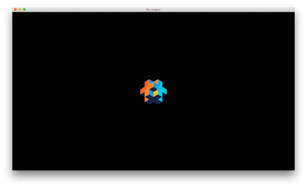

黑色屏幕可能不是很令人兴奋，但它是一个运行的Defold游戏应用程序，我们可以轻松地将其修改为更有趣的内容。那么让我们开始吧。

::: sidenote
Defold编辑器处理文件。通过双击*Assets pane*中的文件，您可以在适合的编辑器中打开它。然后您可以使用该文件的内容。

当您完成文件编辑后，您必须保存它。在主菜单中选择<kbd>File ▸ Save</kbd>。编辑器通过在包含未保存更改的任何文件的选项卡中的文件名后面添加星号'*'来提供提示。

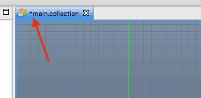
:::

## 项目配置

在开始之前，让我们为项目设置几个设置。从`Assets Pane`中打开*game.project*资产，并向下滚动到Display部分。将项目的`width`和`height`分别设置为`1280`和`720`。

您还需要将Spine扩展添加到项目中，以便我们可以为英雄角色制作动画。添加与您安装的Defold编辑器版本兼容的Spine扩展版本。可用的Spine版本可以在这里看到：

[https://github.com/defold/extension-spine/releases](https://github.com/defold/extension-spine/releases)

右键单击要使用的版本的zip文件的链接：


将发布链接添加到您的[game.project dependencies](/manuals/libraries/#setting-up-library-dependencies)列表中。添加Spine扩展后，您还需要重新启动编辑器以激活Spine扩展中包含的编辑器集成。

## STEP 2 - 创建地面

让我们迈出第一步，为我们的角色创建一个竞技场，或者更确切地说是一块滚动的地面。我们分几步完成这个任务。

1. 通过将"ground01.png"和"ground02.png"图像文件（来自资源包中的"level-images"子文件夹）拖到项目中的合适位置，例如"main"文件夹内的"images"文件夹，将图像资源导入项目中。
2. 创建一个新的*Atlas*文件来保存地面纹理（在*Assets pane*中右键单击合适的文件夹，例如*main*文件夹，然后选择<kbd>New ▸ Atlas File</kbd>）。将图集文件命名为*level.atlas*。

  ::: sidenote
  *Atlas*是一个将一组单独的图像合并为一个更大图像文件的文件。这样做的原因是为了节省空间并获得性能。您可以在[2D graphics documentation](/manuals/2dgraphics)中阅读更多关于Atlas和其他2D图形功能的信息。
  :::

3. 通过右键单击*Outline*中的图集根目录并选择<kbd>Add Images</kbd>，将地面图像添加到新图集中。选择导入的图像，然后单击*OK*。图集中的每个图像现在可以作为单帧动画（静态图像）访问，用于精灵、粒子效果和其他视觉元素。保存文件。

  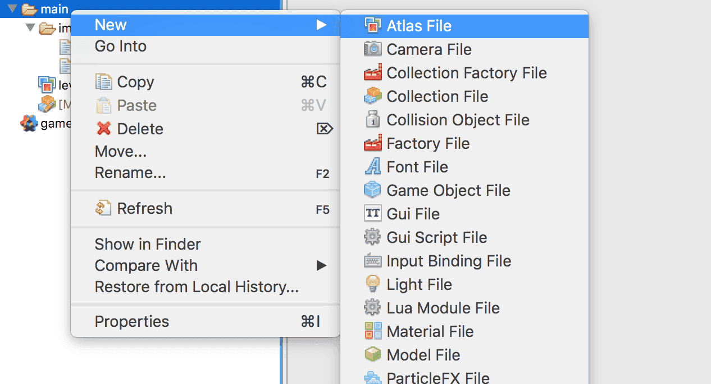

  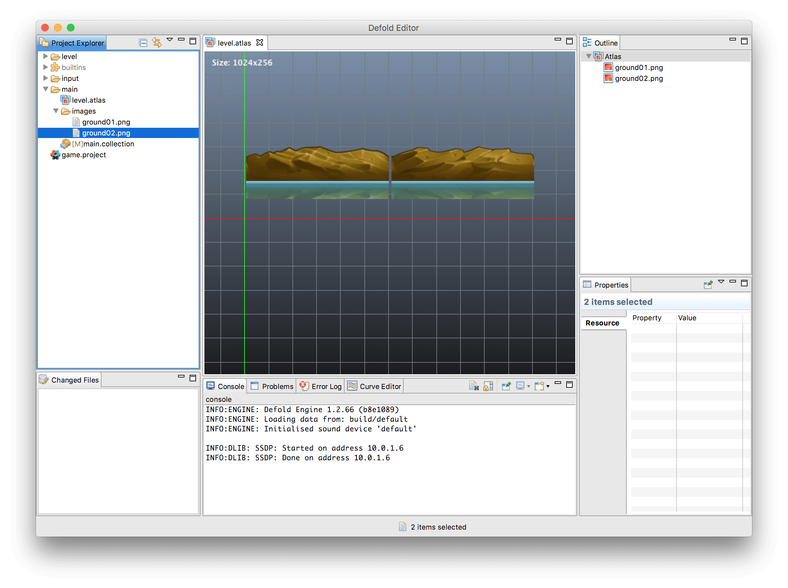

  ::: sidenote
  *为什么它不起作用！*人们在开始使用Defold时常遇到的一个问题是忘记保存！将图像添加到图集后，您需要保存文件才能访问该图像。
  :::

4. 为地面创建一个集合文件*ground.collection*，并向其中添加7个游戏对象（在*Outline*视图中右键单击集合的根目录，然后选择<kbd>Add Game Object</kbd>）。通过在*Properties*视图中更改*Id*属性，将对象命名为"ground0"、"ground1"、"ground2"等。请注意，Defold会自动为新游戏对象分配唯一ID。

5. 在每个对象中，添加一个精灵组件（在*Outline*视图中右键单击游戏对象，然后选择<kbd>Add Component</kbd>，然后选择*Sprite*并单击*OK*），将精灵组件的*Image*属性设置为您刚刚创建的图集，并将精灵的默认动画设置为两个地面图像之一。将_精灵组件_（不是游戏对象）的X位置设置为190，Y位置设置为40。由于图像的宽度为380像素，我们将其横向移动一半像素，游戏对象的枢轴将位于精灵图像的最左边缘。

  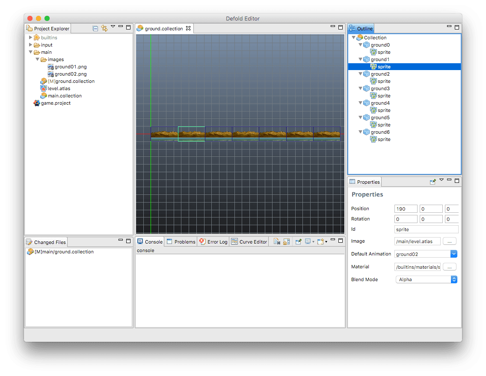

6. 我们使用的图形有点太大，所以将每个游戏对象缩放到60%（X和Y缩放0.6，结果为228像素宽的地面片段）。

  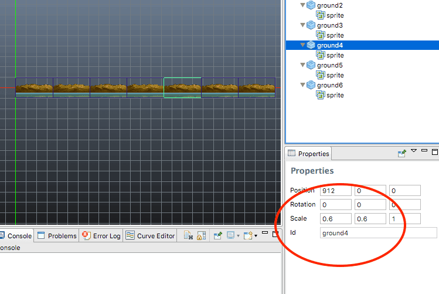

7. 将所有_游戏对象_排成一行。将_游戏对象_（不是精灵组件）的X位置设置为0、228、456、684、912、1140和1368（宽度228像素的倍数）。

  ::: sidenote
  创建一个完整的带有精灵组件的缩放游戏对象然后复制可能是最简单的。在*Outline*视图中标记它，然后选择<kbd>Edit ▸ Copy</kbd>，然后选择<kbd>Edit ▸ Paste</kbd>。

  值得注意的是，如果您想要更大或更小的瓦片，您只需更改缩放比例即可。但是，这样做还需要您将所有地面游戏对象的X位置更改为新宽度的倍数。
  :::

8. 保存文件，然后将*ground.collection*添加到*main.collection*文件中：首先双击*main.collection*文件，然后右键单击*Outline*视图中的根对象，然后选择<kbd>Add Collection From File</kbd>。在对话框中，选择*ground.collection*并单击*OK*。确保将*ground.collection*放置在位置0、0、0，否则它将在视觉上偏移。保存它。

9. 启动游戏（<kbd>Project ▸ Build</kbd>）以查看一切是否就位。

  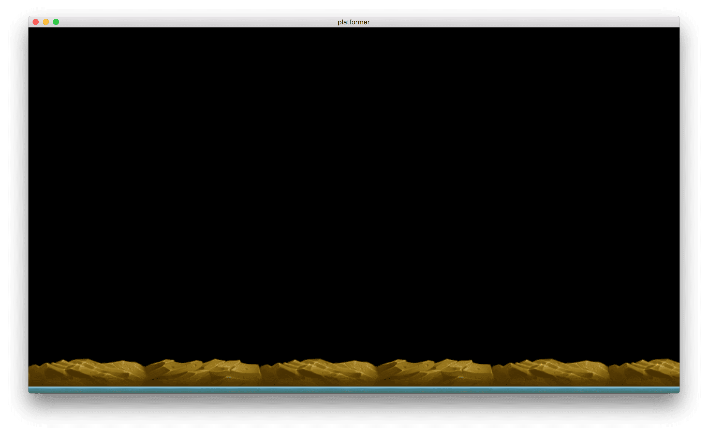

到现在为止，您可能会感到困惑，想知道我们创建的所有这些东西到底是什么，所以让我们花点时间看看任何Defold项目中最基本的构建块：

游戏对象
: 这些是存在于运行游戏中的事物。每个游戏对象在3D空间中都有一个位置、旋转和缩放。它不一定是可见的。游戏对象持有任意数量的_组件_，这些组件添加了如图形（精灵、瓦片地图、模型、脊椎模型和粒子效果）、声音、物理、生成（用于生成）等能力。Lua_脚本组件_也可以被添加，以赋予游戏对象行为。游戏中存在的每个游戏对象都有一个*id*，您需要通过消息传递来与它通信。

集合
: 集合本身在运行游戏中不存在，但用于启用游戏对象的静态命名，同时允许同一游戏对象的多个实例。实际上，集合用作游戏对象和其他集合的容器。您可以像使用原型（也称为其他引擎中的"prefabs"或"blueprints"）一样使用集合，用于复杂的游戏对象和集合层次结构。在启动时，引擎加载一个主集合，并为您放入其中的任何内容注入生命。默认情况下，这是项目中*main*文件夹中的*main.collection*文件，但您可以在项目设置中更改它。

目前，这些描述可能已经足够了。但是，可以在[Building blocks manual](/manuals/building-blocks)中找到对这些内容更全面的介绍。稍后访问该手册以获得对Defold工作原理的更深入理解是个好主意。

## STEP 3 - 使地面移动

现在我们已经将所有地面片段放置到位，让它们移动起来相当简单。思路是这样的：将片段从右向左移动，当一个片段到达屏幕最左边缘时，将其移动到最右位置。移动所有这些游戏对象需要一个Lua脚本，所以让我们创建一个：

1. 右键单击*Assets pane*中的*main*文件夹，然后选择<kbd>New ▸ Script File</kbd>。将新文件命名为*ground.script*。
2. 双击新文件以调出Lua脚本编辑器。
3. 删除文件的默认内容，将以下Lua代码复制到其中，然后保存文件。

```lua
-- ground.script
local pieces = { "ground0", "ground1", "ground2", "ground3",
                    "ground4", "ground5", "ground6" } -- <1>

function init(self) -- <2>
    self.speed = 360  -- Speed in pixels/s
end

function update(self, dt) -- <3>
    for i, p in ipairs(pieces) do -- <4>
        local pos = go.get_position(p)
        if pos.x <= -228 then -- <5>
            pos.x = 1368 + (pos.x + 228)
        end
        pos.x = pos.x - self.speed * dt -- <6>
        go.set_position(pos, p) -- <7>
    end
end
```
1. 将地面游戏对象的id存储在Lua表中，以便我们可以迭代它们。
2. `init()`函数在游戏对象在游戏中诞生时被调用。我们启动一个对象本地成员变量，其中包含地面的速度。
3. `update()`每帧调用一次，通常每秒60次。`dt`包含自上次调用以来的秒数。
4. 遍历所有地面游戏对象。
5. 将当前位置存储在局部变量中，然后如果当前对象在最左边缘，则将其移动到最右边缘。
6. 以设定的速度减少当前X位置。乘以`dt`以获得以像素/秒为单位的帧率独立速度。
7. 用新速度更新对象的位置。

::: sidenote
Defold是一个快速引擎核心，管理您的数据和游戏对象。您需要的任何逻辑或行为都是用Lua语言创建的。Lua是一种快速轻量级的编程语言，非常适合编写游戏逻辑。有很多资源可以学习这门语言，比如书[Programming in Lua](http://www.lua.org/pil/)和官方[Lua reference manual](http://www.lua.org/manual/5.3/)。

Defold在Lua之上添加了一组API，以及一个_消息传递_系统，允许您编程游戏对象之间的通信。有关其工作原理的详细信息，请参见[Message passing manual](/manuals/message-passing)。
:::

::: sidenote
您可以使用<F6>、<F7>和<F8>键分别切换编辑器的Assets Pane、Console和Outline部分
:::

现在我们有了一个脚本文件，我们应该在游戏对象的组件中添加对它的引用。这样，脚本将作为游戏对象生命周期的一部分执行。我们通过在*ground.collection*中创建一个新的游戏对象并向其中添加一个*Script*组件来引用我们刚刚创建的Lua脚本文件：

1. 右键单击集合的根目录，然后选择<kbd>Add Game Object</kbd>。将对象的*id*设置为"controller"。
2. 右键单击"controller"对象，然后选择<kbd>Add Component from file</kbd>，然后选择*ground.script*文件。

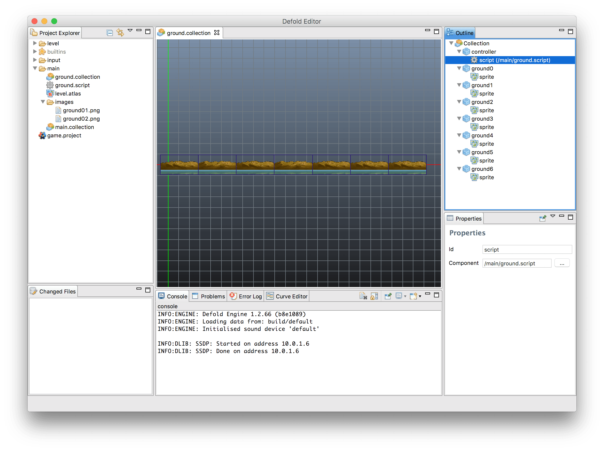

现在当您运行游戏时，"controller"游戏对象将在其*Script*组件中运行脚本，使地面在屏幕上平滑滚动。

## STEP 4 - 创建英雄角色

英雄角色将是一个包含以下组件的游戏对象：

*Spine Model*
: 这给了我们一个像纸娃娃一样的小英雄角色，其身体部位可以平滑（且廉价）地动画化。

*Collision Object*
: 这将检测英雄角色与关卡中它可以运行、危险或可以拾取的事物之间的碰撞。

*Script*
: 这获取用户输入并对其做出反应，使英雄角色跳跃、动画和处理碰撞。

首先导入身体部位图像，然后将它们添加到我们称为*hero.atlas*的新图集中：

1. 通过右键单击*Assets pane*并选择<kbd>New ▸ Folder</kbd>创建一个新文件夹。确保在单击之前不要选择文件夹，否则新文件夹将在标记的文件夹内创建。将文件夹命名为"hero"。
2. 通过右键单击*hero*文件夹并选择<kbd>New ▸ Atlas File</kbd>创建一个新的图集文件。将文件命名为*hero.atlas*。
3. 在*hero*文件夹中创建一个新的子文件夹*images*。右键单击*hero*文件夹并选择<kbd>New ▸ Folder</kbd>。
4. 将身体部位图像从资源包中的*hero-images*文件夹拖到您在*Assets pane*中刚刚创建的*images*文件夹中。
5. 打开*hero.atlas*，右键单击*Outline*中的根节点，然后选择<kbd>Add Images</kbd>。标记所有身体部位图像，然后单击*OK*。
6. 保存图集文件。

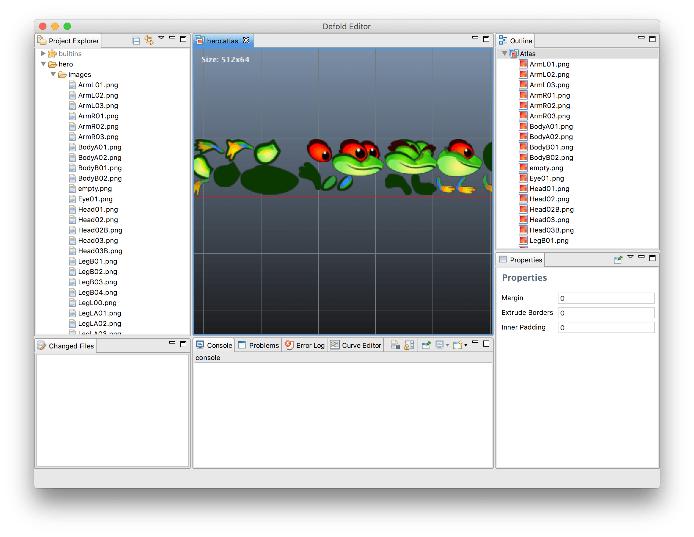

我们还需要导入Spine动画数据并为其设置*Spine Scene*：

1. 将文件*hero.spinejson*（包含在资源包中）拖到*Assets pane*中的*hero*文件夹中。
2. 创建一个*Spine Scene*文件。右键单击*hero*文件夹并选择<kbd>New ▸ Spine Scene File</kbd>。将文件命名为*hero.spinescene*。
3. 双击新文件以打开和编辑*Spine Scene*。
4. 将*spine_json*属性设置为导入的JSON文件*hero.spinejson*。单击该属性，然后单击文件选择器按钮*...*以打开资源浏览器。
5. 将*atlas*属性设置为引用*hero.atlas*文件。
6. 保存文件。

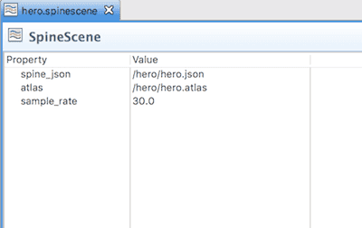

::: sidenote
文件*hero.spinejson*已以Spine JSON格式导出。您需要Spine动画软件才能创建此类文件。如果您想使用其他动画软件，可以将动画导出为精灵表，并将其用作*Tile Source*或*Atlas*资源中的翻书动画。有关更多信息，请参见[Animation](/manuals/animation)手册。
:::

### 构建游戏对象

现在我们可以开始构建英雄游戏对象：

1. 创建一个新文件*hero.go*（右键单击*hero*文件夹并选择<kbd>New ▸ Game Object File</kbd>）。
2. 打开游戏对象文件。
3. 向其中添加一个*Spine Model*组件。（右键单击*Outline*中的根目录，然后选择<kbd>Add Component</kbd>，然后选择"Spine Model"。）
4. 将组件的*Spine Scene*属性设置为您刚刚创建的文件*hero.spinescene*，并选择"run_right"作为默认动画（我们稍后会正确修复动画）
5. 保存文件。

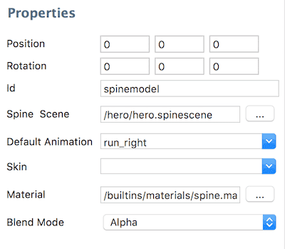

现在是时候添加物理碰撞功能了：

1. 向英雄游戏对象添加一个*Collision Object*组件。（右键单击*Outline*中的根目录，然后选择<kbd>Add Component</kbd>，然后选择"Collision Object"）
2. 右键单击新组件，然后选择<kbd>Add Shape</kbd>。添加两个形状以覆盖角色的身体。一个球体和一个盒子就可以了。
3. 单击形状，并使用*Move Tool*（<kbd>Scene ▸ Move Tool</kbd>）将形状移动到良好位置。
4. 标记*Collision Object*组件，并将*Type*属性设置为"Kinematic"。

::: sidenote
"Kinematic"碰撞意味着我们希望碰撞被注册，但物理引擎不会自动解决碰撞并模拟对象。物理引擎支持多种不同类型的碰撞对象。您可以在[Physics documentation](/manuals/physics)中阅读更多相关信息。
:::

重要的是我们指定碰撞对象应该与什么交互：

1. 将*Group*属性设置为名为"hero"的新碰撞组。
2. 将*Mask*属性设置为另一个组"geometry"，此碰撞对象应该注册与该组的碰撞。请注意，"geometry"组尚不存在，但我们很快将添加属于该组的碰撞对象。

最后，创建一个新的*hero.script*文件并将其添加到游戏对象中。

1. 右键单击*Assets pane*中的*hero*文件夹，然后选择<kbd>New ▸ Script File</kbd>。将新文件命名为*hero.script*。
2. 打开新文件，然后将以下代码复制并粘贴到脚本文件中，然后保存它。（代码相当简单，除了将英雄碰撞形状与其碰撞的对象分开的求解器。这是由`handle_geometry_contact()`函数完成的。）

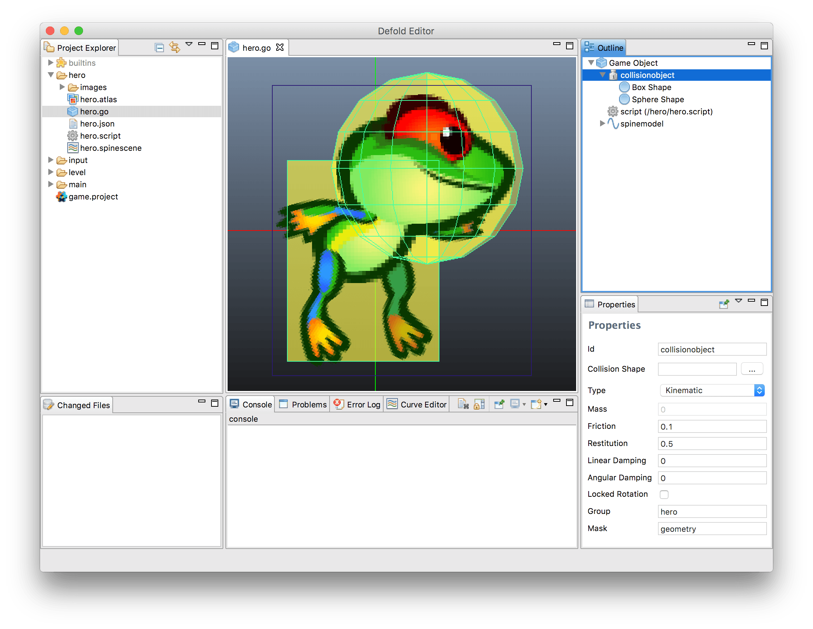

::: sidenote
我们自己处理碰撞的原因是，如果我们将角色的碰撞对象类型设置为动态，引擎将对所涉及的物体执行牛顿模拟。对于这样的游戏，这样的模拟远非最佳，因此我们完全控制而不是与物理引擎的各种力量作斗争。

现在，要做到这一点并正确处理碰撞需要一点向量数学。在[Physics documentation](/manuals/physics#resolving-kinematic-collisions)中给出了如何解决运动学碰撞的详细解释。
:::

```lua
-- gravity pulling the player down in pixel units/sˆ2
local gravity = -20

-- take-off speed when jumping in pixel units/s
local jump_takeoff_speed = 900

function init(self)
    -- this tells the engine to send input to on_input() in this script
    msg.post(".", "acquire_input_focus")

    -- save the starting position
    self.position = go.get_position()

    -- keep track of movement vector and if there is ground contact
    self.velocity = vmath.vector3(0, 0, 0)
    self.ground_contact = false
end

function final(self)
    -- Return input focus when the object is deleted
    msg.post(".", "release_input_focus")
end

function update(self, dt)
    local gravity = vmath.vector3(0, gravity, 0)

    if not self.ground_contact then
        -- Apply gravity if there's no ground contact
        self.velocity = self.velocity + gravity
    end

    -- apply velocity to the player character
    go.set_position(go.get_position() + self.velocity * dt)

    -- reset volatile state
    self.correction = vmath.vector3()
    self.ground_contact = false
end

local function handle_geometry_contact(self, normal, distance)
    -- project the correction vector onto the contact normal
    -- (the correction vector is the 0-vector for the first contact point)
    local proj = vmath.dot(self.correction, normal)
    -- calculate the compensation we need to make for this contact point
    local comp = (distance - proj) * normal
    -- add it to the correction vector
    self.correction = self.correction + comp
    -- apply the compensation to the player character
    go.set_position(go.get_position() + comp)
    -- check if the normal points enough up to consider the player standing on the ground
    -- (0.7 is roughly equal to 45 degrees deviation from pure vertical direction)
    if normal.y > 0.7 then
        self.ground_contact = true
    end
    -- project the velocity onto the normal
    proj = vmath.dot(self.velocity, normal)
    -- if the projection is negative, it means that some of the velocity points towards the contact point
    if proj < 0 then
        -- remove that component in that case
        self.velocity = self.velocity - proj * normal
    end
end

function on_message(self, message_id, message, sender)
    if message_id == hash("contact_point_response") then
        -- check if we received a contact point message. One message for each contact point
        if message.group == hash("geometry") then
            handle_geometry_contact(self, message.normal, message.distance)
        end
    end
end

local function jump(self)
    -- only allow jump from ground
    if self.ground_contact then
        -- set take-off speed
        self.velocity.y = jump_takeoff_speed
    end
end

local function abort_jump(self)
    -- cut the jump short if we are still going up
    if self.velocity.y > 0 then
        -- scale down the upwards speed
        self.velocity.y = self.velocity.y * 0.5
    end
end

function on_input(self, action_id, action)
    if action_id == hash("jump") or action_id == hash("touch") then
        if action.pressed then
            jump(self)
        elseif action.released then
            abort_jump(self)
        end
    end
end
```

1. 将脚本作为*Script*组件添加到英雄对象（右键单击*hero.go*中的根目录，然后选择<kbd>Add Component From File</kbd>，然后选择*hero.script*文件）。

如果您愿意，现在可以尝试将英雄角色临时添加到主集合中并运行游戏，看看它穿过世界。

英雄功能所需的最后一件事是输入。上面的脚本已经包含了一个响应"jump"和"touch"（用于触摸屏）动作的`on_input()`函数。让我们为这些动作添加输入绑定。

1. 打开"input/game.input_bindings"
2. 为"KEY_SPACE"添加一个键触发器，并将动作命名为"jump"
3. 为"TOUCH_MULTI"添加一个触摸触发器，并将动作命名为"touch"。（动作名称是任意的，但应与脚本中的名称匹配。请注意，您不能在多个触发器上使用相同的动作名称）
4. 保存文件。

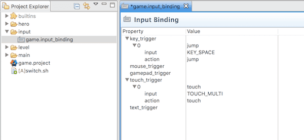

## STEP 5 - 重构关卡

现在我们已经设置了一个带有碰撞和所有功能的英雄角色，我们还需要为地面添加碰撞，以便英雄角色有东西可以碰撞（或运行）。我们稍后会做这件事，但首先，我们应该做一点重构，将所有关卡内容放在一个单独的集合中，并稍微清理一下文件结构：

1. 创建一个新的*level.collection*文件（右键单击*Assets pane*中的*main*，然后选择<kbd>New ▸ Collection File</kbd>）。
2. 打开新文件，右键单击*Outline*中的根目录，然后选择<kbd>Add Collection from File</kbd>并选择*ground.collection*。
3. 在*level.collection*中，右键单击*Outline*中的根目录，然后选择<kbd>Add Game Object File</kbd>并选择*hero.go*。
4. 现在，在项目根目录中创建一个名为*level*的新文件夹（右键单击*game.project*下方的空白区域，然后选择<kbd>New ▸ Folder</kbd>），然后将您到目前为止创建的关卡资源移动到其中：文件*level.collection*、*level.atlas*、保存关卡图集图像的"images"文件夹，以及文件*ground.collection*和*ground.script*。
5. 打开*main.collection*，删除*ground.collection*，而是添加*level.collection*（右键单击并选择<kbd>Add Collection from File</kbd>），现在包含*ground.collection*。确保将集合放置在位置0、0、0。

::: sidenote
您可能已经注意到，*Assets pane*中看到的文件层次结构与您在集合中构建的内容结构是解耦的。单个文件从集合和游戏对象文件中引用，但它们的位置是完全任意的。

如果您想将文件移动到新位置，Defold会通过自动更新对文件的引用（重构）来帮助。当制作复杂的软件（如游戏）时，能够随着项目的增长和变化而改变项目结构是非常有帮助的。Defold鼓励这一点并使过程顺利进行，所以不要害怕移动您的文件！
:::

我们还应该在关卡集合中添加一个带有脚本组件的控制器游戏对象：

1. 创建一个新的脚本文件。右键单击*Assets pane*中的*level*文件夹，然后选择<kbd>New ▸ Script File</kbd>。将文件命名为*controller.script*。
2. 打开脚本文件，将以下代码复制到其中，然后保存文件：

    ```lua
    -- controller.script
    go.property("speed", 360) -- <1>

    function init(self)
        msg.post("ground/controller#ground", "set_speed", { speed = self.speed })
    end
    ```
    1. 这是一个脚本属性。我们将其设置为默认值，但脚本的任何放置实例都可以在编辑器的属性视图中覆盖此值。

3. 打开*level.collection*文件。
4. 右键单击*Outline*中的根目录，然后选择<kbd>Add Game Object</kbd>。
5. 将*Id*设置为"controller"。
6. 右键单击*Outline*中的"controller"游戏对象，然后选择<kbd>Add Component from File</kbd>并选择*level*文件夹中的*controller.script*文件。
7. 保存文件。

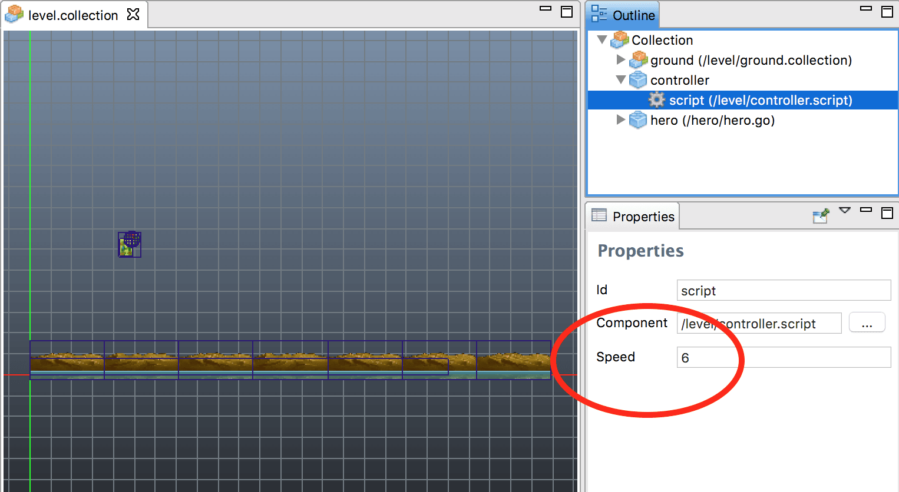

::: sidenote
"controller"游戏对象不存在于文件中，而是在关卡集合中就地创建。这意味着游戏对象实例是从就地数据创建的。对于像这样的单一用途游戏对象，这很好。如果您需要多个相同游戏对象的实例，并且希望能够修改用于创建每个实例的原型/模板，只需创建一个游戏对象文件，并将游戏对象从文件添加到集合中。这将创建一个具有对文件作为原型/模板的引用的游戏对象。

现在，这个"controller"游戏对象的目的是控制与运行关卡相关的所有内容。很快，这个脚本将负责生成英雄角色与之交互的平台和硬币，但目前它只会设置关卡的速度。
:::

在关卡控制器脚本的`init()`函数中，它向地面控制器对象的脚本组件发送一条消息，通过其id寻址：

```lua
msg.post("ground/controller#controller", "set_speed", { speed = self.speed })
```

控制器游戏对象的id设置为`"ground/controller"`，因为它存在于"ground"集合中。然后我们在哈希字符`"#"`之后添加组件id`"controller"`，该字符将对象id与组件id分开。请注意，地面脚本还没有任何代码来响应`set_speed`消息，所以我们必须向*ground.script*添加一个`on_message()`函数并为其添加逻辑。

1. 打开*ground.script*。
2. 添加以下代码并保存文件：

```lua
-- ground.script
function on_message(self, message_id, message, sender)
    if message_id == hash("set_speed") then -- <1>
        self.speed = message.speed -- <2>
    end
end
```
1. 所有消息在发送时都在内部进行哈希处理，必须与哈希值进行比较。
2. 消息数据是一个包含与消息一起发送的数据的Lua表。

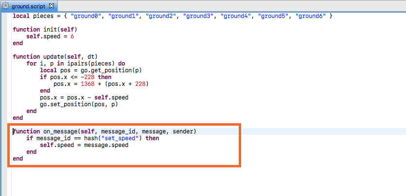

## STEP 6 - 地面物理与平台

此时我们应该为地面添加物理碰撞：

1. 打开*ground.collection*文件。
2. 向合适的游戏对象添加一个新的*Collision Object*组件。由于地面脚本不响应碰撞（所有逻辑都在英雄脚本中），我们可以将其放在任何_静止_游戏对象中（地面瓦片对象不是静止的，所以避免那些）。一个很好的候选者是"controller"游戏对象，但如果您愿意，可以为其创建一个单独的对象。右键单击游戏对象，然后选择<kbd>Add Component</kbd>并选择*Collision Object*。
3. 通过右键单击*Collision Object*组件并选择<kbd>Add Shape</kbd>然后选择*Box*来添加一个盒子形状。
4. 使用*Move Tool*和*Scale Tool*（<kbd>Scene ▸ Move Tool</kbd>和<kbd>Scene ▸ Scale Tool</kbd>）使盒子覆盖所有地面瓦片。
5. 将碰撞对象的*Type*属性设置为"Static"，因为地面物理不会移动。
6. 将碰撞对象的*Group*属性设置为"geometry"，将*Mask*设置为"hero"。现在英雄的碰撞对象和这个对象将注册它们之间的碰撞。
7. 保存文件。

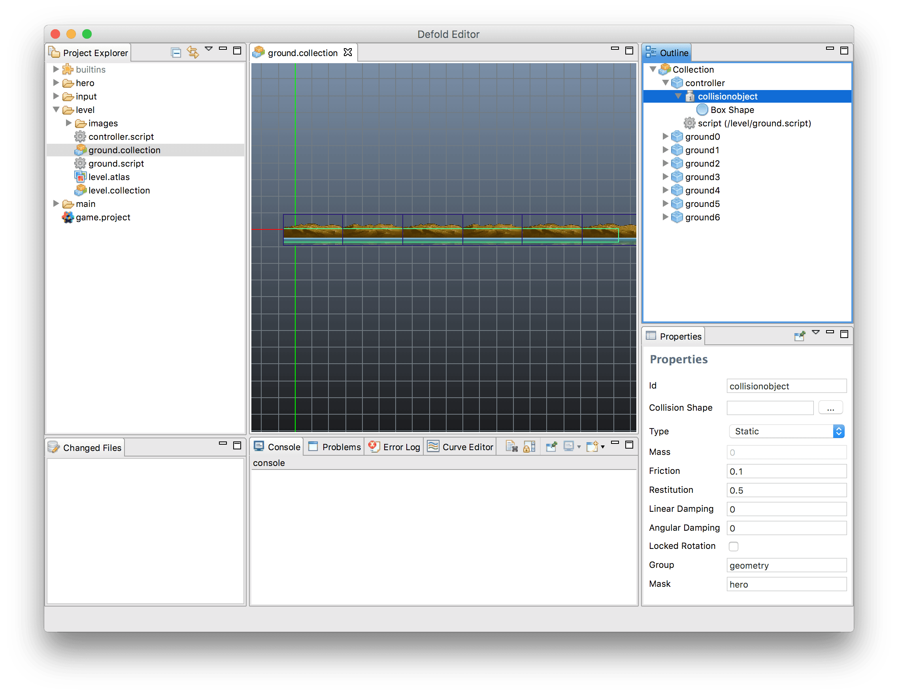

现在您应该能够尝试运行游戏（<kbd>Project ▸ Build</kbd>）。英雄角色应该在地面奔跑，并且应该能够使用<kbd>Space</kbd>按钮跳跃。如果您在移动设备上运行游戏，您可以通过点击屏幕来跳跃。

为了使我们的游戏世界生活不那么枯燥，我们应该添加可以跳跃的平台。

1. 将图像文件*rock_planks.png*从资源包拖到*level/images*子文件夹。
2. 打开*level.atlas*并将新图像添加到图集中（右键单击并选择<kbd>Add Images</kbd>）。
3. 保存文件。
4. 在*level*文件夹中创建一个新的*Game Object*文件，名为*platform.go*。（右键单击*Assets pane*中的*level*，然后选择<kbd>New ▸ Game Object File</kbd>）
5. 向游戏对象添加一个*Sprite*组件（右键单击*Outline*视图中的根目录，然后选择<kbd>Add Component</kbd>，然后选择*Sprite*）。
6. 将*Image*属性设置为引用文件*level.atlas*，并将*Default Animation*设置为"rock_planks"。为方便起见，将关卡对象保存在子文件夹"level/objects"中。
7. 向平台游戏对象添加一个*Collision Object*组件（右键单击*Outline*视图中的根目录，然后选择<kbd>Add Component</kbd>）。
8. 确保将组件的*Type*设置为"Kinematic"，并将*Group*和*Mask*分别设置为"geometry"和"hero"
9. 向*Collision Object*组件添加一个*Box Shape*。（右键单击组件，然后选择<kbd>Add Shape</kbd>，然后选择*Box*）。
10. 使用*Move Tool*和*Scale Tool*（<kbd>Scene ▸ Move Tool</kbd>和<kbd>Scene ▸ Scale Tool</kbd>）使*Collision Object*组件中的形状覆盖平台。
11. 创建一个*Script*文件*platform.script*（右键单击*Assets pane*，然后选择<kbd>New ▸ Script File</kbd>），并将以下代码放入文件中，然后保存它：

    ```lua
    -- platform.script
    function init(self)
        self.speed = 540      -- Default speed in pixels/s
    end

    function update(self, dt)
        local pos = go.get_position()
        if pos.x < -500 then
            go.delete() -- <1>
        end
        pos.x = pos.x - self.speed * dt
        go.set_position(pos)
    end

    function on_message(self, message_id, message, sender)
        if message_id == hash("set_speed") then
            self.speed = message.speed
        end
    end
    ```
    1. 当平台移动到屏幕右边缘外时只需删除它

12. 打开*platform.go*并将新脚本添加为组件（右键单击*Outline*视图中的根目录，然后选择<kbd>Add Component From File</kbd>，然后选择*platform.script*）。
13. 将*platform.go*复制到一个新文件（右键单击*Assets pane*中的文件，然后选择<kbd>Copy</kbd>，然后再次右键单击并选择<kbd>Paste</kbd>），并将新文件命名为*platform_long.go*。
14. 打开*platform_long.go*并添加第二个*Sprite*组件（右键单击*Outline*视图中的根目录，然后选择<kbd>Add Component</kbd>）。或者，您可以复制现有的*Sprite*。
15. 使用*Move Tool*（<kbd>Scene ▸ Move Tool</kbd>）将*Sprite*组件并排放置。
16. 使用*Move Tool*和*Scale Tool*使*Collision Object*组件中的形状覆盖两个平台。

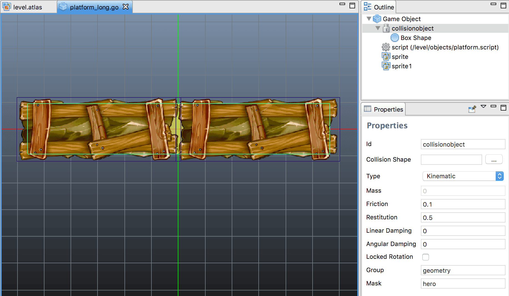

::: sidenote
请注意，*platform.go*和*platform_long.go*都有*Script*组件，它们引用同一个脚本文件。这是一件好事，因为我们对脚本文件所做的任何脚本更改都会影响常规和长平台的行为。
:::

## 生成平台

游戏的想法是它应该是一个简单的无尽跑酷。这意味着平台游戏对象不能放置在编辑器的集合中。相反，我们必须动态生成它们：

1. 打开*level.collection*。
2. 向"controller"游戏对象添加两个*Factory*组件（右键单击它，然后选择<kbd>Add Component</kbd>，然后选择*Factory*）
3. 将组件的*Id*属性设置为"platform_factory"和"platform_long_factory"。
4. 将"platform_factory"的*Prototype*属性设置为*/level/objects/platform.go*文件。
5. 将"platform_long_factory"的*Prototype*属性设置为*/level/objects/platform_long.go*文件。
6. 保存文件。
7. 打开管理关卡的*controller.script*文件。
8. 修改脚本，使其包含以下内容，然后保存文件：

```lua
-- controller.script
go.property("speed", 360)

local grid = 460
local platform_heights = { 100, 200, 350 } -- <1>

function init(self)
    msg.post("ground/controller#controller", "set_speed", { speed = self.speed })
    self.gridw = 0
end

function update(self, dt) -- <2>
    self.gridw = self.gridw + self.speed * dt

    if self.gridw >= grid then
        self.gridw = 0

        -- Maybe spawn a platform at random height
        if math.random() > 0.2 then
            local h = platform_heights[math.random(#platform_heights)]
            local f = "#platform_factory"
            if math.random() > 0.5 then
                f = "#platform_long_factory"
            end

            local p = factory.create(f, vmath.vector3(1600, h, 0), nil, {}, 0.6)
            msg.post(p, "set_speed", { speed = self.speed })
        end
    end
end
```
1- 预定义的Y位置值，用于生成平台。
2- `update()`函数每帧调用一次，我们使用它来决定是否以特定间隔（避免重叠）和高度生成常规或长平台。很容易尝试各种生成算法来创建不同的游戏玩法。

现在运行游戏（<kbd>Project ▸ Build</kbd>）。

哇，这开始变成一个（几乎）可玩的东西了...

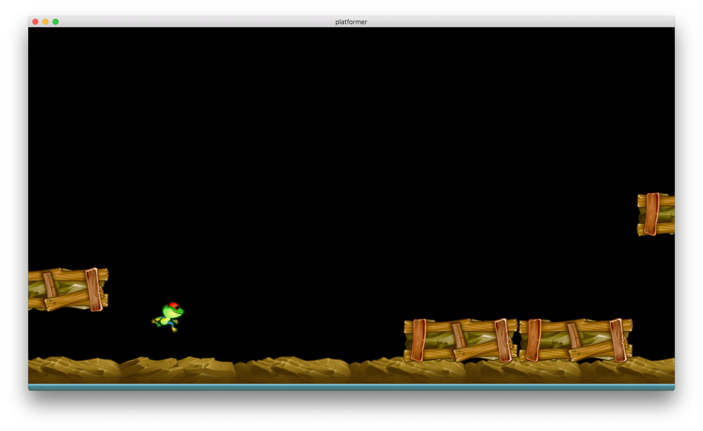

## STEP 7 - 动画与死亡

我们要做的第一件事是为英雄角色注入生命。现在，可怜的东西被困在运行循环中，不能很好地响应跳跃或其他任何东西。我们从资源包中添加的Spine文件实际上包含了一组用于此目的的动画。

1. 打开*hero.script*文件，并在现有的`update()`函数之前添加以下函数：

```lua
    -- hero.script
    local function play_animation(self, anim)
        -- only play animations which are not already playing
        if self.anim ~= anim then
            -- tell the spine model to play the animation
            local anim_props = { blend_duration = 0.15 }
            spine.play_anim("#spinemodel", anim, go.PLAYBACK_LOOP_FORWARD, anim_props)
            -- remember which animation is playing
            self.anim = anim
        end
    end

    local function update_animation(self)
        -- make sure the right animation is playing
        if self.ground_contact then
            play_animation(self, hash("run"))
        else
            play_animation(self, hash("jump"))

        end
    end
```

2. 找到函数`update()`并添加对`update_animation`的调用：

```lua
    ...
    -- apply it to the player character
    go.set_position(go.get_position() + self.velocity * dt)

    update_animation(self)
    ...
  ```

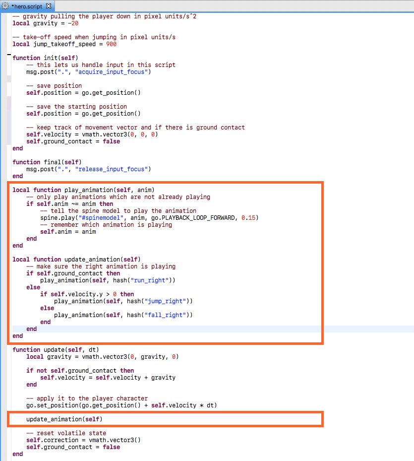

::: sidenote
Lua对局部变量具有"词法范围"，并且对您放置`local`函数的顺序很敏感。函数`update()`调用局部函数`update_animation()`和`play_animation()`，这意味着运行时必须已经看到局部函数才能调用它。这就是为什么我们必须将函数放在`update()`之前。如果您切换函数的顺序，将会得到一个错误。请注意，这仅适用于`local`变量。您可以在http://www.lua.org/pil/6.2.html上阅读更多关于Lua的作用域规则和局部函数的信息
:::

这就是为英雄添加跳跃和下落动画所需的全部内容。如果您运行游戏，您会注意到玩起来感觉好多了。您可能还会意识到，不幸的是，平台可以将英雄推离屏幕。这是碰撞处理的副作用，但补救措施很容易——添加暴力并使平台的边缘变得危险！

1. 将*spikes.png*从资源包拖到*Assets pane*中的"level/images"文件夹。
2. 打开*level.atlas*并添加图像（右键单击并选择<kbd>Add Images</kbd>）
3. 打开*platform.go*并添加几个*Sprite*组件。将*Image*设置为*level.atlas*，将*Default Animation*设置为"spikes"。
4. 使用*Move Tool*和*Rotate Tool*将尖刺沿着平台的边缘放置。
5. 为了使尖刺在平台后面渲染，将尖刺精灵的*Z*位置设置为-0.1。
6. 向平台添加一个新的*Collision Object*组件（右键单击*Outline*中的根目录，然后选择<kbd>Add Component</kbd>）。将*Group*属性设置为"danger"。还将*Mask*设置为"hero"。
7. 向*Collision Object*添加一个盒子形状（右键单击并选择<kbd>Add Shape</kbd>），并使用*Move Tool*（<kbd>Scene ▸ Move Tool</kbd>）和*Scale Tool*放置形状，以便英雄角色在从侧面或下方撞击平台时会与"danger"对象碰撞。
8. 保存文件。

    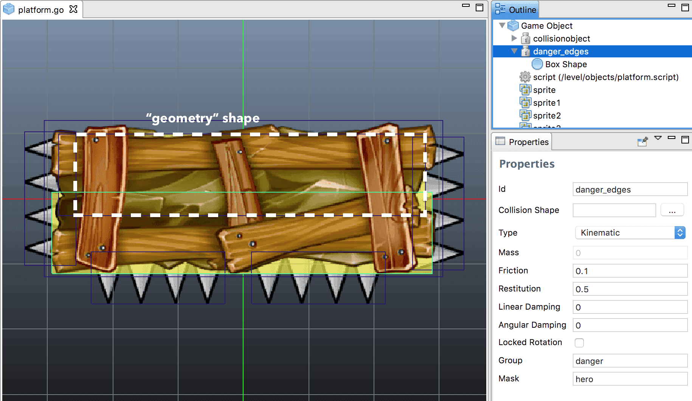

9. 打开*hero.go*，标记*Collision Object*，并将"danger"名称添加到*Mask*属性中。然后保存文件。

    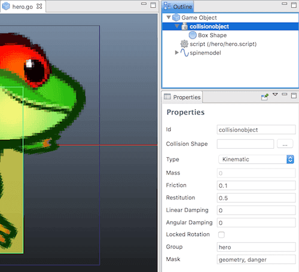

10. 打开*hero.script*并更改`on_message()`函数，以便如果英雄角色与"danger"边缘碰撞，我们会得到反应：

    ```lua
    -- hero.script
    function on_message(self, message_id, message, sender)
        if message_id == hash("reset") then
            self.velocity = vmath.vector3(0, 0, 0)
            self.correction = vmath.vector3()
            self.ground_contact = false
            self.anim = nil
            go.set(".", "euler.z", 0)
            go.set_position(self.position)
            msg.post("#collisionobject", "enable")

        elseif message_id == hash("contact_point_response") then
            -- check if we received a contact point message
            if message.group == hash("danger") then
                -- Die and restart
                play_animation(self, hash("death"))
                msg.post("#collisionobject", "disable")
                -- <1>
                go.animate(".", "euler.z", go.PLAYBACK_ONCE_FORWARD, 160, go.EASING_LINEAR, 0.7)
                go.animate(".", "position.y", go.PLAYBACK_ONCE_FORWARD, go.get_position().y - 200, go.EASING_INSINE, 0.5, 0.2,
                    function()
                        msg.post("#", "reset")
                    end)
            elseif message.group == hash("geometry") then
                handle_geometry_contact(self, message.normal, message.distance)
            end
        end
    end
    ```
    1. 在英雄死亡时添加旋转和下落移动。这可以大大改进！

11. 更改`init()`函数以发送"reset"消息来初始化对象，然后保存文件：

    ```lua
    -- hero.script
    function init(self)
        -- this lets us handle input in this script
        msg.post(".", "acquire_input_focus")
        -- save position
        self.position = go.get_position()
        msg.post("#", "reset")
    end
    ```

## STEP 8 - 重置关卡

如果您现在尝试游戏，很快就会明显发现重置机制不起作用。英雄重置没问题，但您可以轻松重置到会立即坠落到平台边缘并再次死亡的情况。我们想要做的是在死亡时正确重置整个关卡。由于关卡只是一系列生成的平台，我们只需要跟踪所有生成的平台，然后在重置时删除它们：

1. 打开*controller.script*文件并编辑代码以存储所有生成的平台的id：

    ```lua
    -- controller.script
    go.property("speed", 360)

    local grid = 460
    local platform_heights = { 100, 200, 350 }

    function init(self)
        msg.post("ground/controller#controller", "set_speed", { speed = self.speed })
        self.gridw = 0
        self.spawns = {} -- <1>
    end

    function update(self, dt)
        self.gridw = self.gridw + self.speed * dt

        if self.gridw >= grid then
            self.gridw = 0

            -- Maybe spawn a platform at random height
            if math.random() > 0.2 then
                local h = platform_heights[math.random(#platform_heights)]
                local f = "#platform_factory"
                if math.random() > 0.5 then
                    f = "#platform_long_factory"
                end

                local p = factory.create(f, vmath.vector3(1600, h, 0), nil, {}, 0.6)
                msg.post(p, "set_speed", { speed = self.speed })
                table.insert(self.spawns, p) -- <1>
            end
        end
    end

    function on_message(self, message_id, message, sender)
        if message_id == hash("reset") then -- <2>
            -- Tell the hero to reset.
            msg.post("hero#hero", "reset")
            -- Delete all platforms
            for i,p in ipairs(self.spawns) do
                go.delete(p)
            end
            self.spawns = {}
        elseif message_id == hash("delete_spawn") then -- <3>
            for i,p in ipairs(self.spawns) do
                if p == message.id then
                    table.remove(self.spawns, i)
                    go.delete(p)
                end
            end
        end
    end
    ```
    1. 我们使用一个表来存储所有生成的平台
    2. "reset"消息删除表中存储的所有平台
    3. "delete_spawn"消息删除特定平台并将其从表中移除

2. 保存文件。
3. 打开*platform.script*并修改它，以便当平台到达最左边缘时，不仅删除平台，还向关卡控制器发送一条消息要求删除平台：

    ```lua
    -- platform.script
    ...
    if pos.x < -500 then
        msg.post("/level/controller#controller", "delete_spawn", { id = go.get_id() })
    end
    ...
    ```

    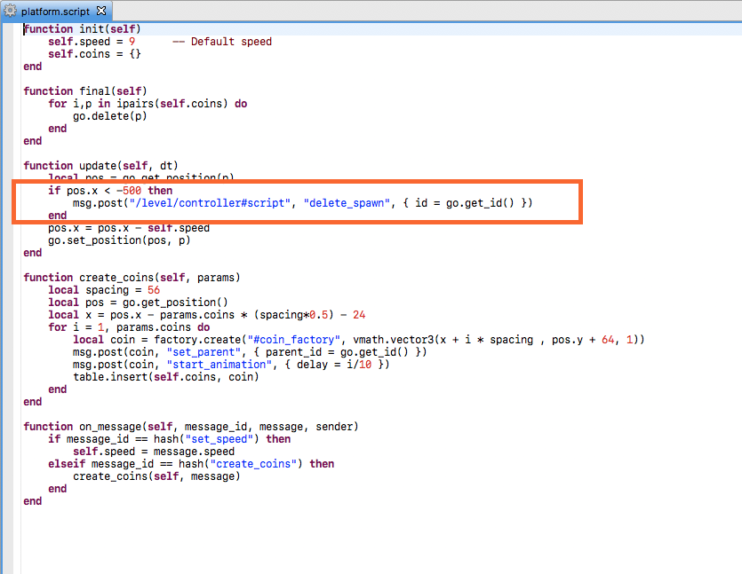

4. 保存文件。
5. 打开*hero.script*。现在，我们需要做的最后一件事是告诉关卡进行重置。我们已经将要求英雄重置的消息移动到关卡控制器脚本中。像这样集中控制重置是有意义的，因为它允许我们，例如，引入更长的定时死亡序列，更容易实现：

```lua
-- hero.script
...
go.animate(".", "position.y", go.PLAYBACK_ONCE_FORWARD, go.get_position().y - 200, go.EASING_INSINE, 0.5, 0.2,
    function()
        msg.post("controller#controller", "reset")
    end)
...
```

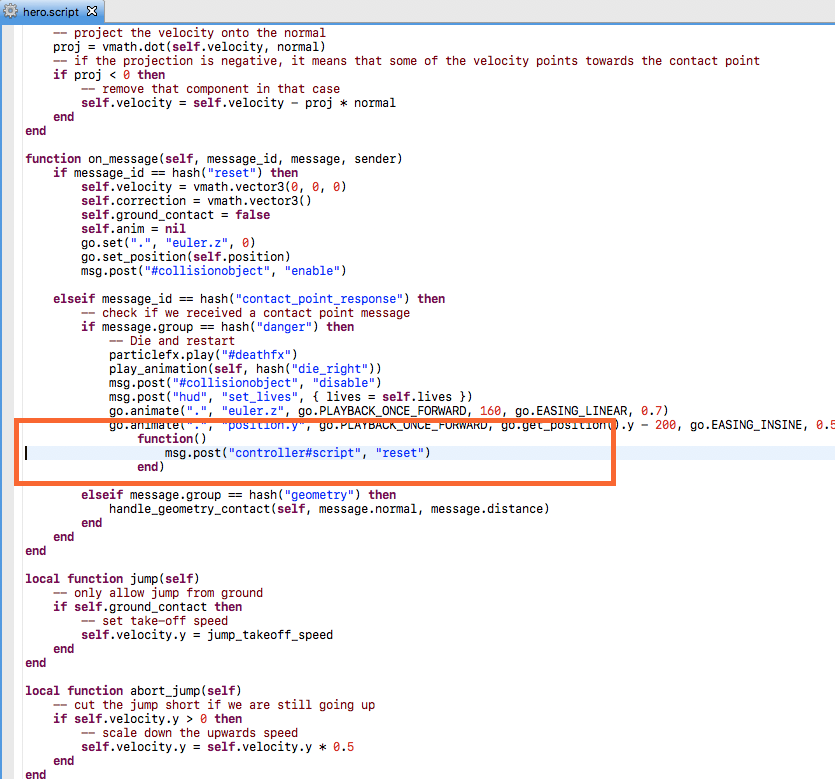

现在主要的重启-死亡循环已经就位！

接下来 - 活着的目标：硬币！

## STEP 9 - 收集金币

想法是在关卡中放置硬币供玩家收集。首先要问的是如何将它们放入关卡。例如，我们可以开发一个与平台生成算法某种程度上协调的生成方案。然而，我们最终选择了一个更简单的方法，只是让平台本身生成硬币：

1. 将*coin.png*图像从资源包拖到*Assets pane*中的"level/images"。
2. 打开*level.atlas*并添加图像（右键单击并选择<kbd>Add Images</kbd>）。
3. 在*level*文件夹中创建一个*Game Object*文件，命名为*coin.go*（右键单击*Assets pane*中的*level*，然后选择<kbd>New ▸ Game Object File</kbd>）。
4. 打开*coin.go*并添加一个*Sprite*组件（在*Outline*中右键单击并选择<kbd>Add Component</kbd>）。将*Image*设置为*level.atlas*，将*Default Animation*设置为"coin"。
5. 添加一个*Collision Object*（在*Outline*中右键单击并选择<kbd>Add Component</kbd>）
并添加一个覆盖图像的*Sphere*形状（右键单击组件并选择<kbd>Add Shape</kbd>）。
6. 使用*Move Tool*（<kbd>Scene ▸ Move Tool</kbd>）和*Scale Tool*使球体覆盖硬币图像。
7. 将碰撞对象*Type*设置为"Kinematic"，将其*Group*设置为"pickup"，将其*Mask*设置为"hero"。
8. 打开*hero.go*并将"pickup"添加到*Collision Object*组件的*Mask*属性中，然后保存文件。
9. 创建一个新的脚本文件*coin.script*（右键单击*Assets pane*中的*level*，然后选择<kbd>New ▸ Script File</kbd>）。用以下内容替换模板代码：

    ```lua
    -- coin.script
    function init(self)
        self.collected = false
    end

    function on_message(self, message_id, message, sender)
        if self.collected == false and message_id == hash("collision_response") then
            self.collected = true
            msg.post("#sprite", "disable")
        elseif message_id == hash("start_animation") then
            pos = go.get_position()
            go.animate(go.get_id(), "position.y", go.PLAYBACK_LOOP_PINGPONG, pos.y + 24, go.EASING_INOUTSINE, 0.75, message.delay)
        end
    end
    ```

10. 将脚本文件作为*Script*组件添加到硬币对象（在*Outline*中右键单击根目录，然后选择*Add Component from File*）。

    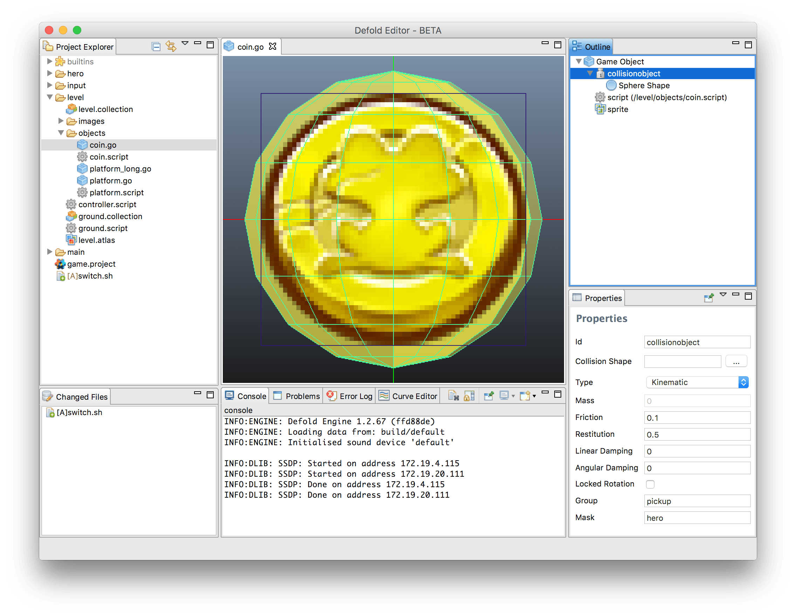

计划是从平台对象生成硬币，所以在*platform.go*和*platform_long.go*中放入硬币的工厂。

1. 打开*platform.go*并添加一个*Factory*组件（在*Outline*中右键单击并选择<kbd>Add Component</kbd>）。
2. 将*Factory*的*Id*设置为"coin_factory"，并将其*Prototype*设置为文件*coin.go*。
3. 现在打开*platform_long.go*并创建一个相同的*Factory*组件。
4. 保存这两个文件。

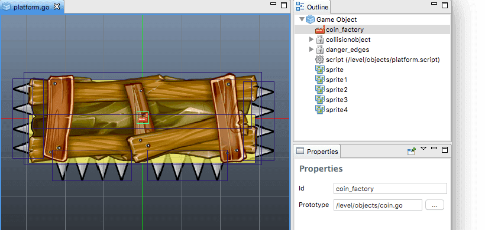

现在我们需要修改*platform.script*，使其生成和删除硬币：

```lua
-- platform.script
function init(self)
    self.speed = 540     -- Default speed in pixels/s
    self.coins = {}
end

function final(self)
    for i,p in ipairs(self.coins) do
        go.delete(p)
    end
end

function update(self, dt)
    local pos = go.get_position()
    if pos.x < -500 then
        msg.post("/level/controller#controller", "delete_spawn", { id = go.get_id() })
    end
    pos.x = pos.x - self.speed * dt
    go.set_position(pos)
end

function create_coins(self, params)
    local spacing = 56
    local pos = go.get_position()
    local x = pos.x - params.coins * (spacing*0.5) - 24
    for i = 1, params.coins do
        local coin = factory.create("#coin_factory", vmath.vector3(x + i * spacing , pos.y + 64, 1))
        msg.post(coin, "set_parent", { parent_id = go.get_id() }) -- <1>
        msg.post(coin, "start_animation", { delay = i/10 }) -- <2>
        table.insert(self.coins, coin)
    end
end

function on_message(self, message_id, message, sender)
    if message_id == hash("set_speed") then
        self.speed = message.speed
    elseif message_id == hash("create_coins") then
        create_coins(self, message)
    end
end
```
1. 通过将生成的硬币的父级设置为平台，它将随平台一起移动。
2. 动画使硬币上下跳舞，相对于现在是硬币父级的平台。

::: sidenote
父子关系严格来说是_场景图_的修改。子对象将与其父对象一起变换（移动、缩放或旋转）。如果您需要游戏对象之间的其他"所有权"关系，您需要在代码中专门跟踪它。
:::

本教程的最后一步是向*controller.script*添加几行代码：

```lua
-- controller.script
...
local platform_heights = { 100, 200, 350 }
local coins = 3 -- <1>
...
```
1. 在常规平台上生成的硬币数量。

```lua
-- controller.script
...
local coins = coins
if math.random() > 0.5 then
    f = "#platform_long_factory"
    coins = coins * 2 -- 长平台上的硬币数量是两倍
end
...
```

```lua
-- controller.script
...
msg.post(p, "set_speed", { speed = self.speed })
msg.post(p, "create_coins", { coins = coins })
table.insert(self.spawns, p)
...
```

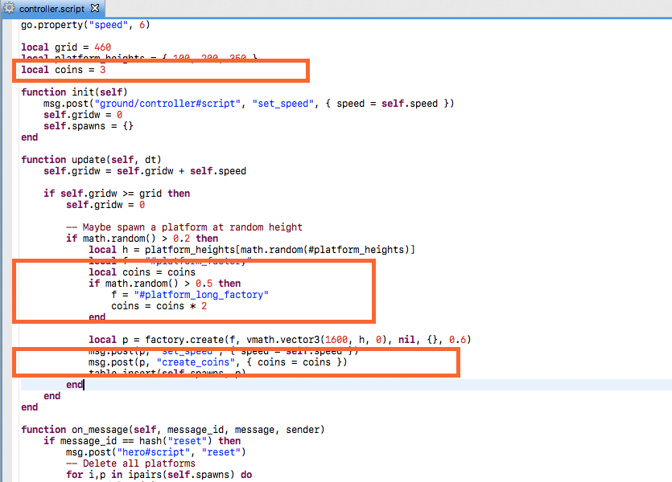

现在我们有了一个简单但功能齐全的游戏！如果您能做到这一点，您可能想继续自己添加以下内容：

1. 计分和生命计数器
2. 拾取和死亡的粒子效果
3. 漂亮的背景图像

> 在[此处](images/runner/sample-runner.zip)下载项目的完整版本

这就结束了这个入门教程。现在继续深入Defold。我们准备了很多[手册和教程](//www.defold.com/learn)来指导您，如果您遇到困难，欢迎来到[论坛](//forum.defold.com)。

祝您Defold愉快！