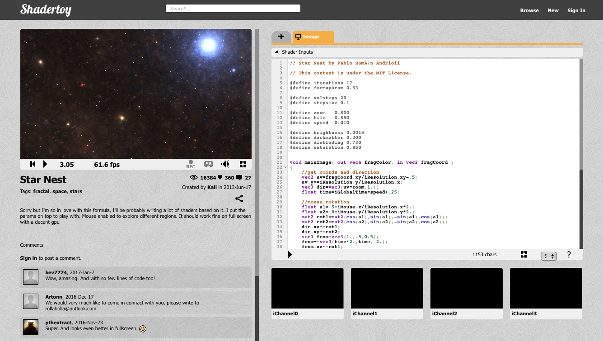
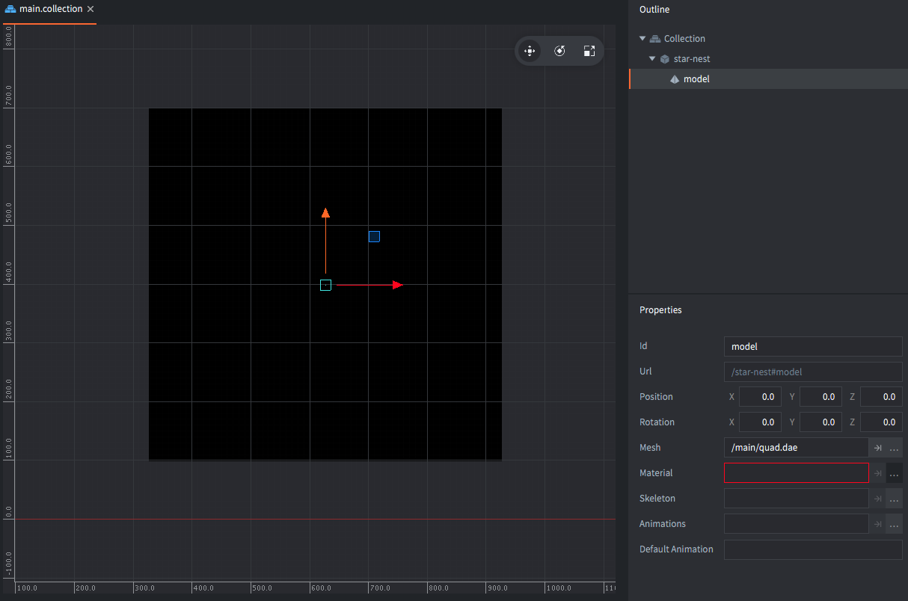
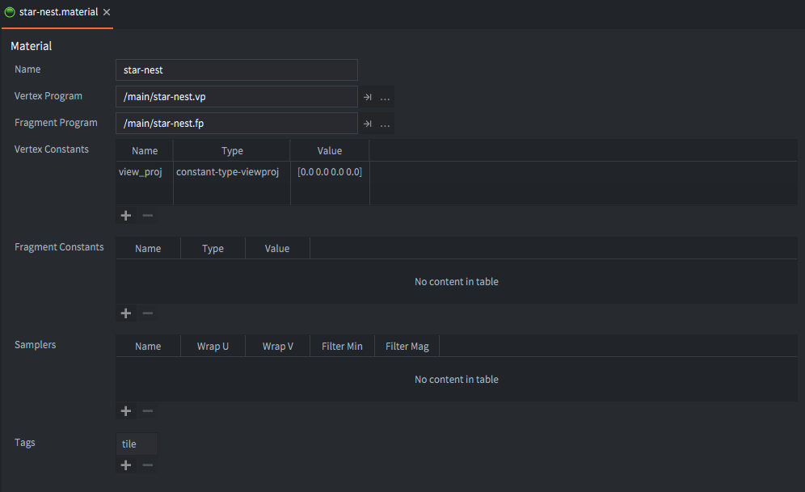
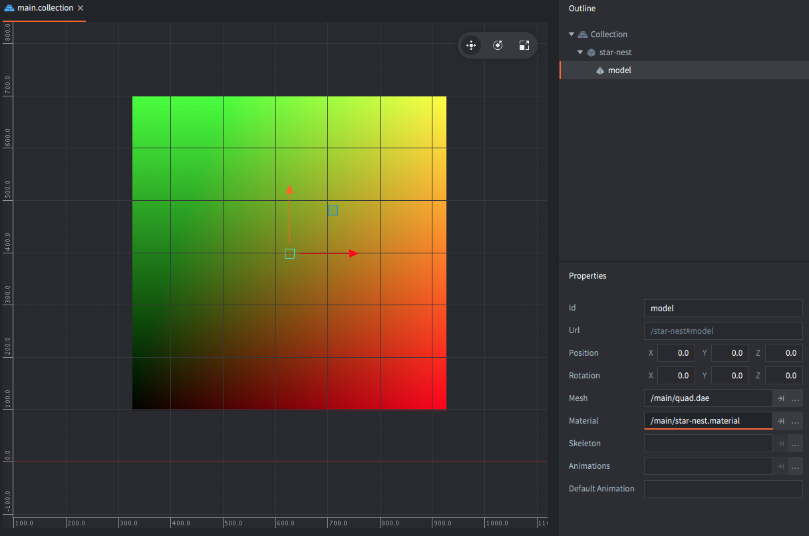
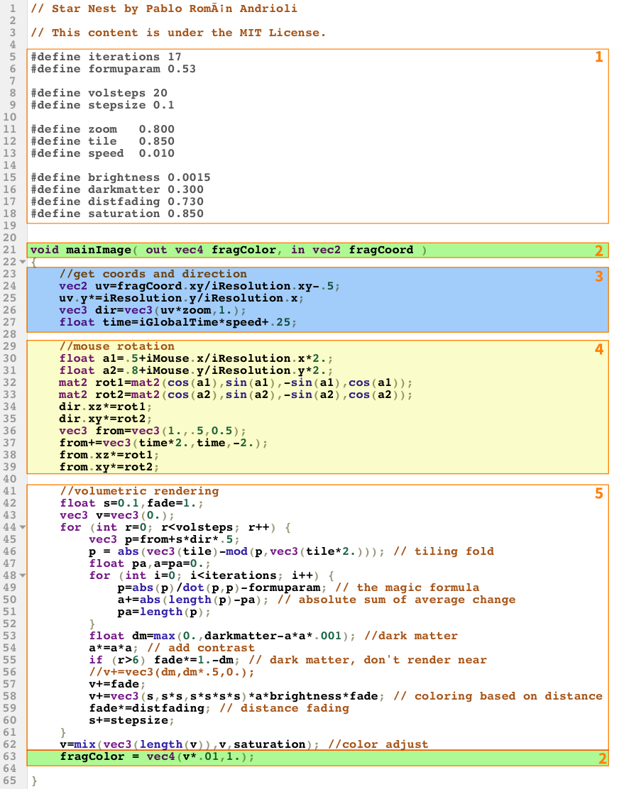
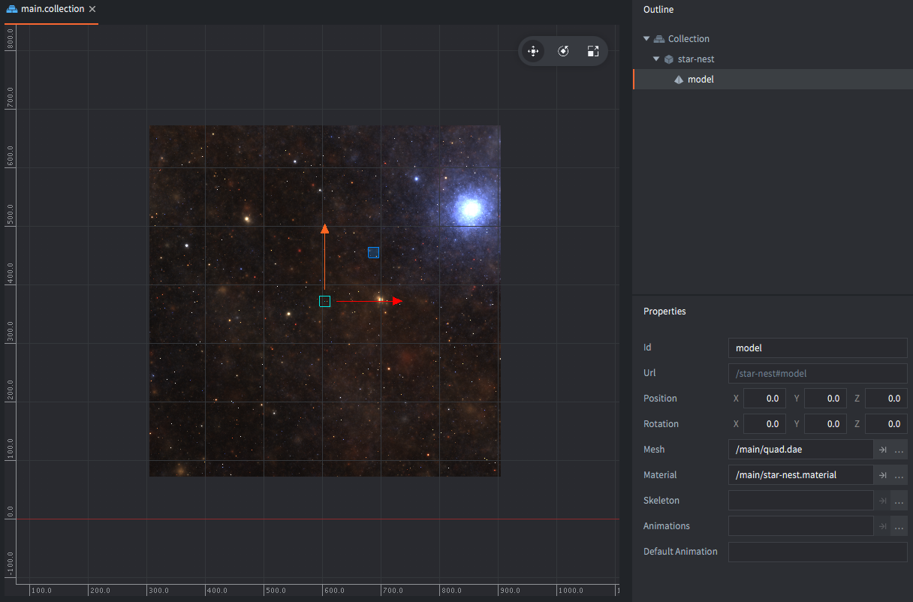
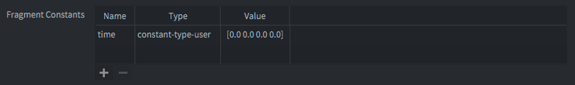
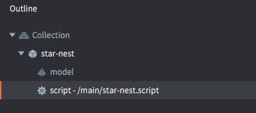

# Shadertoy教程

[Shadertoy.com](https://www.shadertoy.com/)是一个汇集用户贡献的GLSL着色器的网站。它是寻找着色器代码和灵感的绝佳资源。在本教程中，我们将从Shadertoy获取一个着色器，并使其在Defold中运行。本教程假设您对着色器有基本了解。如果您需要阅读相关内容，[着色器手册](/manuals/shader/)是一个很好的起点。

我们将使用的着色器是Pablo Andrioli（在Shadertoy上的用户名为"Kali"）创作的[Star Nest](https://www.shadertoy.com/view/XlfGRj)。这是一个纯程序化的数学黑魔法片段着色器，渲染出一个非常酷的星空效果。



这个着色器只有65行相当复杂的GLSL代码，但不用担心。我们将把它视为一个黑盒子，基于几个简单的输入来完成它的工作。我们的任务是修改着色器，使其与Defold而不是Shadertoy接口。

## 需要纹理化的对象

Star Nest着色器是一个纯片段着色器，所以我们只需要一些东西来让着色器进行纹理化。有几种选择：精灵、瓦片地图、GUI或模型。在本教程中，我们将使用一个简单的3D模型。原因是我们可以轻松地将模型渲染变成全屏效果——例如，如果我们想要进行视觉后期处理，就需要这样做。

我们首先在Blender（或任何其他3D建模程序）中创建一个二次平面网格。为了方便起见，4个顶点坐标在X轴上为-1和1，在Y轴上为-1和1。Blender默认Z轴向上，所以你需要将网格绕X轴旋转90°。你还应该确保为网格生成正确的UV坐标。在Blender中，选择网格后进入*编辑模式*，然后选择<kbd>网格 ▸ UV展开... ▸ 展开</kbd>。


[下载quad.dae](https://github.com/defold/template-basic-3d/blob/master/assets/meshes/quad.dae)


::: sidenote
Blender是一个免费的开源3D软件，可以从[blender.org](https://www.blender.org)下载。
:::


1. 将模型导出为名为*`quad.dae`*的*Collada*文件，并将其拖到新的Defold项目中。
2. 在Defold中打开您的"main.collection"文件，并创建一个新的游戏对象"star-nest"。
3. 为"star-nest"添加一个*模型*组件。
4. 将*网格*属性设置为*`quad.dae`*文件。
5. 模型很小（2⨉2单位），所以我们需要将"star-nest"游戏对象缩放到合理的大小。600⨉600是一个很好的大尺寸，所以将X和Y缩放设置为300。

模型应该出现在场景编辑器中，但它呈现为全黑色。这是因为它还没有设置材质：



## 创建材质

创建一个新的材质文件*`star-nest.material`*、一个顶点着色器程序*`star-nest.vp`*和一个片段着色器程序*`star-nest.fp`*：

1. 打开*star-nest.material*。
2. 将*顶点程序*设置为`star-nest.vp`。
3. 将*片段程序*设置为`star-nest.fp`。
4. 添加一个*顶点常量*并将其命名为"`view_proj`"（代表"视图投影"）。
5. 将其*类型*设置为`CONSTANT_TYPE_VIEWPROJ`。
6. 在*标签*中添加一个"tile"标签。这样四边形将在绘制精灵和瓦片时包含在渲染通道中。

    

7. 打开顶点着色器程序文件*`star-nest.vp`*。它应该包含以下代码。保持代码不变。

    ```glsl
    // star-nest.vp
    uniform mediump mat4 view_proj;

    // 位置在世界空间中
    attribute mediump vec4 position;
    attribute mediump vec2 texcoord0;

    varying mediump vec2 var_texcoord0;

    void main()
    {
        gl_Position = view_proj * vec4(position.xyz, 1.0);
        var_texcoord0 = texcoord0;
    }
    ```

8. 打开片段着色器程序文件*`star-nest.fp`*并修改代码，使片段颜色基于UV坐标的X和Y坐标（`var_texcoord0`）设置。我们这样做是为了确保我们正确设置了模型：

    ```glsl
    // star-nest.fp
    varying mediump vec2 var_texcoord0;

    void main()
    {
        gl_FragColor = vec4(var_texcoord0.xy, 0.0, 1.0);
    }
    ```

9. 在"star-nest"游戏对象中的模型组件上设置材质。

现在编辑器应该使用新着色器渲染模型，我们可以清楚地看到UV坐标是否正确；左下角应该是黑色（0, 0, 0），左上角应该是绿色（0, 1, 0），右上角应该是黄色（1, 1, 0），右下角应该是红色（1, 0, 0）：



## 星巢着色器

现在一切准备就绪，可以开始处理实际的着色器代码了。让我们先看一下原始代码。它由几个部分组成：



1. 第5-18行定义了一堆常量。我们可以保持这些不变。

2. 第21行和第63行包含输入片段X和Y屏幕空间纹理坐标（`in vec2 fragCoord`），以及输出片段颜色（`out vec4 fragColor`）。

    在Defold中，输入纹理坐标通过一个变化变量`var_texcoord0`从顶点着色器作为UV坐标（范围0-1）传递。输出片段颜色设置为内置变量`gl_FragColor`。

3. 第23-27行设置了纹理的尺寸以及移动方向和缩放时间。视口/纹理的分辨率作为`uniform vec3 iResolution`传递给着色器。着色器根据片段坐标和分辨率计算具有正确宽高比的UV样式坐标。还进行了一些分辨率偏移以获得更好的构图。

    Defold版本需要修改这些计算以使用来自`var_texcoord0`的UV坐标。

    时间也在这里设置。它作为`uniform float iGlobalTime`传递给着色器。Defold目前不支持`float`统一变量，所以我们需要通过`vec4`来提供时间。

4. 第29-39行设置了体积渲染的旋转，鼠标位置影响旋转。鼠标坐标作为`uniform vec4 iMouse`传递给着色器。

    在本教程中，我们将跳过鼠标输入。

5. 第41-62行是着色器的核心。我们可以保持这段代码不变。

## 修改后的星巢着色器

通过上述部分并进行必要的更改，得到以下着色器代码。为了更好的可读性，它已经被清理了一些。Defold和Shadertoy版本之间的区别已注明：

```glsl
// Star Nest by Pablo Román Andrioli
// 此内容遵循MIT许可证。

#define iterations 17
#define formuparam 0.53

#define volsteps 20
#define stepsize 0.1

#define zoom   0.800
#define tile   0.850
#define speed  0.010

#define brightness 0.0015
#define darkmatter 0.300
#define distfading 0.730
#define saturation 0.850

varying mediump vec2 var_texcoord0; // <1>

void main() // <2>
{
    // 获取坐标和方向
    vec2 res = vec2(1.0, 1.0); // <3>
    vec2 uv = var_texcoord0.xy * res.xy - 0.5;
    vec3 dir = vec3(uv * zoom, 1.0);
    float time = 0.0; // <4>

    float a1=0.5; // <5>
    float a2=0.8;
    mat2 rot1=mat2(cos(a1),sin(a1),-sin(a1),cos(a1));
    mat2 rot2=mat2(cos(a2),sin(a2),-sin(a2),cos(a2));
    dir.xz*=rot1;
    dir.xy*=rot2;
    vec3 from = vec3(1.0, 0.5, 0.5);
    from += vec3(time * 2.0, time, -2.0);
    from.xz *= rot1;
    from.xy *= rot2;

    //体积渲染
    float s = 0.1, fade = 1.0;
    vec3 v = vec3(0.0);
    for(int r = 0; r < volsteps; r++) {
        vec3 p = from + s * dir * 0.5;
        // 平铺折叠
        p = abs(vec3(tile) - mod(p, vec3(tile * 2.0)));
        float pa, a = pa = 0.0;
        for (int i=0; i < iterations; i++) {
            // 魔法公式
            p = abs(p) / dot(p, p) - formuparam;
            // 平均变化的绝对和
            a += abs(length(p) - pa);
            pa = length(p);
        }
        //暗物质
        float dm = max(0.0, darkmatter - a * a * 0.001);
        a *= a * a;
        // 暗物质，不要在附近渲染
        if(r > 6) fade *= 1.0 - dm;
        v += fade;
        // 基于距离的着色
        v += vec3(s, s * s, s * s * s * s) * a * brightness * fade;
        fade *= distfading;
        s += stepsize;
    }
    // 颜色调整
    v = mix(vec3(length(v)), v, saturation);
    gl_FragColor = vec4(v * 0.01, 1.0); // <6>
}
```
1. 顶点着色器设置了一个变化变量`var_texcoord0`与UV坐标。我们需要声明它。
2. Shadertoy有一个`void mainImage(out vec4 fragColor, in vec2 fragCoord)`入口点。在Defold中，`main()`没有参数。所以相反，我们读取变化变量`var_texcoord0`并写入`gl_FragColor`。
3. 对于本教程，我们为渲染定义静态分辨率。目前模型是正方形的，所以我们可以使用`vec2 = vec2(1.0, 1.0);`。对于1280⨉720的矩形模型，我们改为设置`vec2 res = vec2(1.78, 1.0);`并将uv坐标乘以它以获得正确的宽高比。
4. 目前，`time`设置为零。我们将在下一阶段添加时间。
5. 我们将通过完全移除`iMouse`值来保持本教程的简单性。请注意，我们仍然使用旋转计算来减少体积渲染中的视觉对称性。
6. 最后，设置结果片段颜色。

保存片段着色器程序。现在模型应该在场景编辑器中用星空效果很好地纹理化：




## 动画

谜题的最后一块是引入时间来使星星移动。为了将时间值传递给着色器，我们需要使用着色器常量，一个统一变量。要设置一个新的常量：

1. 打开*star-nest.material*。
2. 添加一个*片段常量*并将其命名为"time"。
3. 将其*类型*设置为`CONSTANT_TYPE_USER`。将x、y、z和w组件保持为0。



现在我们需要修改着色器代码以声明和使用新的常量：

```glsl
...
varying mediump vec2 var_texcoord0;
uniform lowp vec4 time; // <1>

void main()
{
    //获取坐标和方向
    vec2 res = vec2(2.0, 1.0);
    vec2 uv = var_texcoord0.xy * res.xy - 0.5;
    vec3 dir = vec3(uv * zoom, 1.0);
    float time = time.x * speed + 0.25; // <2>
    ...
```
1. 声明一个名为"time"的`vec4`类型的新统一变量。将其保持为`lowp`（低精度）就足够了。
2. 读取时间统一变量的`x`组件，并使用它来计算时间值。

最后一步是向着色器提供时间值：

1. 创建一个新的脚本文件*`star-nest.script`*。
2. 输入以下代码：

```lua
function init(self)
    self.t = 0 -- <1>
end

function update(self, dt)
    self.t = self.t + dt -- <2>
    go.set("#model", "time", vmath.vector4(self.t, 0, 0, 0)) -- <3>
end
```
1. 在脚本组件（`self`）中存储一个值`t`并初始化为0。
2. 每帧将`self.t`的值增加自上一帧以来经过的秒数。这个值通过参数`dt`（增量时间）可用，是1/60（`update()`每秒调用60次）。
3. 在模型组件上设置"time"常量。常量是一个`vector4`，所以我们使用`x`组件作为时间值。
4. 最后，将*star-nest.script*作为脚本组件添加到"star-nest"游戏对象：

    

就是这样！我们完成了！

一个有趣的延续练习是将原始鼠标移动输入添加到着色器中。如果您掌握了如何处理输入，这应该是相当简单的。

祝您使用Defold愉快！