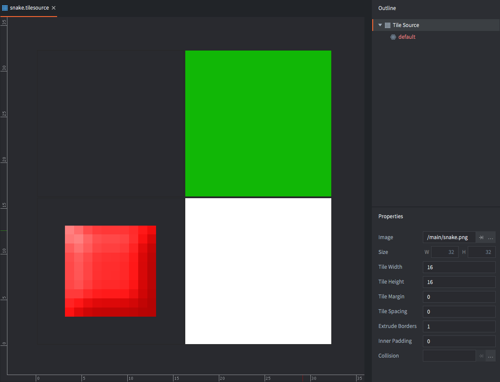
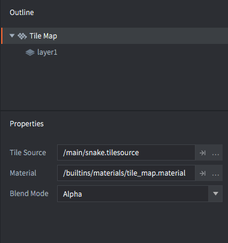
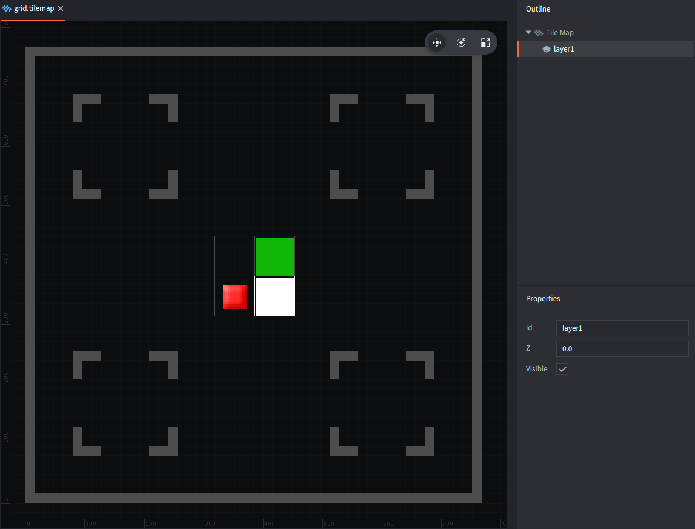
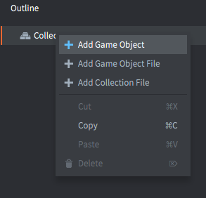
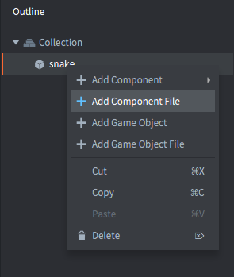
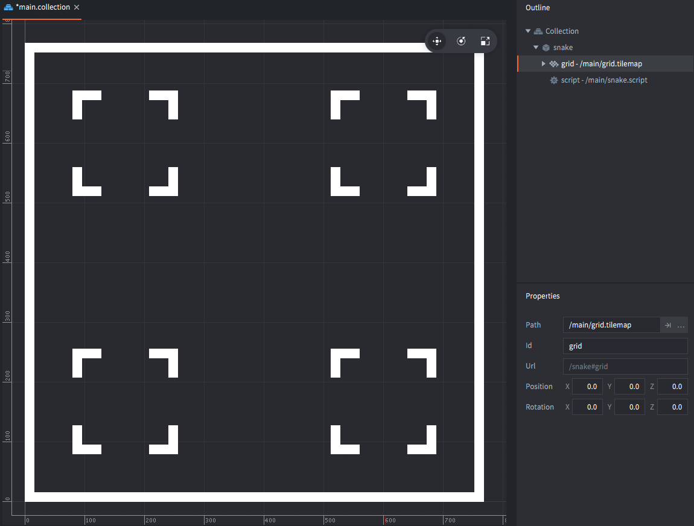
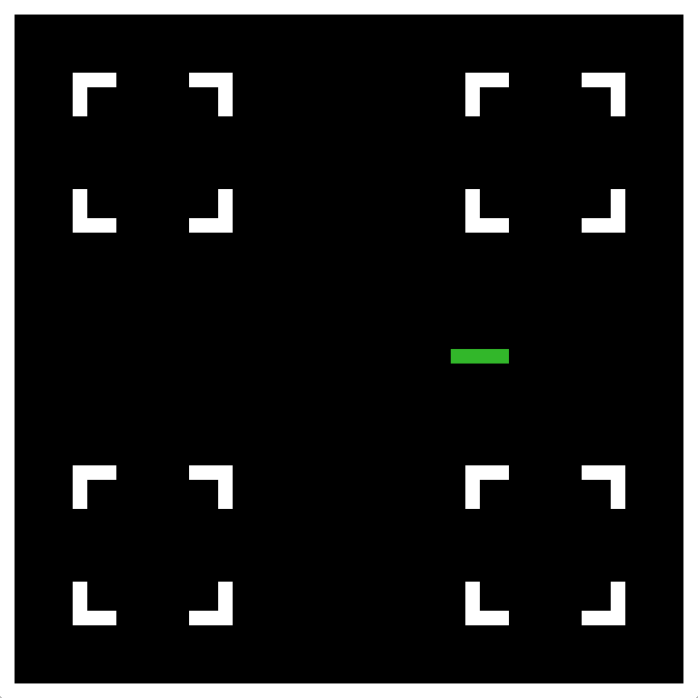
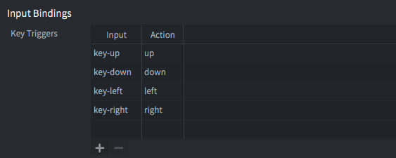

# 贪吃蛇

本教程将引导你完成创建最常见的经典游戏之一的过程。这个游戏有很多变体，这个版本的特点是一条蛇吃"食物"，并且只有在吃的时候才会生长。这条蛇还在一个包含障碍物的游戏场地上爬行。

## 创建项目

1. 启动Defold。
2. 在左侧选择*新建项目*。
3. 选择*从模板*选项卡。
4. 选择*空项目*
5. 在本地驱动器上为项目选择一个位置。
6. 点击*创建新项目*。

打开*game.project*设置文件，将游戏尺寸设置为768⨉768或16的其他倍数。之所以要这样做，是因为游戏将在一个网格上绘制，每个片段将是16x16像素，这样游戏屏幕就不会截断任何部分片段。

## 向游戏添加图形

图形方面需要的东西很少。一个16x16的蛇片段，一个用于障碍物，一个用于食物。这张图片是你唯一需要的资产。<kbd>右键点击</kbd>图像，将其保存到本地磁盘，然后拖动到项目文件夹中的某个位置。


Defold提供了一个内置的*瓦片地图*组件，你将使用它来创建游戏场地。瓦片地图允许你设置和读取单个瓦片，这非常适合这个游戏。由于瓦片地图从*瓦片源*获取图形，所以你需要创建一个：

<kbd>右键点击</kbd>*main*文件夹并选择<kbd>新建 ▸ 瓦片源</kbd>。将新文件命名为"snake"（编辑器会将文件保存为"snake.tilesource"）。

将*图像*属性设置为你刚刚导入的图形文件。

*宽度*和*高度*属性应保持为16。这会将32⨉32像素的图像分割成4个瓦片，编号为1-4。



请注意，*扩展边框*属性设置为1像素。这是为了防止图形一直延伸到边缘的瓦片周围出现视觉伪影。

## 创建游戏场地瓦片地图

现在你有一个可以使用的瓦片源，所以是时候创建游戏场地瓦片地图组件了：

<kbd>右键点击</kbd>*main*文件夹并选择<kbd>新建 ▸ 瓦片地图</kbd>。将新文件命名为"grid"（编辑器会将文件保存为"grid.tilemap"）。



将新瓦片地图的*瓦片源*属性设置为"snake.tilesource"。

Defold只存储瓦片地图实际使用的区域，所以你需要添加足够的瓦片来填充屏幕边界。

选择"layer1"图层。

选择菜单选项<kbd>编辑 ▸ 选择瓦片...</kbd>显示瓦片调色板，然后点击你想要在绘制时使用的瓦片。

在屏幕边缘绘制一个边框和一些障碍物。



完成后保存瓦片地图。

## 将瓦片地图和脚本添加到游戏中

现在打开*main.collection*。这是引擎启动时加载的引导集合。<kbd>右键点击</kbd>*大纲*中的根目录并选择<kbd>添加游戏对象</kbd>，这将在集合中创建一个新的游戏对象，该游戏对象在游戏启动时加载。



然后<kbd>右键点击</kbd>新游戏对象并选择<kbd>添加组件文件</kbd>。选择你刚刚创建的"grid.tilemap"文件。



<kbd>右键点击</kbd>*资源*浏览器中的*main*文件夹并选择<kbd>新建 ▸ 脚本</kbd>。将新脚本文件命名为"snake"（它将保存为"snake.script"）。这个文件将包含游戏的所有逻辑。

回到*main.collection*并<kbd>右键点击</kbd>持有瓦片地图的游戏对象。选择<kbd>添加组件文件</kbd>并选择"snake.script"文件。

现在你已经将瓦片地图组件和脚本放置到位。如果你运行游戏，你应该会看到游戏场地，就像你在瓦片地图上绘制的那样。



## 游戏脚本 - 初始化

你将要编写的脚本将驱动整个游戏。其工作原理的想法如下：

1. 脚本保存一个蛇当前占据的瓦片位置列表。
2. 如果玩家按下方向键，存储蛇应该移动的方向。
3. 在固定的时间间隔内，将蛇在当前移动方向上移动一步。

打开*snake.script*并找到`init()`函数。这个函数在游戏启动时脚本初始化时由引擎调用。将代码更改为以下内容。

```lua
function init(self)
    self.segments = {
        {x = 7, y = 24},
        {x = 8, y = 24},
        {x = 9, y = 24},
        {x = 10, y = 24} } -- <1>
    self.dir = {x = 1, y = 0} -- <2>
    self.speed = 7.0 -- <3>

    self.t = 0 -- <4>
end
```
1. 将蛇的片段存储为包含表列表的Lua表，每个表保存一个片段的X和Y位置。
2. 将当前方向存储为包含X和Y方向的表。
3. 存储当前移动速度，表示为每秒瓦片数。
4. 存储一个计时器值，将用于跟踪移动速度。

上面的脚本代码是用Lua语言编写的。关于代码有几点需要注意：

- Defold保留了一组内置的回调*函数*，这些函数在脚本组件的生命周期中被调用。这些*不是*方法而是普通函数。运行时通过参数`self`传递对当前脚本组件实例的引用。`self`引用用于存储实例数据。
- Lua表字面量用花括号括起来编写。表条目可以是键/值对（`{x = 10, y = 20}`）、嵌套的Lua表（`{ {a = 1}, {b = 2} a}`）或其他数据类型。
- `self`引用可以用作你可以存储数据的Lua表。只需像任何其他表一样使用点表示法：`self.data = "value"`。该引用在脚本的整个生命周期内都有效，在这种情况下，从游戏开始直到你退出它。

如果你不理解以上任何内容，不用担心。只需跟随，实验并给它时间——你最终会理解的。

## 游戏脚本 - 更新

`init()`函数在脚本组件实例化到运行游戏中时只调用一次。然而，`update()`函数每帧调用一次，每秒60次。这使得该函数非常适合实时游戏逻辑。

更新的想法是这样的：

1. 在某个设定的时间间隔执行以下操作：
2. 查看蛇的头部，然后创建一个新头部，该头部从当前头部偏移当前移动方向。因此，如果蛇按X=-1和Y=0移动，并且当前头部位于X=32和Y=10，那么新头部应该位于X=31和Y=10。
3. 将新头部添加到构成蛇的片段列表中。
4. 从片段表中移除尾部。
5. 清除尾部瓦片。
6. 绘制蛇片段。

在*snake.script*中找到`update()`函数并将代码更改为以下内容：

```lua
function update(self, dt)
    self.t = self.t + dt -- <1>
    if self.t >= 1.0 / self.speed then -- <2>
        local head = self.segments[#self.segments] -- <3>
        local newhead = {x = head.x + self.dir.x, y = head.y + self.dir.y} -- <4>

        table.insert(self.segments, newhead) -- <5>

        local tail = table.remove(self.segments, 1) -- <6>
        tilemap.set_tile("#grid", "layer1", tail.x, tail.y, 0) -- <7>

        for i, s in ipairs(self.segments) do -- <8>
            tilemap.set_tile("#grid", "layer1", s.x, s.y, 2) -- <9>
        end

        self.t = 0 -- <10>
    end
end
```
1. 使用自上次调用`update()`以来的时间差（以秒为单位）推进计时器。
2. 如果计时器已经推进了足够的时间。
3. 获取当前头部片段。`#`是用于获取表长度的运算符，前提是它被用作数组，它确实是——所有片段都是没有指定键的表值。
4. 基于当前头部位置和移动方向（`self.dir`）创建一个新的头部片段。
5. 将新头部添加到片段表的（末尾）。
6. 从片段表的（开头）移除尾部。
7. 清除被移除尾部位置的瓦片。
8. 遍历片段表中的元素。每次迭代将`i`设置为表中的位置（从1开始），`s`设置为当前片段。
9. 将片段位置的瓦片设置为值2（即绿色蛇瓦片颜色）。
10. 完成后，将计时器重置为零。

如果你现在运行游戏，你应该看到4段长的蛇在游戏场地上从左到右爬行。



## 玩家输入

在添加代码以响应玩家输入之前，你需要设置输入连接。在*资源*浏览器中找到文件*input/game.input_binding*并<kbd>双击</kbd>打开它。添加一组*键触发器*绑定用于向上、向下、向左和向右移动。



输入绑定文件将实际的用户输入（键、鼠标移动等）映射到动作*名称*，这些名称被提供给请求输入的脚本。有了绑定后，打开*snake.script*并添加以下代码：

```lua
function init(self)
    msg.post(".", "acquire_input_focus") -- <1>

    self.segments = {
        {x = 7, y = 24},
        {x = 8, y = 24},
        {x = 9, y = 24},
        {x = 10, y = 24} }
    self.dir = {x = 1, y = 0}
    self.speed = 7.0

    self.t = 0
end
```
1. 向当前游戏对象（"."是当前游戏对象的简写）发送消息，告诉它开始接收来自引擎的输入。

```lua
function on_input(self, action_id, action)
    if action_id == hash("up") and action.pressed then -- <1>
        self.dir.x = 0 -- <2>
        self.dir.y = 1
    elseif action_id == hash("down") and action.pressed then
        self.dir.x = 0
        self.dir.y = -1
    elseif action_id == hash("left") and action.pressed then
        self.dir.x = -1
        self.dir.y = 0
    elseif action_id == hash("right") and action.pressed then
        self.dir.x = 1
        self.dir.y = 0
    end
end
```
1. 如果接收到"up"输入动作，如输入绑定中所设置，并且`action`表的`pressed`字段设置为`true`（玩家按下了键），则：
2. 设置移动方向。

再次运行游戏并检查你是否能够控制蛇。

现在，请注意，如果你同时按下两个键，这将导致对`on_input()`的两次调用，每次按键一次。如上面所写的代码，只有最后一次调用会对蛇的方向产生影响，因为后续对`on_input()`的调用将覆盖`self.dir`中的值。

还要注意，如果蛇向左移动而你按下<kbd>右</kbd>键，蛇将转向自身。*显然*解决这个问题的方法是在`on_input()`中的`if`子句中添加一个附加条件：

```lua
if action_id == hash("up") and self.dir.y ~= -1 and action.pressed then
    ...
elseif action_id == hash("down") and self.dir.y ~= 1 and action.pressed then
    ...
```

然而，如果蛇向左移动并且玩家在下一个移动步骤发生之前*快速*地先按下<kbd>上</kbd>，然后按下<kbd>右</kbd>，只有<kbd>右</kbd>按下会产生效果，蛇将移动到自身中。使用上面显示的添加到`if`子句的条件，输入将被忽略。*不好！*

解决这个问题的正确方法是将输入存储在队列中，并在蛇移动时从该队列中提取条目：

```lua
function init(self)
    msg.post(".", "acquire_input_focus")

    self.segments = {
        {x = 7, y = 24},
        {x = 8, y = 24},
        {x = 9, y = 24},
        {x = 10, y = 24} }
    self.dir = {x = 1, y = 0}
    self.dirqueue = {} -- <1>
    self.speed = 7.0

    self.t = 0
end

function update(self, dt)
    self.t = self.t + dt
    if self.t >= 1.0 / self.speed then
        local newdir = table.remove(self.dirqueue, 1) -- <2>
        if newdir then
            local opposite = newdir.x == -self.dir.x or newdir.y == -self.dir.y -- <3>
            if not opposite then
                self.dir = newdir -- <4>
            end
        end

        local head = self.segments[#self.segments]
        local newhead = {x = head.x + self.dir.x, y = head.y + self.dir.y}

        table.insert(self.segments, newhead)

        local tail = table.remove(self.segments, 1)
        tilemap.set_tile("#grid", "layer1", tail.x, tail.y, 0)

        for i, s in ipairs(self.segments) do
            tilemap.set_tile("#grid", "layer1", s.x, s.y, 2)
        end

        self.t = 0
    end
end

function on_input(self, action_id, action)
    if action_id == hash("up") and action.pressed then
        table.insert(self.dirqueue, {x = 0, y = 1}) -- <5>
    elseif action_id == hash("down") and action.pressed then
        table.insert(self.dirqueue, {x = 0, y = -1})
    elseif action_id == hash("left") and action.pressed then
        table.insert(self.dirqueue, {x = -1, y = 0})
    elseif action_id == hash("right") and action.pressed then
        table.insert(self.dirqueue, {x = 1, y = 0})
    end
end
```
1. 初始化一个空表，该表将保存输入方向队列。
2. 从方向队列中提取第一个项目。
3. 如果有项目（`newdir`不为null），则检查`newdir`是否指向与`self.dir`相反的方向。
4. 只有在新方向不指向相反方向时才设置新方向。
5. 将输入方向添加到方向队列，而不是直接设置`self.dir`。

启动游戏并检查它是否按预期运行。

## 食物和与障碍物的碰撞

蛇需要地图上的食物，这样它才能长得又长又快。让我们添加这个！

```lua
local function put_food(self) -- <1>
    self.food = {x = math.random(2, 47), y = math.random(2, 47)} -- <2>
    tilemap.set_tile("#grid", "layer1", self.food.x, self.food.y, 3) -- <3>
end

function init(self)
    msg.post(".", "acquire_input_focus")

    self.segments = {
        {x = 7, y = 24},
        {x = 8, y = 24},
        {x = 9, y = 24},
        {x = 10, y = 24} }
    self.dir = {x = 1, y = 0}
    self.dirqueue = {}
    self.speed = 7.0
    self.t = 0

    math.randomseed(socket.gettime()) -- <4>
    put_food(self) -- <5>
end
```
1. 声明一个名为`put_food()`的新函数，该函数将一块食物放在地图上。
2. 将随机X和Y位置存储在名为`self.food`的变量中。
3. 将位置X和Y处的瓦片设置为值3，这是食物的瓦片图形。
4. 在开始使用`math.random()`提取随机值之前，设置随机种子，否则将生成相同系列的随机值。这个种子应该只设置一次。
5. 在游戏开始时调用函数`put_food()`，这样玩家开始时地图上就有一个食物项目。

现在，检测蛇是否与某物碰撞只是查看蛇前进方向上的瓦片地图上的内容并做出反应的问题。添加一个跟踪蛇是否存活的变量：

```lua
function init(self)
    msg.post(".", "acquire_input_focus")

    self.segments = {
        {x = 7, y = 24},
        {x = 8, y = 24},
        {x = 9, y = 24},
        {x = 10, y = 24} }
    self.dir = {x = 1, y = 0}
    self.dirqueue = {}
    self.speed = 7.0
    self.alive = true -- <1>
    self.t = 0

    math.randomseed(socket.gettime())
    put_food(self)
end
```
1. 一个标志，指示蛇是否存活。

然后添加测试与墙壁/障碍物和食物碰撞的逻辑：

```lua
function update(self, dt)
    self.t = self.t + dt
    if self.t >= 1.0 / self.speed and self.alive then -- <1>
        local newdir = table.remove(self.dirqueue, 1)

        if newdir then
            local opposite = newdir.x == -self.dir.x or newdir.y == -self.dir.y
            if not opposite then
                self.dir = newdir
            end
        end

        local head = self.segments[#self.segments]
        local newhead = {x = head.x + self.dir.x, y = head.y + self.dir.y}

        table.insert(self.segments, newhead)

        local tile = tilemap.get_tile("#grid", "layer1", newhead.x, newhead.y) -- <2>

        if tile == 2 or tile == 4 then
            self.alive = false -- <3>
        elseif tile == 3 then
            self.speed = self.speed + 1 -- <4>
            put_food(self)
        else
            local tail = table.remove(self.segments, 1) -- <5>
            tilemap.set_tile("#grid", "layer1", tail.x, tail.y, 1)
        end

        for i, s in ipairs(self.segments) do
            tilemap.set_tile("#grid", "layer1", s.x, s.y, 2)            
        end

        self.t = 0
    end
end
```
1. 只有在蛇存活时才推进蛇。
2. 在绘制到瓦片地图之前，读取新蛇头部位置上的内容。
3. 如果瓦片是障碍物或蛇的另一部分，游戏结束！
4. 如果瓦片是食物，增加速度，然后放出一个新的食物项目。
5. 请注意，只有在没有碰撞的情况下才会移除尾部。这意味着如果玩家吃到食物，蛇将增长一个片段，因为在该移动中没有移除尾部。

现在尝试游戏并确保它运行良好！

本教程到此结束，但请继续尝试游戏并完成下面的一些练习！

## 完整脚本

以下是供参考的完整脚本代码：

```lua
local function put_food(self)
    self.food = {x = math.random(2, 47), y = math.random(2, 47)}
    tilemap.set_tile("#grid", "layer1", self.food.x, self.food.y, 3)        
end

function init(self)
    msg.post(".", "acquire_input_focus")

    self.segments = {
        {x = 7, y = 24},
        {x = 8, y = 24},
        {x = 9, y = 24},
        {x = 10, y = 24} }
    self.dir = {x = 1, y = 0}
    self.dirqueue = {}
    self.speed = 7.0
    self.alive = true
    self.t = 0

    math.randomseed(socket.gettime())
    put_food(self)
end

function update(self, dt)
    self.t = self.t + dt
    if self.t >= 1.0 / self.speed and self.alive then
        local newdir = table.remove(self.dirqueue, 1)

        if newdir then
            local opposite = newdir.x == -self.dir.x or newdir.y == -self.dir.y
            if not opposite then
                self.dir = newdir
            end
        end

        local head = self.segments[#self.segments]
        local newhead = {x = head.x + self.dir.x, y = head.y + self.dir.y}

        table.insert(self.segments, newhead)

        local tile = tilemap.get_tile("#grid", "layer1", newhead.x, newhead.y)

        if tile == 2 or tile == 4 then
            self.alive = false
        elseif tile == 3 then
            self.speed = self.speed + 1
            put_food(self)
        else
            local tail = table.remove(self.segments, 1)
            tilemap.set_tile("#grid", "layer1", tail.x, tail.y, 1)
        end

        for i, s in ipairs(self.segments) do
            tilemap.set_tile("#grid", "layer1", s.x, s.y, 2)            
        end

        self.t = 0
    end
end

function on_input(self, action_id, action)
    if action_id == hash("up") and action.pressed then
        table.insert(self.dirqueue, {x = 0, y = 1})
    elseif action_id == hash("down") and action.pressed then
        table.insert(self.dirqueue, {x = 0, y = -1})
    elseif action_id == hash("left") and action.pressed then
        table.insert(self.dirqueue, {x = -1, y = 0})
    elseif action_id == hash("right") and action.pressed then
        table.insert(self.dirqueue, {x = 1, y = 0})
    end
end
```

## 练习

本教程顶部的可玩游戏包含一些额外的改进。尝试实现这些改进是一个很好的练习：

1. 添加计分和计分器。
2. `put_food()`函数没有考虑蛇的位置，也没有考虑障碍物的位置。修复这个问题。
3. 如果游戏结束，显示"游戏结束"消息，然后允许玩家再试一次。
4. 额外加分：添加玩家2的蛇。