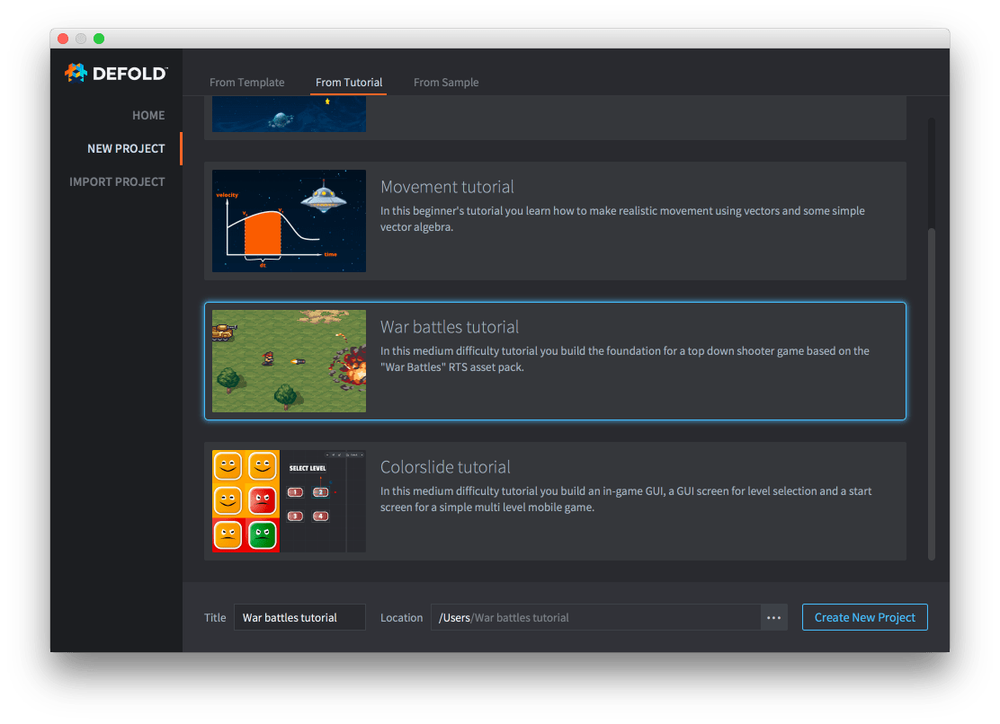

# 星球大戰教程

本教程中你將學會製作帶有移動和射擊功能的小游戲.

本教程已被整合進 Defold 編輯器當中:

1. 啓動 Defold.
2. 于左側選擇 *New Project* .
3. 切換到 *From Tutorial* 標籤頁.
4. 選擇 "War battles tutorial"
5. 指定項目目錄然後點擊 *Create New Project*.

{srcset="images/new-war-battles@2x.png 2x"}

編輯器會自動打開項目根目錄裏的 "README" 文件, 其中包含了完整的教學資料.

{style="display:inline;margin:0 0.5rem 0 0;vertical-align: middle;"}
[完整教程請見 Github](https://github.com/defold/tutorial-war-battles)

有問題請登錄 [Defold Forum](//forum.defold.com) , 這裏有官方和友善的網友爲你答疑解惑.

開發愉快!
